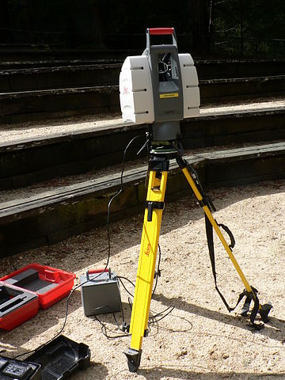

Capítulo 3.Sensor Kinect y herramientas software implicadas el sensado de fallas
================================================================================

Sensores 3D
-----------

.. TODO: DEFINICION, CARACTERÍSTICAS,FORMA DE REPRESENTACIÓN DE OBJETOS EN 3D, TIPOS DE SENSORES 3D, CARACTERÍSTICAS Y APLICACIONES. 

.. https://en.wikipedia.org/wiki/3D_scanner
.. https://en.wikipedia.org/wiki/Structured-light_3D_scanner
.. https://en.wikipedia.org/wiki/Field_of_view
.. https://en.wikipedia.org/wiki/Point_cloud
.. https://en.wikipedia.org/wiki/List_of_programs_for_point_cloud_processing
.. https://en.wikipedia.org/wiki/Lidar

Los scanners o sensores 3D, son elementos de medición que se emplean con el fin de analizar objetos del mundo real o entornos y obtener información respecto a sus características físicas, tales como colores y/o forma, que posteriormente pueden emplearse para genera modelos 3D digitales de éstos. Estos modelo se representa por medio de una nube de puntos (Point Cloud), que es una estructura de puntos definidos  en algún sistema de coordenadas, estando éstos definidos por sus coordenadas (X,Y,Z) en un sistema de coordenadas tridimensional. Estas representaciones pueden ser directamente renderizadas e inspeccionadas, sin embargo para su uso en aplicaciones comerciales de edición o modelado deben ser convertidas en mallas poligonales o modelos triangulados, modelos NURBS (modelo matemático empleado para la representación de superficies y curvaturas) o modelos compatibles con el diseño asistido por computadora (CAD).

Estos sensores son similares a las camaras digitales, ya que cuentan con un campo de visión cónico y solamente pueden recolectar información respecto del entorno en lugares que cuentan con suficiente iluminación. Sin embargo, a diferencia de éstas  que unicamente capturan información respecto de los colores de la superficie, los scanners 3D son capaces de recolectar información acerca de la distancia de cada punto en la imagen  dentro de su rango de visión, por lo que la coordenada de cada punto puede ser precisada. Aunque la imagen proporcionada por un scanner 3D incluya información de posicionamiento de los puntos que componen una imagen, una única captura del objeto no bastará para brindar un modelo tridimensional completo de las características de éste, por lo que si se desea obtener éste resultado, se deben realizar varias capturas desde distintos puntos de vista del mismo objeto y luego realizar la unión final de todas estas capturas en una captura final.

Existen diferentes tipos de sensores 3D que emplean distintas técnicas para la obtención del objeto 3D, aunque de manera general se clasifican en: Técnicas de contacto, donde las características del objeto se obtienen por medio del contacto físico, sosteniéndolo por medio un brazo robótico que puede ser manipulado para escanear la superficie completa de un objeto o, manteniéndolo apoyado sobre una plataforma fija; Y técnicas sin contacto, donde se detecta radiación o luz sobre el objeto con el propósito de adquirir información de éste. Dentro de las aproximaciones sin contacto se encuentran: luz, ultrasonido o rayos X, y en las metodologías con contacto se encuentran las que emplean las máquinas de medición de coordenadas (CMM) industriales. Dentro de los tipos de sensores sin contacto, éstos se pueden subdividir en activos y pasivos. Los activos son aquellos sensores que emiten algún tipo de radiación o luz sobre un objeto y absorben su reflexión con el fin de inspeccionar el objeto. Las aproximaciones existentes para medir esta radiación se pueden subdividir en tres clases generales: Time of Flight(ToF), Cambio de fase (Phase Shift) y triangulación por láser.

Los tipos de láser ToF emiten varios impulsos láser hacia un objeto y miden el tiempo que requiere alcanzar el objeto y ser reflejado de vuelta al sensor emisor y, por medio de la siguiente fórmula computan la distancia:

.. math:: D = c * t/ 2
   :label: ecuacionDistanciaToF

Dado que la velocidad de la luz en la atmósfera *c* es una constante se conoce, solamente se debe calcular el tiempo de viaje y de retorno *t*, por lo que la precisión con la que un láser ToF detecta un objeto, depende en gran medida de la precisión con la que se mide el tiempo. Por lo tanto, la detección de este tipo de dispositivos consiste en emitir varios rayos de luz y variar gradualmente la dirección del láser, por medio de un sistema de espejos que gradua los ángulos horizontales y verticales, de manera que se puedan captar las distancias de todos puntos del objeto que se encuentra en el campo de visión. Una vez obtenidas las distancias y conociéndo los ángulos horizontales y verticales, se pueden computar la posición X,Y,Z para cada uno de los puntos. Un ejemplo de este tipo de scanners son los dispositivos Lidar que emiten un haz de luz láser sobre un objeto y miden la luz reflejada, y partiendo de la diferencia entre los tiempos y longitudes de onda producen un modelo tridimensional del objetivo.         

   
   Ejemplo de laser tipo Lidar que se emplea para escanear formaciones rocosas y edificios.

.. http://floridalaserscanning.com/3d-laser-scanning/how-does-laser-scanning-work/

Los lasers de cambio de fase funcionan emitiendo un haz de luz constante sobre el objeto o superficie y miden la diferencia entre las longitudes de onda del haz de luz emitido y el reflejado, y la distancia se computa a partir de ésta diferencia. El rango máximo que puede ser medido empleando éste método es la mitad de la longitud de onda, por lo que medir con una modulación de onda de alta frecuencia brinda distancias precisas pero rangos menores.  

.. figure:: ../figs/Cap3/ejemplo_phase_shift.jpg
   :scale: 60%
   
   Comparación gráfica de laser ToF y Phase Shift 

Los scanners 3D de triangulación, consisten en emitir una luz láser sobre un objeto y por medio de una cámara detectar la posición del haz en el campo de visión de la cámara, de manera que dependiendo de que tan lejos el objeto se encuentre el punto, aparecerá en distintas posiciones del campo de visión de la cámara. Posteriormente empleando la distancia entre el emisor láser y los ángulos del emisor láser y la cámara, se forma un triángulo que es empleado para calcular la ubicación del punto.

.. figure:: ../figs/Cap3/ejemplo_triangulacion.jpg
   :scale: 60%
   
   Esquema gráfico de scanners de triangulación

Dentro de los scanners que emplean estos mecanismos se encuentran los siguientes:

* Análisis Holográfico (Conoscopic Holography): Este tipo de dispositivo consiste en proyectar un rayo laser en una superficie y luego emplear la reflexión del mismo, haciendo que éste atraviese un cristal con forma cónica y genere un patrón de luz que se proyecta en una cámara y posteriormente es analizado para medir la distancia.

* Luz estructurada 3D (Structured Light 3D): Los lásers 3D de luz estructurada proyectan un patrón de luz sobre un objeto o superficie y captan la deformación producida por el objeto, pudiendo ser éste de unidimensional (una línea de luz) o bidimensional (una grilla o patrón de lineas). Un sensor que se encuentra desplazado del emisor de luz, se emplea para captar la deformación y luego se computa la distancia. Este tipo de dispositivos se caracterizan por ser veloces, ya que en lugar de escanear un punto a la vez, los sensores escanean múltiples puntos en campo de visión con una sola emisión, lo que elimina la posibilidad de distorsión por movimiento.    
  
* Luz modulada (Moduled Light): En este tipo de sensores, la luz emitida por el emisor se modifica variando la amplitud de la radiación emitida en base a un patrón establecido (generalmente una onda sinusoidal) y una cámara detecta la diferencia entre la amplitud del patrón y la diferencia de radiación reflejada, empleándose ésta para detectar la distancia del objeto y computar las posiciones. 
  

Por otro lado, la técnica de scanners sin contacto pasivos, no emiten ningún tipo de radiación sino que se funcionamiento se basa en capturar la radiación reflejada del ambiente, como la luz solar o la luz infraroja. Estos tipos de scanners se caracterizan por ser económicos, ya que no requieren de hardware  especializado  para la emisión de un tipo de radiación, sino pricipalmente de cámaras digitales simples. Dentro de esta categoría de lasers, se encuentran los siguientes:

* Scanners estereoscópicos (Stereoscopic Scanners): Estos dipositivos emplean dos cámaras de video en posiciones diferentes, enfocadas hacia el mismo objeto, que captarán distintas imágenes cuyas diferencias serán empleadas para computar la distancia y las posiciones de  cada punto en las imágenes.
 
* Silhouette scanners: Estos scanners capturan una secuencia de imágenes para generar un contorno alrededor de un objeto que contrasta con el fondo, que posteriormente son superpuestos para formar un hull visual y generar una aproximación del objeto.

Por otro lado, un ejemplo de los scanners de contacto son las camaras de medidas de coordenadas(Coordinate Measuring Machine) empleadas para la medición de las características geométricas de partes o productos industriales ensamblados. Este dispositivo se compone de tres ejes X,Y,Z ortogonales entre si, donde cada uno se mantiene una escala para registrar las coordenadas del elemento que se analiza. Así, este tipo de scanner desplaza uno de los ejes (ya sea automáticamente o manualmente) mientras que el resto se mantiene fijo, y graba cada una de las coordenadas del objeto.  

.. APLICACIONES de estos sensores

Sensor Kinect
+++++++++++++
.. terminos de busqueda google -->
.. "developing libraries kinect"
.. https://www.google.com.ar/search?q=developing+libraries+kinect&safe=off&ei=SylUWpf3KIiawASF96vQBA&start=40&sa=N&biw=1183&bih=616

.. TODO: FUNCIONAMIENTO Y CARACTERISTICAS, DRIVERS EN WINDOWS Y LINUX, ENUMERAR LIBRERÍAS PARA EL DESARROLLO DE APLICACIONES DESDE WINDOWS Y LINUX. 

.. https://en.wikipedia.org/wiki/Kinect

.. Libro Beginning Programming with Microsoft SDK Kinect -->
.. http://droppdf.com/v/IBzJ5
.. https://books.google.com.ar/books?id=Cfxnzjf9phAC&pg=PA29&lpg=PA29&dq=developing+libraries+kinect&source=bl&ots=phpg5X6rp_&sig=XD4KMR3pfCUE8ACGCtDE81-MBto&hl=es&sa=X&ved=0ahUKEwi_luTe5MnYAhXGEZAKHbgbB6I4ChDoAQglMAA#v=onepage&q=developing%20libraries%20kinect&f=false

.. Libro Hacking the kinect -->
.. http://pdf.th7.cn/down/files/1312/hacking_the_kinect.pdf

.. ZigFu con Unity y Kinect -->
.. https://forum.unity.com/threads/connecting-kinect-unity-with-official-sdk.162075/

Kinect for Windows SDK(Xbox Development Kit)
----------------------------------------------

.. https://developer.microsoft.com/en-us/windows/kinect
.. https://developer.microsoft.com/en-us/windows/kinect/tools
.. https://msdn.microsoft.com/library/dn799271.aspx

.. http://dailydotnettips.com/2016/01/17/developing-kinect-for-windows-v2-0-app-with-visual-studio-2015-on-windows-10/

.. Libro Kinect for Windows SDK Programming Guide -->
.. https://books.google.com.ar/books?id=7XqIvRDHVzkC&pg=PT173&lpg=PT173&dq=wpf+kinect&source=bl&ots=ECZpK_Tctb&sig=E8t0Ntgqy7DpvtqqzhRdesxBIs0&hl=es&sa=X&ved=0ahUKEwjUrZSX6snYAhWEIJAKHbVGB4Q4HhDoAQgoMAE#v=onepage&q=wpf%20kinect&f=false

.. WPF with Kinect -->
.. http://dotneteers.net/blogs/vbandi/archive/2013/03/25/kinect-interactions-with-wpf-part-i-getting-started.aspx

Librería Java For Kinect(J4K)
-----------------------------

.. http://research.dwi.ufl.edu/ufdw/j4k/faq.php
.. http://research.dwi.ufl.edu/ufdw/index.php

Librería PCL
------------
.. https://openkinect.org/wiki/Main_Page
.. https://openkinect.org/wiki/Getting_Started

.. https://en.wikipedia.org/wiki/3D_scanner
.. https://en.wikipedia.org/wiki/Point_cloud
.. http://cmuems.com/excap/readings/forsyth-ponce-computer-vision-a-modern-approach.pdf
.. http://szeliski.org/Book/drafts/SzeliskiBook_20100903_draft.pdf
.. 
.. Tipos de feature descriptors -->
.. https://arxiv.org/pdf/1102.4258.pdf
.. 

.. TODO: QUE ES PCL, CARACTERISTICAS, Tipos de ALGORITMOS PARA PROCESAMIENTO DE NUBES. 
..  ALgoritmos de pre-procesamiento de nube: 
..    -Estimacion de features (procesamiento de normales)
..    -Estructuración de la nube (Descomposicion: kd-tree y octree)
..    -Filtrado con passthrough filter y outlier removal (radius-based y statistical)
..    -Resampling ya sea empleando downsampling (voxel grid y uniform sampling) y upsampling (moving least squares)
..    -Segmentation (empleando tanto las normales como el color)

.. Algoritmos de procesamiento de descriptores:
  - Descriptores locales (empleando color o normales)
  - Descriptores globales(empleando color o normales)

