Capítulo 3.Sensor Kinect y herramientas software implicadas el sensado de fallas
================================================================================

Sensores 3D
-----------

.. https://en.wikipedia.org/wiki/3D_scanner
.. https://en.wikipedia.org/wiki/Structured-light_3D_scanner
.. https://en.wikipedia.org/wiki/Field_of_view
.. https://en.wikipedia.org/wiki/Point_cloud
.. https://en.wikipedia.org/wiki/List_of_programs_for_point_cloud_processing
.. https://en.wikipedia.org/wiki/Lidar
.. https://es.wikipedia.org/wiki/Esc%C3%A1ner_3D

Los scanners o sensores 3D, son elementos de medición que se emplean con el fin de analizar objetos o entornos del mundo real y obtener información respecto a sus características físicas, tales como colores y/o forma, que posteriormente pueden emplearse para genera modelos 3D digitales de éstos. Estos modelos se representan por medio de una nube de puntos (Point Cloud), que es una estructura de puntos definidos  en algún sistema de coordenadas, siendo la definición más empleada las coordenadas tridimensionales (X,Y,Z). Estas representaciones pueden ser directamente renderizadas e inspeccionadas, sin embargo, para su uso en aplicaciones comerciales de edición o modelado deben ser convertidas en mallas poligonales o modelos triangulados, modelos NURBS (modelo matemático empleado para la representación de superficies y curvaturas) o modelos compatibles con el diseño asistido por computadora (CAD). Estos sensores son similares a las cámaras digitales, ya que cuentan con un campo de visión cónico y solamente pueden recolectar información respecto del entorno en lugares que cuentan con suficiente iluminación. Sin embargo, a diferencia de éstas  que unicamente capturan información respecto de los colores de la superficie, los scanners 3D son capaces de recolectar información acerca de la distancia de cada punto en la imagen  dentro de su rango de visión, por lo que la coordenada de cada punto puede ser precisada. Aunque la imagen proporcionada por un scanner 3D incluya información de posicionamiento de los puntos que componen una imagen, una única captura del objeto no bastará para brindar un modelo tridimensional completo de las características de éste, por lo que si se desea obtener éste resultado, se deben realizar varias capturas desde distintos puntos de vista del mismo objeto y luego realizar la unión final de todas estas capturas en una captura final.

Existen diferentes tipos de sensores 3D que emplean distintas técnicas para la obtención del objeto 3D, aunque de manera general se clasifican en: Técnicas de contacto, donde las características del objeto se obtienen por medio del contacto físico, sosteniéndolo por medio un brazo robótico que puede ser manipulado para escanear la superficie completa de un objeto o, manteniéndolo apoyado sobre una plataforma fija; Y técnicas sin contacto, donde se detecta radiación no visible (rayos infraroja o X) o radiación visible (luz solar) sobre el objeto con el propósito de adquirir información de éste. Dentro de los tipos de sensores sin contacto, éstos se pueden subdividir en activos y pasivos.

Los sensores activos sin contacto, son aquellos que emiten algún tipo de radiación o luz sobre un objeto y absorben su reflexión con el fin de inspeccionar el objeto y, aproximaciones existentes para medir esta radiación se encuentran las siguientes: 

* Time of Flight(ToF)
* Diferencia de fase (Phase Shift)
* Triangulación por láser
* Luz estructurada
* Luz Modulada

Los tipos de láser ToF emiten varios impulsos láser hacia un objeto y miden el tiempo que requiere alcanzar el objeto y ser reflejado de vuelta al sensor emisor y por medio de la siguiente fórmula computan la distancia:

.. math:: D = c * t/ 2
   :label: ecuacionDistanciaToF

Dado que la velocidad de la luz en la atmósfera *c* es una constante que se conoce, solamente se debe calcular el tiempo de viaje y de retorno *t*, por lo que la precisión con la que un láser ToF detecta un objeto, depende en gran medida de la precisión respecto de la medición del tiempo. Por lo tanto, la detección de este tipo de dispositivos consiste en realizar un escaneo por medio de la emisión de un láser sobre un objeto y en base a este resultado, computar las distancias y las coordenadas de los puntos asociados a éstas, que componen el objeto.

Existen diferentes métodos para el escaneo del objeto por medio de lasers, entre ellas las aproximaciones más comunes son las que emplean los sensores Lidar y las Cámaras ToF. El sensor Lidar (Light Detection And Ranging) emplea un pulso láser para medir la distancia a un objeto variando rápidamente su dirección por medio de un sistema de espejos rotativos, modificando los ángulos horizontales y verticales, de manera que se puedan captar las distancias de todos puntos del objeto que se encuentra en el campo de visión. Una vez obtenidas las distancias y conociendo los ángulos horizontales y verticales, se pueden computar la posiciones (X,Y,Z) para cada uno de los puntos. Así, partiendo de la diferencia entre los tiempos de retorno de los rayos y, adicionalmente, empleando diferencias entre longitudes de onda (emitidas y recibidas), se genera un modelo tridimensional del objetivo. Estos dispositivos se empelan principalmente en satélites para la generación de mapas terrestres de alta resolución, topografía, documentación histórica de objetos antiguos y en la detección de objetos en vehículos autónomos.             

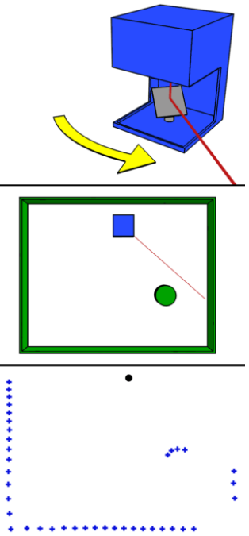

   Ejemplo de láser tipo Lidar. En la figura superior, se puede observar el rayo proyectado (línea roja) que es desplazado para escanear una escena entera por medio de un espejo rotativo. En la figura central se denota con azul el láser, con una círculo verde un objeto esférico y un rectángulo verde que constituye las paredes del entorno en el que se ubica el dispositivo. Finalmente, en la figura inferior se muestra el sensor representado como un punto negro, y los puntos azules simbolizan cada uno de los puntos capturados por el dispositivo durante el escaneo.

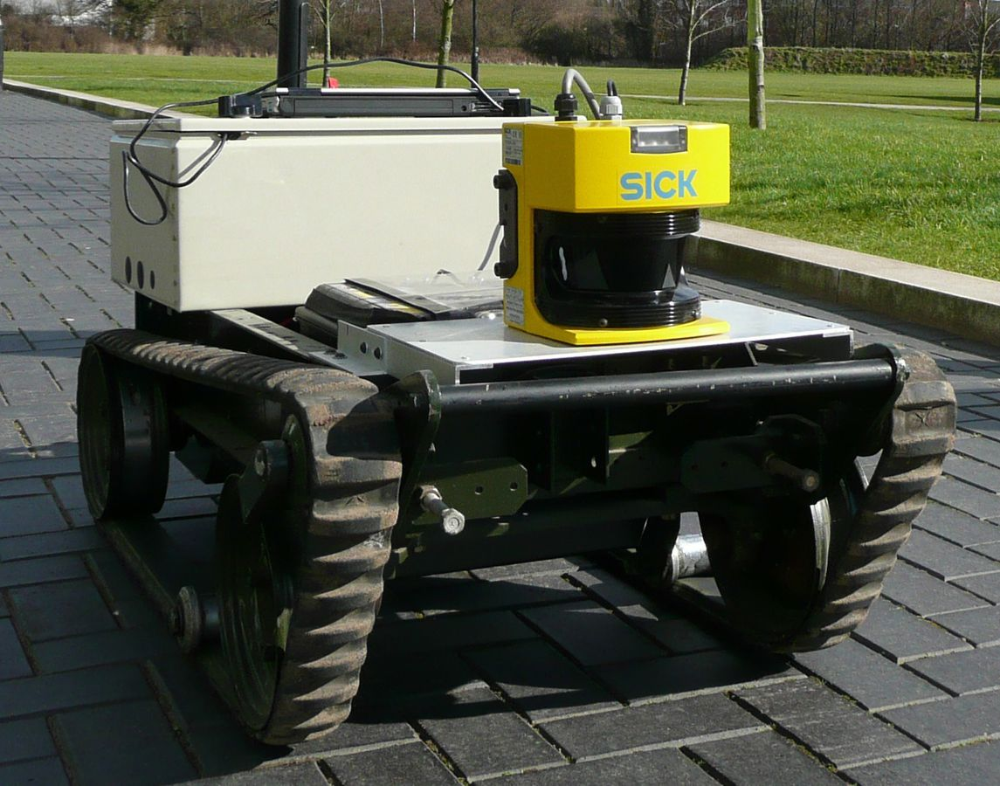
   
   Robot móvil con un láser Lidar SICK Laser Rangefield.

Por otro lado, la cámara ToF no escanea individualmente cada uno de los puntos en el campo de visión, sino que emite varios pulsos de radiación simultáneamente, capturando la escena completa por cada emisión. Luego una cámara sensible a la radiación captura la imagen producida por la reflexión del conjunto de pulsos (cuyas características variarán dependiendo de la distancia entre el sensor y el objeto),  se filtra la radiación de interés, cuya longitud de onda coincide con la del tipo que fue emitida, se calcula las coordenadas de los puntos y se genera la imagen de salida. Estos dispositivos se emplean en: Aplicaciones automovilísticas para detección de peatones y prevención de colisiones, interfaces humanas donde se captura la interacción con el usuario, tales como televisores y videojuegos, donde se emplea el dispositivo para capturar movimientos y gestos que son utilizados como gamepads ( como la segunda generación del sensor Kinect Version 2), en robótica en robots que se desplazan en un entorno donde deben esquivar obstáculos o seguir una persona, o en visión por computadora en entornos industriales para tareas automatizadas de medición, o detección de objetos que serán empleados por un robot para realizar una tarea.

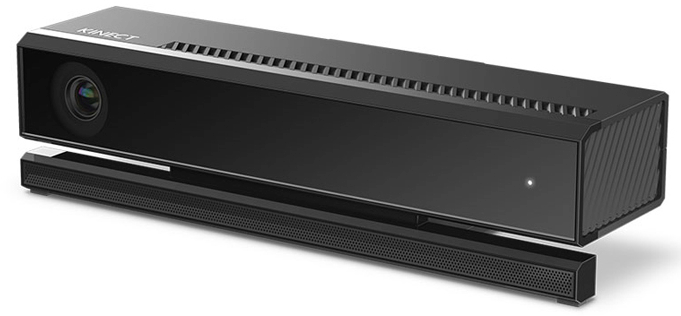

   Kinect V2 con cámara ToF desarrollada por Microsoft. 

Este tipo de sensores, tienen la ventaja de ser rápidos para el muestreo, de alta precisión, aptos para trabajos de medición en monumentos o elementos de construcción, con una alta densidad de puntos por captura, una velocidad de captura entre 10.000 y 100.000 puntos por segundo y un rango de medición alto entre 200 y 300 m. Sin embargo, estos dispositivos no cuentan con una resolución de profundidad alta, la precisión del modelo generado es aproximadamente 1 cm y no se cuenta con información de color.  

.. http://floridalaserscanning.com/3d-laser-scanning/how-does-laser-scanning-work/
.. http://www.cs.virginia.edu/~mjh7v/bib/Chen08.pdf
.. https://en.wikipedia.org/wiki/Phase_(waves)

Los lásers de diferencia de fase (Phase Shift) funcionan emitiendo un haz de luz constante que sigue un patrón de onda sinusoidal, con una longitud de onda específica, el cual es almacenado en el sensor y emitido hacia el objeto. Luego, el reflejo de este rayo es capturado por el sensor y es comparado contra el patrón original almacenado en el sensor, con el fin de obtener la diferencia de fase entre ambas señales y así computar las distancias.

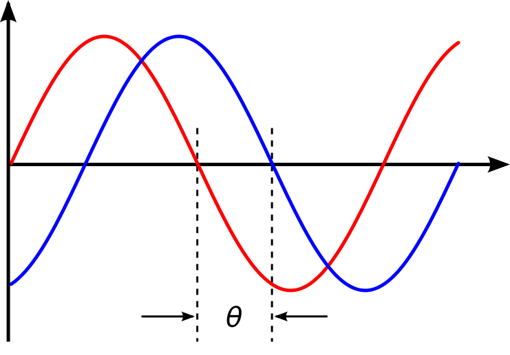
   
   Representación gráfica de la diferencia de fase entre dos ondas sinusoidales.

Este proceso es similar a la técnica de tiempo de vuelo, excepto que la fase del láser reflejado refina la precisión respecto de la detección de la distancia. El alcance de este tipo de sensores se encuentra limitado por las características de la señal emitida, ya que la precisión de la medición es inversamente proporcional a la frecuencia empleada, por lo que medir con una alta frecuencia brinda mayor precisión en la distancia, pero menor rango de medición. Este tipo de dispositivo cuenta con una velocidad de adquisición alta (ubicándose ésta entre 100.000 y 1.000.000 de puntos por segundo) y un alcance de captura intermedio entre 70-100 m. Sin embargo, aunque la velocidad de captura es considerablemente superior a los scanners ToF, las nubes de puntos generadas por el método de diferencia de fase suelen contener más ruido. 

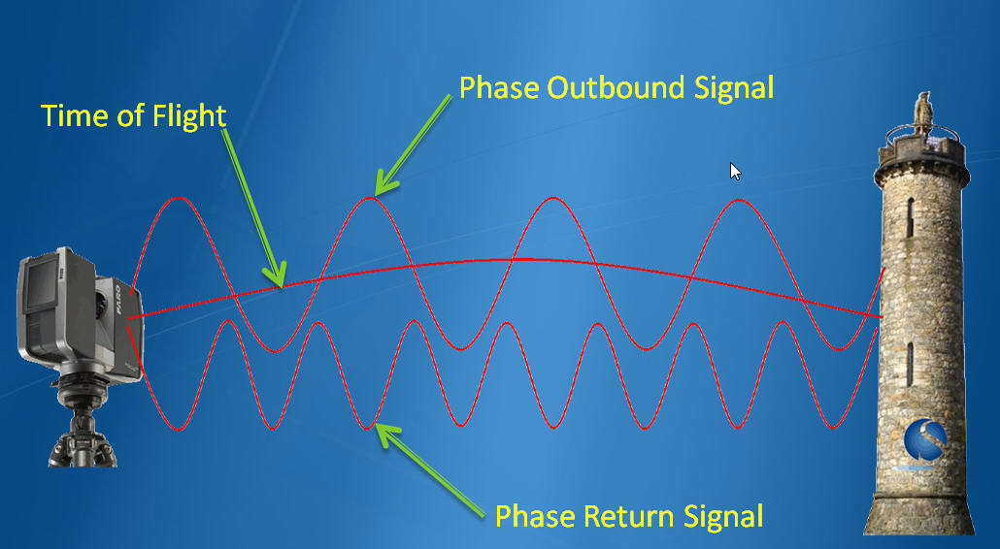
   
   Comparación gráfica de laser ToF y Phase Shift 

.. https://www.researchgate.net/figure/General-Configuration-of-a-Laser-Triangulation-System_fig1_283108894
.. http://sensors-actuators-info.blogspot.com.ar/2009/08/laser-triangulation-sensor.html

Los escaners 3D de triangulación, se componen por un láser y una cámara que captura los rayos emitidos por el éste a través de una lente, la cual permite enfocar la posición de cada punto abarcado por el rayo en el campo de visión del sensor. De esta forma, la captura de un objeto consiste en emitir un rayo sobre el objeto y capturar el reflejo de éste sobre el mismo en la lente de la cámara y, dependiendo de la posición que adopte el reflejo del rayo en el lente se puede computar el ángulo :math:`{\alpha}` para cada punto. Finalmente, con este valor, la distancia entre la cámara y el láser y el punto del objeto donde rebota el rayo se forma un triangulo, a partir del cual es posible calcular por triangulación la distancia entre la cámara y un punto. Así, dependiendo de que tan lejano el objeto se encuentre el punto, aparecerá en distintas posiciones del campo de visión de la cámara.

.. .. figure:: ../figs/Cap3/ejemplo_triangulacion.jpg

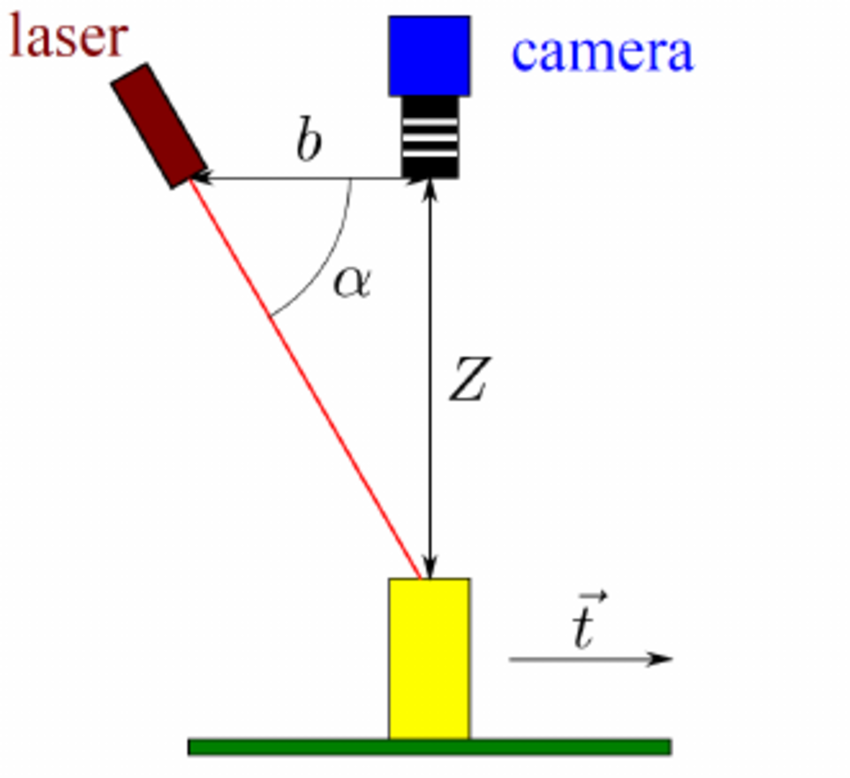
   
   Esquema gráfico de scanners de triangulación.

.. Los sensores de Holografía Conoscópica (Conoscopic Holography), consisten en proyectar un rayo láser en una superficie y luego emplear la reflexión del mismo, haciendo que éste atraviese un cristal con forma cónica y genere un patrón de luz que se proyecta en una cámara y posteriormente es analizado para medir la distancia.

Los sensores de luz estructurada 3D (Structured Light 3D), proyectan un patrón de luz sobre un objeto o superficie, pudiendo ser éste de unidimensional (una línea de luz) o bidimensional (una grilla o patrón de lineas). Un sensor que se encuentra desplazado del emisor de luz, se emplea para captar la deformación del rayo original y a partir de esta calcular la distancia. Este tipo de dispositivos se caracterizan por ser veloces, ya que en lugar de escanear un punto a la vez, los sensores escanean múltiples puntos en el campo de visión con una sola emisión, lo que elimina la posibilidad de distorsión por movimiento. La resolución y velocidad de estos sensores es similar a la de las cámaras VGA, y su precisión es similar a las ToF (aproximadamente 1 cm), contando con un alcance máximo entre 3 m y 6 m, sin embargo estos dispositivos tienen dificultades para captar objetos pequeños menores a 1 cm.   

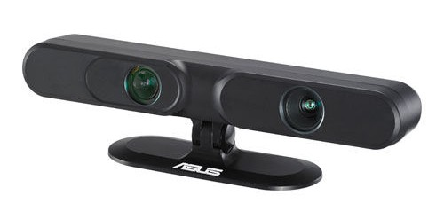

   Ejemplo de sensor ASUS Xion Pro con luz estructurada.

  
.. En los scanners de luz modulada (Moduled Light), la luz emitida por el emisor se modifica variando la amplitud de la radiación emitida en base a un patrón establecido (generalmente una onda sinusoidal) y una cámara detecta la diferencia entre la amplitud del patrón y la diferencia de radiación reflejada, empleándose ésta para detectar la distancia del objeto y computar las posiciones. 

En los escáner de luz modulada (Moduled Light), la radiación emitida por el láser es una luz que varía continuamente en base a un patrón establecido, siendo generalmente  una onda sinusoidal de la que se repiten varios ciclos, hacia el objeto que se desea escanear. Así, una cámara detecta la diferencia entre la onda de la radiación emitida y la radiación reflejada por el objeto, y dependiendo de la diferencia entre éstas se computan las distancias. 

Por otro lado, la técnica de escáner sin contacto pasivos, no emiten ningún tipo de radiación sino que su funcionamiento se basa en capturar la radiación reflejada del ambiente, como la luz solar o la luz infraroja. Estos tipos de escáner se caracterizan por ser económicos, ya que no requieren de hardware  especializado para la emisión de un tipo de radiación. Dentro de esta categoría de dispositivos, se encuentran los siguientes:

* Escáner estereoscópicos (Stereoscopic Scanners): Estos dispositivos emplean dos cámaras de video en posiciones diferentes (desplazadas algunos centímetros) enfocadas hacia el mismo objeto, que captarán imágenes distintas del mismo y, por medio del análisis de estas diferencias, se puede calcular la distancia de cada punto punto en las imágenes. Un ejemplo de este tipo de dispositivos son las cámaras estéreo, que cuentan con la ventaja de ser económicas, sin embargo requieren una perfecta calibración de ambas cámaras de video y son sensibles a las malas condiciones de iluminación. 
 
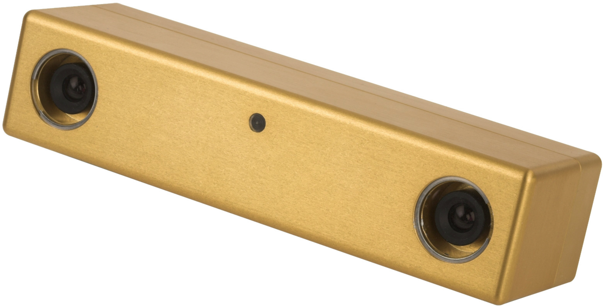

   Cámara estéreo

* Silhouette scanners: Estos escáner capturan una secuencia de imágenes para generar un contorno alrededor de un objeto que contrasta con el fondo, que posteriormente son superpuestos para formar un hull visual y generar una aproximación del objeto.
  

Con respecto a los escáner de contacto, un ejemplo de su funcionamiento son las cámaras de medidas de coordenadas(Coordinate Measuring Machine) empleadas para la medición de las características geométricas de partes o productos industriales ensamblados. Este dispositivo se compone de tres ejes X,Y,Z ortogonales entre si, donde cada uno mantiene una escala para registrar las coordenadas del elemento que se analiza. Así, este tipo de escáner desplaza uno de los ejes (ya sea automáticamente o manualmente) mientras que el resto se mantiene fijo, y graba cada una de las coordenadas del objeto.  

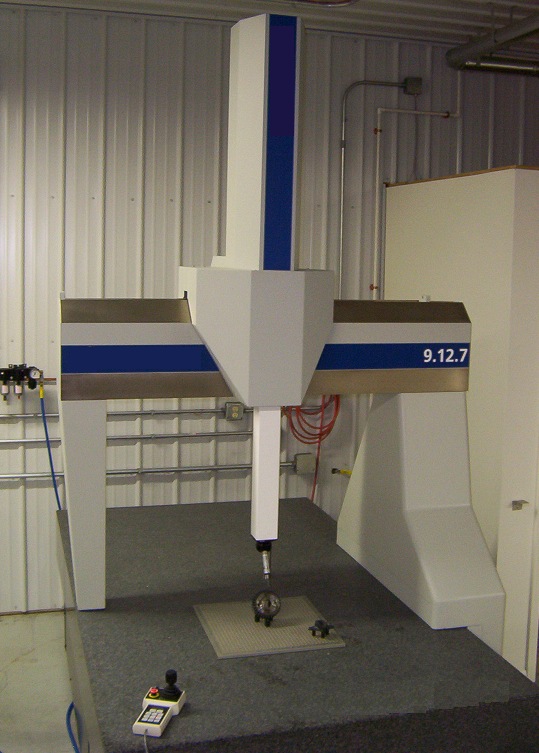

   Ejemplo de Coordinate Measure Machine.

Existen varias áreas donde se aplican los escáners 3D, entre las más comunes se encuentran:

* Control de calidad industrial. Una de las principales aplicaciones de los escáners 3D consisten en la digitalización de partes producidas, tanto en el diseño como en la producción de la parte final. Estos dispositivos deben ser precisos y versátiles, con el fin de obtener la mayor cantidad de información acerca del proceso de construcción de partes.
 
* Registros históricos. En esta rama se emplean dispositivos 3D sin contacto que permitan el análisis de restos animales o artefactos antiguos sin dañarlos, con el fin de generar un modelo a mayor o menor escala, para ser exhibido en museos.
  
* Ciencias médicas. Dentro de las ciencias médicas, los escáners 3D se emplean por ejemplo, en la rama de construcción de piezas dentales, ya que por su precisión y adquisición sin contacto, permiten generar de manera satisfactoria piezas cuyas dimensiones serían complejas de adquirir.
   
* Gráficos por computadora. Debido a que con las tecnologías actuales en la industria de videojuegos permiten la creación de entornos con mayor nivel gráfico de detalle, actualmente se recurre a los escáners 3D para la construcción de éstos en el entorno del videojuego, ya que escanear estos objetos consume menos tiempo que la creación a mano con herramientas digitales.  

Sensor Kinect V1
^^^^^^^^^^^^^^^^

.. TODO: FUNCIONAMIENTO Y CARACTERISTICAS, DRIVERS EN WINDOWS Y LINUX, ENUMERAR LIBRERÍAS PARA EL DESARROLLO DE APLICACIONES DESDE WINDOWS Y LINUX. 

.. https://en.wikipedia.org/wiki/Kinect

.. Libro Beginning Programming with Microsoft SDK Kinect -->
.. http://droppdf.com/v/IBzJ5

.. Libro Hacking the kinect -->
.. http://pdf.th7.cn/down/files/1312/hacking_the_kinect.pdf

.. https://www.jameco.com/jameco/workshop/howitworks/xboxkinect.html
.. https://electronics.howstuffworks.com/microsoft-kinect2.htm

.. https://en.wikipedia.org/wiki/Range_imaging
.. https://web.archive.org/web/20100620012436/http://www.microsoft.com/Presspass/press/2010/mar10/03-31PrimeSensePR.mspx?rss_fdn=Press%20Releases
.. https://venturebeat.com/2009/09/05/how-many-vendors-does-it-take-to-make-microsofts-project-natal-game-control-system/

.. Componentes del Kinect -->
.. https://msdn.microsoft.com/en-us/library/jj663790.aspx
.. https://msdn.microsoft.com/en-us/library/jj131033.aspx
.. https://msdn.microsoft.com/en-us/library/jj131023.aspx
.. https://msdn.microsoft.com/en-us/library/hh973078.aspx

.. http://www.cs.upc.edu/~virtual/RVA/CourseSlides/Kinect.pdf
.. http://www.laserfocusworld.com/articles/2011/01/lasers-bring-gesture-recognition-to-the-home.html
.. https://bbzippo.wordpress.com/2010/11/28/kinect-in-infrared/
.. http://www.depthbiomechanics.co.uk/?p=100

El sensor Kinect es un dispositivo de juego compatible con las plataformas Xbox y PC, desarrollado por las compañías Microsoft y Primesense, pensado para la interacción del usuario sin la necesidad de controles físicos de juego, definiendo para la interacción humano-máquina una interfaz de gestos y de comandos hablados. Este dispositivo tiene la capacidad de generar imágenes de rango (Range Image), que son aquellas que, por cada pixel de la imagen tienen asociada la información de distancia de cada uno, hacia el punto de captura. Este dispositivo fue lanzado en dos versiones, la versión Kinect V1 para la consola Xbox 360 y la versión Kinect V2 para la consola Xbox One. 

.. Especificaciones Kinect -->
.. https://edwinnui.wordpress.com/2015/02/05/diferencias-entre-kinect-v1-y-kinect-v2-2/
.. https://www.fayerwayer.com/2010/06/especificaciones-tecnicas-de-kinect/
.. https://kotaku.com/5576002/here-are-kinects-technical-specs
.. http://www.cs.upc.edu/~virtual/RVA/CourseSlides/Kinect.pdf

La versión Kinect V1 (empleada para la captura de muestras de la presente tesina) se basa en la técnica de proyección de luz estructurada 3D con luz infraroja(IR) constituyéndose por: Un emisor IR, una cámara IR o sensor de profundidad IR, una cámara de video color RGB, un conjunto de micrófonos en la parte inferior para la captura de comandos de voz(array de micrófonos), un acelerómetro y un motor de inclinación. Para realizar el sensado de objetos en el campo de visión, el sensor recolecta constantemente varias imágenes o frames por segundo(fps) paralelamente, correspondientes a las cámaras IR y de video. La cámara IR funciona a 30 fps y admite resoluciones de 320x240 (con 16 bits de profundidad) y 640x480 pixeles (32 bits con color), mientras que la cámara de video funciona a 30 fps en una resolución de 640x480 pixeles y a 12 fps con una resolución de 1280x960 pixeles.
Así, en cada frame el emisor IR emite un patrón de puntos con distintas intensidades en 830nm, que son capturados por la cámara IR la cual se encarga de filtrar únicamente las señales IR, evitando que otros tipos de señales del entorno (tales como las señales de control remoto o luces propias de la iluminación interior), interfieran con el funcionamiento del sensor. De esta forma, la cámara IR captura la señal IR, que se representa como una imagen en escala de grises, donde cada pixel contiene la distancia Cartesiana en milímetros hacia la coordenada de ese pixel desde el dispositivo de captura. El sensado de objetos se encuentra delimitado por un rango de distancia entre 0.8 m y 0.4 m por defecto para la versión de Xbox 360, mientras que para la versión de Windows se incluye además un rango cercano de 0.4m y 3 m. 

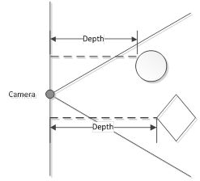

   Funcionamiento del stream de profundidad

.. .. figure:: ../figs/Cap3/ejemplo_patron_puntos.jpg
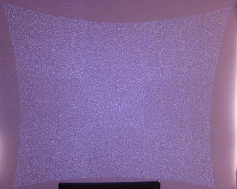

   Patrón de puntos proyectados sobre una superficie

Luego, el chip de procesamiento interno del sensor analiza las diferencias entre el patrón original emitido y la información de profundidad sensada por la cámara IR, se realiza una reducción de los datos capturados y se combina esta información con los datos de la cámara RGB de video para generar la nube de puntos final.

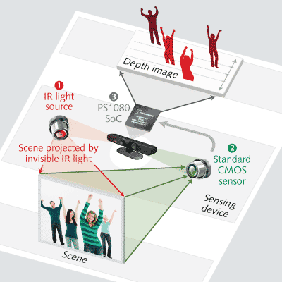

   Esquema general de funcionamiento del Kinect V1

Aunque la cámara de video RGB admite una resolución mayor a la cámara IR, ésta se ajusta para combinarse con la cámara IR y producir la nube de puntos final. Adicionalmente, la cámara RGB ofrece algunas características para optimizar la calidad del video tales como balanceo de blancos automático, saturación de color, corrección de defectos y eliminación de parpadeo.

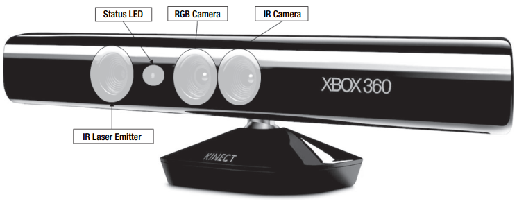

   Diagrama externo del sensor Kinect V1

.. figure:: ../figs/Cap3/componentesKinectV2.png
   :scale: 60%

   Representación externa de los componentes de hardware del sensor Kinect V1

Empleando la información de profundidad, el dispositivo ofrece la posibilidad de realizar el rastreo de esqueletos de jugadores, permitiendo rastrear las articulaciones de 2 personas  completas (con esqueletos compuestos de 20 uniones principales para personas de pie y las 10 uniones pertenecientes a la cintura para personas de sentadas) y la ubicación de 4 personas adicionales.

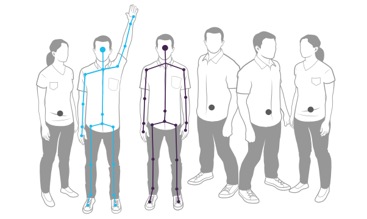

   Rastreo de dos esqueletos completos (compuestos por segmentos azules y uniones, representadas como puntos azules) y 4 esqueletos parciales.

El acelerómetro del dispositivo se emplea para conocer la orientación del sensor con respecto a la gravedad, y se encuentra ubicado en el centro del dispositivo, de manera que el eje Z apunta a la dirección en la que el sensor apunta.

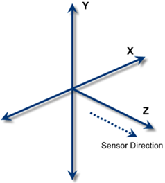
 
    Ejes del dispositivo

.. Human Interaces Guidelines v 1.8.0 -->
Con respecto al audio captado por el dispositivo, éste detecta comandos en un rango que abarca +-50º en frente del dispositivo, pudiendo modificarse programáticamente la dirección en la que apunta el array de micrófonos en incrementos de 10º en una escala total de 100º. Además, el array de micrófonos puede cancelar 20 decibeles(dB) de ruido del ambiente frontal, mientras que el sonido que proviene desde detrás del dispositivo obtiene 6 dB más de supresión. Por defecto, el dispositivo captura los comandos hablados del jugador con el mayor nivel de decibeles.

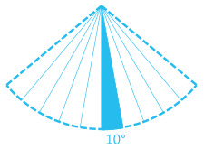

   Modificación del array de micrófonos

Este sensor contiene un campo de de visión de 43º horizontalmente y 57º verticalmente, que puede ser variado verticalmente a través del motor de inclinación en +- 27º, siendo éste el área de interacción con el dispositivo, donde se capturarán todos aquellos elementos que se encuentren en frente del sensor y no se encuentren bloqueados por algún otro objeto.   

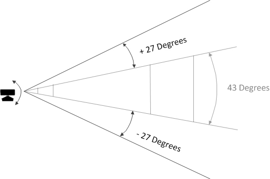

   Extensión de inclinación

La versión Kinect V2, fue lanzada para Xbox One y en lugar del sensor de luz estructurada 3D desarrollada por Primesense, esta versión emplea una versión de cámara Time-of-Flight desarrollado por Microsoft, que cuenta con mayor precisión para capturar los movimientos, una resolución de video de 1920x1080 pixeles a 30 fps para la cámara de video, 512x424 pixeles a 30 fps en la cámara IR,  capacidad de detección de mayor cantidad de articulaciones (ya que en Kinect V1 se podían detectar 6 cuerpos pero solo 2 con sus articulaciones completas, mientras que en esta versión se pueden capturar 6 cuerpos con sus articulaciones completas) y mayor rango de detección del jugador (con una distancia de detección entre 0.5 y 4.5 mts con software oficial).   

Librerías para la utilización del sensor Kinect
-----------------------------------------------

.. LibFreenect desarrollada por OpenKinect-->
.. https://openkinect.org/wiki/Main_Page
.. https://github.com/dimatura/pypcd (Solo almacenamiento)
.. https://github.com/strawlab/python-pcl

.. Openni framework para el desarrollo de aplicaciones con sensores 3D -->
.. http://openni.ru/
.. https://structure.io/openni
.. https://github.com/occipital/openni2

Existen diferentes drivers y librerías que permiten interactuar con el sensor Kinect y desarrollar aplicaciones orientadas a diferentes propósitos y con distintas funcionalidad, aunque principalmente se destacan las siguientes:

* Microsoft Kinect SDK(Librería oficial)
* OpenNI
* Freenect(OpenKinect) y PCL
.. * Java For Kinect(J4K)
 

Kinect for Windows SDK 1.8 (Xbox Development Kit)
^^^^^^^^^^^^^^^^^^^^^^^^^^^^^^^^^^^^^^^^^^^^^^^^^

El Kinect SDK de Microsoft es un conjunto de librerías y herramientas que permiten programar aplicaciones en plataformas de Microsoft empleando la funcionalidad que ofrece el sensor Kinect. Esta SDK permite programar aplicaciones Windows Presentation Foundation (WPF), que es una tecnología que permite emplear los lenguajes de la plataforma .NET y el lenguaje declarativo XAML para crear aplicaciones visualmente atractivas, aplicaciones de escritorio WinForms y aplicaciones web con HTML5 (por medio de una API en Javascript que a través de un servidor configurado localmente permite la interacción o visualización desde un navegador). Esta librería funciona únicamente en plataformas Windows, requiere el framework .NET versión 4 y el IDE Microsoft Visual Studio, e incluye todos los drivers requeridos para interactuar con el sensor Kinect a través de los diferentes sensores de éste. Dentro del rango de funcionalidad que se pueden incorporar en las aplicaciones con el presente SDK se encuentran:

* Reconocimiento y seguimiento de personas por medio de esqueletos (Skeletical Tracking). 
* Cálculo de la distancia entre un objeto y el sensor empleando información de profundidad.
* Captura de audio sin ruido y localización del origen de éste, e incorporación de comandos hablados a una aplicación a través de la definición de una gramática que permita el uso de voz (speech recognition).
* Reconocimiento de gestos para el ingreso de comandos con Kinect.  
* Rastreo de rostros en tiempo real, obteniendo la posición y las expresiones faciales, para el uso en un avatar o comunicación con el dispositivo a través del desarrollo de una interfaz de Usuario en Lenguaje Natural (Natural User Interface, NUI).
* Utilidades para: la grabación y almacenamiento de un conjunto de frames de profunidad y color desde el Kinect con el fin de testear un escenario repetidas veces empleando Kinect Studio y la interacción en tiempo real con modelos renderizados desde el sensor Kinect con Kinect Fusion.
 

De esta manera, la arquitectura de esta librería se compone de los siguientes elementos:

1. Hardware del Kinect.
2. Drivers del Kinect. Los drivers para Windows del dispositivo que se instalan durante la instalación del SDK que permite acceder a la funcionalidad del array de micrófonos a través de la API de audio estándar de Windows, controles de streaming para audio, video y profundidad y funciones de enumeración para varios dispositivos para la utilización de más de un dispositivo.
3. Componentes de audio y video. Éstos son agrupados en la interfaz NUI de Kinect y permiten el acceso al stream de audio, video y profundidad.
4. Componentes DMO (DirectX Media Object) para el filtrado de sonido y el ruido (beamforming) y localización de audio.
5. APIs Estándar de Windows. APIs para el manejo de audio, speech y media.
   

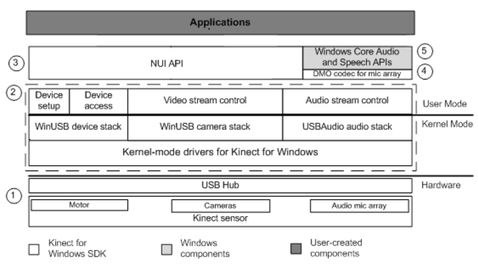

   Arquitectura Kinect For Windows SDK

Entre los módulos principales de la librería se encuentran los siguientes:

* NUI.
* Kinect Interaction.
* Face Tracking.
  
El módulo NUI es el módulo principal del SDK y permite acceder a información de sonido, imágenes a color y profundidad capturada directamente desde el dispositivo, como así también ofrece funcionalidades que procesan esta información, tales como son: Un pipeline que permite reconocer y rastrear el cuerpo humano, el cual convierte la información de profundidad en uniones, que en conjunto representan esqueleto del cuerpo humano, integración con la API Microsoft Speech para proporcionar un motor de procesamiento de comandos hablados que permita agregar comandos de voz a la aplicación, y la integración con la SDK Face Tracking para reconocimiento de expresiones faciales. De esta forma, para que las aplicaciones interactúen con el sensor kinect, el módulo define una clase principal KinectSensor que representa el sensor y que agrupa cada conjunto de frames de video, profundidad y skeletons en streams, que obtienen de manera continua información del dispositivo, y que deben ser habilitados y configurados por el desarrollador de manera explícita para comenzar con el sensado. Así, el flujo de trabajo para la obtención de información con la librería consiste en:

1. Seleccionar un dispositivo Kinect. Esto se realiza por medio de iteración de la colección Kinect.KinectSensors que agrupa todos los dispositivos conectados y permite obtener el nombre y el estado del dispositivo(si se encuentra conectado funcionando correctamente).
2. Luego de seleccionar el dispositivo, se deben habilitar los streams de los que se desee obtener información, invocando para ésto al método enable() de cada stream, que recibe la configuración que especifica el formato de los datos de imagen, la tasa de frames y la resolución de los pixeles de datos, definida como un tipo enumerado en las clases de formato para cada stream. Los streams para frames de imágenes a color, profundidad skeleton se encuentran definidos en las clases ColorStream, DepthStream y SkeletonStream, respectivamente.
3. Posteriormente, se debe iniciar la recolección de datos desde el sensor con el método start(). 
4. Para la obtención de frames, la aplicación obtiene el último frame (color o profundidad) invocando a un método del stream habilitado y lo copia a un buffer si esta disponible, o si no lo esta, puede retornar inmediatamente o esperar el siguiente frame. Para la obtención de frames el SDK proporciona dos modelos diferentes: modelo por consulta (polling) o modelo de eventos; El modelo por consulta consiste en que al momento de solicitar el siguiente frame se especifique una cantidad fija de milisegundos, de manera que se retorne el control a la aplicación cuando el siguiente frame este disponible o cuando el tiempo de espera expire. Mientras que en el modelo por eventos, se definen eventos separados para cada tipo de stream y handlers que reciben el frame del tipo de dato asociado al stream. 
5. Finalmente, se finaliza la captura de información desde el sensor con el método stop() de KinectSensor.

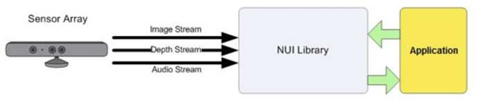

   Interacción de sensor Kinect y aplicación desarrollada por usuario

Por otro lado, el módulo KinectInteraction es un módulo que emplea una combinación del stream de profundidad, stream de esqueleto y algoritmos complejos con el fin de proporcionar a las aplicaciones la capacidad de incorporar la interacción con el usuario por medio de gestos a través de una mano principal (se realiza el seguimiento de ambas pero solo una se emplea para controlar la interacción), efectuando detección y rastreo de la posición y estado de la misma, y brindando la posibilidad de registrar los siguientes gestos del usuario:

* Agarrar y liberar un elemento (Grip and Release), donde el agarre consiste en mantener la mano abierta enfrentando el sensor y luego hacer un puño con la mano, mientras que liberar es la apertura del puño cerrado.
* Detección de gesto presionar(Press), en el que el usuario mantiene su mano abierta enfrentando su palma con el sensor y mantiene sus brazos parcialmente extendidos, para luego extenderlos hacia el dispositivo.
* Información respecto del control virtual que manipula el usuario con su mano principal. Esta información se obtiene por medio de un stream de interacción, similar al resto de los streams, que brinda frames que pueden ser procesado para proporcionar información en la interacción del usuario con la aplicación, tales como la posición de la mano y el estado actual (presionando, agarrando, o liberando) y el control que el usuario esta empleando.

Este módulo define una API nativa en C++ y una API en C# que brinda las características de identificación de usuario, estado y rastreo de la mano , como así también incluye un data stream de interacción (interaction stream), similar al resto de los streams, que permite obtener frames respecto de la interacción del usuario con la aplicación (posición y estado de la mano). Adicionalmente, este módulo define controles en C# para aplicaciones WPF que pueden ser empleados para construir aplicaciones interactivas, tales como son listas scrolleables, botones que responden a los gestos y regiones interactivas.

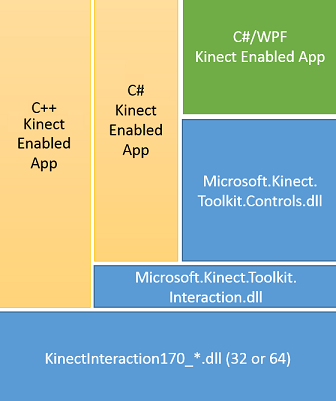

   API en modulo Kinect Interaction

El módulo de Face Tracking SDK utiliza información de los streams de color y de profundidad para deducir la posición de la cabeza y las expresiones faciales, para proporcionar a la aplicación esta información. La calidad de rastreo de rostros depende de la calidad de los frames de entrada de estos streams, por lo que frames más difusos u obscuros serán rastreados con un rendimiento menor que los frames mas brillantes o nítidos. El flujo de trabajo con esta API, consiste en crear un objeto principal IFFaceTracker para la obtención de frames, invocar al método de obtención de nuevos frames de este objeto y procesar los mismos dentro de un bucle, hasta que por alguna condición de corte no se desee continuar con el procesamiento. Esta interfaz proporciona de las siguientes clases para realizar el seguimiento de rostros:

* IFFaceTracker. Esta es la interfaz principal a través de la cual se leen los frames, por medio de los métodos startTracking() para la inicialización del objeto y la determinación de orientación del sensor y, continueTracking() que emplea información anterior de startTracking() o continueTracking() para sucesivas llamadas y se almacenan en un buffer de tipo FT_SENSOR_DATA.
* IFTResult. Esta clase contiene información respecto del resultado de la operación de obtención de frames.
* IFTImage. Esta clase define los diferentes formatos admitidos para la imagen capturada por el sensor, mantiene buffers para almacenar los datos de la imagen y permite acceder a la información propia de ésta (pixeles,width,height,etc.).
* IFTModel. Esta clase permite invocar a métodos para convertir la información capturada a mallas 3D de vértices. 

.. Links oficiales de documentación de Microsoft --> 
.. https://docs.microsoft.com/es-es/visualstudio/ide/visual-studio-ide

.. GUIA DE PROGRAMACION Kinect for windows programming guide -->
.. https://msdn.microsoft.com/en-us/library/hh855348.aspx

   .. Arquitectura general Kinect SDK --> 
   .. https://msdn.microsoft.com/en-us/library/jj663803.aspx

   .. Modulo NUI y submodulos streams (Color,Audio y Depth) -->
   .. https://msdn.microsoft.com/en-us/library/hh855352.aspx

      .. Color Stream -->
      .. https://msdn.microsoft.com/en-us/library/jj131027.aspx

      .. Audio Steam -->
      .. https://msdn.microsoft.com/en-us/library/jj131026.aspx

      .. Deapth Stream -->
      .. https://msdn.microsoft.com/en-us/library/jj131028.aspx

   .. Modulo KInect Interaction (para gestos)-->
   .. https://msdn.microsoft.com/en-us/library/dn188671.aspx

   .. Face Tracking SDK -->
   .. https://msdn.microsoft.com/en-us/library/jj130970.aspx

   .. Modelos ofrecidos por Kinect SDK -->
   .. https://msdn.microsoft.com/en-us/library/hh973076.aspx   

.. Programming Guide -->
.. https://msdn.microsoft.com/en-us/library/hh855348.aspx
.. https://msdn.microsoft.com/en-us/library/hh855354.aspx
.. https://msdn.microsoft.com/en-us/library/hh855357.aspx
.. https://msdn.microsoft.com/en-us/library/microsoft.kinect.colorimagestream.aspx

.. Libro Kinect for Windows SDK Programming Guide -->
.. https://books.google.com.ar/books?id=7XqIvRDHVzkC&pg=PT173&lpg=PT173&dq=wpf+kinect&source=bl&ots=ECZpK_Tctb&sig=E8t0Ntgqy7DpvtqqzhRdesxBIs0&hl=es&sa=X&ved=0ahUKEwjUrZSX6snYAhWEIJAKHbVGB4Q4HhDoAQgoMAE#v=onepage&q=wpf%20kinect&f=false

.. WPF with Kinect -->
.. http://dotneteers.net/blogs/vbandi/archive/2013/03/25/kinect-interactions-with-wpf-part-i-getting-started.aspx

.. Librería Java For Kinect(J4K)
.. -----------------------------

.. http://research.dwi.ufl.edu/ufdw/j4k/faq.php
.. http://research.dwi.ufl.edu/ufdw/index.php

OpenNI
^^^^^^
.. http://openni.ru/
.. http://openni.ru/about/index.html
.. http://openni.ru/openni-programmers-guide/index.html
.. OpenNI V2 -->
.. https://structure.io/openni 

OpenNI framework es un SDK open-source empleado para el desarrollo de librerías y aplicaciones de sensado 3D, que ofrece un rango variado de herramientas para la colaboración y la promoción del software desarrollado, brindando una plataforma de marketing para descargar y compartir software en la comunidad OpenNI. La librería OpenNI proporciona acceso a los dispositivos desarrollados por PrimeSense y Asus Xtion y permite acceder a las imágenes de profundidad y RGB, y streams IR. El flujo de trabajo con OpenNI consiste en emplear la clase principal openni::OpenNI, que engloba todos los dispositivos conectados del sistema y agrupa los eventos de conexión y desconexión de dispositivos, para inicializar todos los dispositivos por medio de OpenNI::initialize(), enumerar todos los dispositivos con  OpenNI::enumerateDevices(), leer y procesar información del dispositivo conectado y finalmente, terminar la ejecución con OpenNI::shutdown(). Luego de la inicialización, se puede acceder al dispositivo por medio de las siguientes clases principales:

*  openni::OpenNI. Es la clase principal para acceder a los dispositivos conectados, eventos relacionados a conexión y desconexión de dispositivos, información de versión de la API y errores.
* openni::Device. Esta clase representa un dispositivo conectado al sistema y requiere que OpenNI se haya inicializado antes de que pueda ser generada una instancia. Esta clase contiene métodos para habilitar el flujo de streams del dispositivo, obtener información del dispositivo, revisar el estado de la conexión y realizar sincronización de frames, para aquellos dispositivos que cuentan con cámaras de video y de profundidad, donde puede que la tasa de frames entre ambos este desfasada.
*  openni::VideoStream. Representa todos los streams de datos obtenido desde un dispositivo y se emplea para obtener objetos de tipo VideoFrameRef. Esta clase permite habilitar, deshabilitar y configurar el stream de datos (framerate, resolución y tipo de pixel) y la lectura de frames puede realizarse ya sea empleando un modelo de polling o un modelo dirigido por eventos.
*  openni::VideoFrameRef. Abstrae los datos y los metadatos de un frame leído desde un stream. Permite acceder a tamaño de los datos, resolución del frame, timestamp, tipo de sensor y datos del frame (Array Stride). 

.. Encabezado h4 -->
Freenect y Librería Point Cloud Library(PCL)
^^^^^^^^^^^^^^^^^^^^^^^^^^^^^^^^^^^^^^^^^^^^

.. https://en.wikipedia.org/wiki/Point_cloud
.. https://openkinect.org/wiki/Main_Page
.. https://openkinect.org/wiki/Getting_Started
.. https://openkinect.org/wiki/Roadmap

.. https://en.wikipedia.org/wiki/Point_Cloud_Library
.. http://pointclouds.org/about/
.. https://en.wikipedia.org/wiki/Computer_vision
.. http://robotica.unileon.es/index.php/PhD-3D-Object-Tracking

.. http://cmuems.com/excap/readings/forsyth-ponce-computer-vision-a-modern-approach.pdf
.. http://szeliski.org/Book/drafts/SzeliskiBook_20100903_draft.pdf
.. 
.. Tipos de feature descriptors -->
.. https://arxiv.org/pdf/1102.4258.pdf

Freneect (Libfreenect) es un driver multiplataforma, de código abierto para el sensor Kinect disponible para Windows, Linux y OS X, que incluye todo el código necesario para inicializar, activar y comunicarse con el sensor Kinect y es desarrollado por la comunidad abierta OpenKinect (que cuenta con más de 2000 miembros) y cuyo interés radica en explotar las capacidades del sensor sobre diversas plataformas. Libfreenect se encuentra disponible tanto para la versión 1 de Kinect (en Xbox 360) y 2.0 (Xbox One). Este driver permite acceder a imágenes con RGB y profundidad, motor, acelerómetro, led y audio del y proporciona el siguiente conjunto de wrappers para los lenguajes de programación:

* Python
* C, C++ y C#
* Java JNI, Java JNA
* Common Lisp
* Actionscript

Adicionalmente, libfreenect brinda las utilidades de prueba Record y Fakenect: La primera permite grabar una secuencia de frames del dispositivo en disco volcando las lecturas de los streams de video, profundidad y acelerómetro, mientras que la segunda se enfoca en permitir leer las grabaciones hechas por Record, de manera que se no sea necesario contar con un sensor conectado para realizar pruebas.  

.. http://https.www.pointclouds.org/news/2012/05/29/pcl-goes-mobile-with-ves-and-kiwi/

Por otro lado, PCL es un proyecto que comenzó en 2010 por Willow Garage (compañía desarrolladora de la librería de imágenes OpenCV) y de la compañía desarolladora de Robotic Operating System(ROS), cuya primera versión fue oficialmente liberada en 2011. Point Cloud Library(PCL) es una librería independiente, de código abierto, multiplataforma (disponible para Linux, Windows, MacOS, y Android/iOS), escrita en C++, para la captura, el procesamiento geométrico y almacenamiento de nubes de puntos 2D/3D. Aunque esta librería fue pensada para desarrollar en C++, también existe un binding para Python que incluye el siguiente conjunto de funciones: Entrada/Salida de archivos PCD,segmentación, suavizado, filtrado y registración. Esta librería ofrece algoritmos vinculados a tareas relacionadas a la visión artificial (o visión por computadora), que es un área de la inteligencia artificial, donde se busca que una computadora obtenga información y logre un entendimiento de alto nivel de las propiedades de ésta (tales como formas, iluminación, distribución de colores) a partir de un video o imagen del mundo real. Esta disciplina incluye aquellos métodos que permiten adquirir, analizar, procesar y extraer datos que puedan ser convertidos a información numérica y simbólica que pueda ser de utilidad durante la automatización de una tarea. Dentro del rango de aplicaciones en las que se emplea la visión artificial las más comunes son las siguientes:

* Reconocimiento óptico de caracteres(OCR) interpretando códigos escritos a mano.
* Inspección de máquinas, asesorando la calidad de partes empelando estéreo visión con iluminación especializada para medir tolerancias en partes de dispositivos aéreos o de automóviles.
* Seguridad automotriz, detectando obstáculos como peatones en los senderos viales, bajo condiciones donde las técnicas de visión activas como Lidar no funcionan correctamente.
* CGI (computer-generated imagery) en Cine-TV, donde la filmación real con actores se une con imágenes generadas por computadora rastreando puntos clave en el video origen, con el fin de estimar el movimiento de la cámara y la forma del entorno.
* Captura de movimiento, utilizando marcadores retro-reflectivos capturados desde distintas cámaras con el objetivo de capturar digitalmente el patrón de movimiento de actores para realizar una animación por computadora.
* Reconocimiento de huellas digitales para el acceso de personal autorizado automatizado.

.. PyPCD -->
.. https://github.com/dimatura/pypcd

.. Librería PyPCD
.. --------------

De esta forma, PCL es una librería que ofrece diferentes módulos independientes que pueden ser combinados de distintas formas en un pipeline de instrucciones, con el fin de lograr el reconocimiento de distintos tipos de objetos en una nube de puntos. Los algoritmos de estos módulos están pensados para abarcar un  diverso rango de tareas que son necesarias para una correcta detección de objetos, tales como filtrado de puntos con valores atípicos distantes del resto en una nube (outliers en la nube), almacenamiento, lectura y conversión de nubes de puntos en distintos formatos, descomposición de la nube para realizar búsquedas, concatenar y fusionar dos nubes de puntos con los mismos o distintos campos, segmentar partes de una escena, extraer puntos clave y computar descriptores geométricos con el propósito de distinguir elementos del mundo real. De manera general, el pipeline de PCL para el reconocimiento de objetos se compone de las siguientes etapas:

* Pre-procesamiento de nube: Durante esta etapa se elimina el ruido de la nube previamente capturada, se aplican algoritmos para estructurarla y se estiman features que proporcionan información acerca de las características de la superficie que serán empleadas durante las siguientes etapas.

* Segmentación de objetos: En esta etapa se realiza la segmentación por medio de distintas técnicas con el fin de obtener clusters de interés, que serán utilizados para generar descriptores.

* Generación de descriptores: Durante esta fase, se computan los descriptores para el/los cluster/s aislados. Un descriptor es una estructura compleja que codifica información respecto de la geometría que rodea un punto, de manera que permiten identificar un conjunto de puntos a lo largo de varias nubes de puntos, sin importar el ruido, la resolución o las posibles transformaciones. Adicionalmente, algunos descriptores capturan información global respecto del objeto al que pertenecen, como el punto de visión que puede ser utilizado para computar la posición.   

A continuación, se enumeran y describen los algoritmos principales empleados durante cada fase.

.. TODO: QUE ES PCL, CARACTERISTICAS, Tipos de ALGORITMOS PARA PROCESAMIENTO DE NUBES. 
..  ALgoritmos de pre-procesamiento de nube: 
..    -Estimacion de features (procesamiento de normales)
..    -Estructuración de la nube (Descomposicion: kd-tree y octree)
..    -Filtrado con passthrough filter y outlier removal (radius-based y statistical)
..    -Resampling ya sea empleando downsampling (voxel grid y uniform sampling) y upsampling (moving least squares)
..    -Registración de dos nubes de puntos

..  ALgoritmos de segmentación de objetos: 
..    -Segmentation (empleando tanto las normales como el color)
..    -Reconstrucción(Triangulación)

.. Algoritmos de generación de descriptores:
  - Descriptores locales (empleando color o normales)
  - Descriptores globales(empleando color o normales)
  - 

.. Encabezado h5 -->

Algoritmos de pre-procesamiento de nubes
""""""""""""""""""""""""""""""""""""""""

.. http://pointclouds.org/documentation/tutorials/pcd_file_format.php
.. https://en.wikipedia.org/wiki/PLY_(file_format)
.. https://en.wikipedia.org/wiki/Wavefront_.obj_file
.. https://en.wikipedia.org/wiki/STL_(file_format)

.. Encabezado h6 -->

Representación y almacenamiento de una nube de puntos
+++++++++++++++++++++++++++++++++++++++++++++++++++++

Con respecto al almacenamiento persistente de nubes de puntos, aunque éste se puede realizar en diversos formatos, PCL cuenta con su formato PCD (Point Cloud Data file) personalizado definido para complementar el resto de los formatos, donde no se soportan algunas características de procesamiento geométrico, estando disponible en dos versiones: Binaria y ASCII. Cuando este formato se encuentra en versión ASCII, es posible inspeccionarlo con un editor de textos para analizar los datos relacionados a la nube de puntos. Internamente, éste se compone por un encabezado donde se almacena información respecto de la información en la nube de puntos y un cuerpo que contiene las coordenadas 3D, y opcionalmente información RGB o RGBA, para cada punto de la captura. En el encabezado de la nube se encuentran los siguientes datos:

* VERSION, que especifica la versión de la librería PCL.
* FIELDS, que indica los atributos a través de los que se indicarán las coordenadas de cada punto, e información necesaria para el procesamiento de éstos (tales como información de color, normales, etc.). Este valor es una tupla de cadenas separadas por espacios, entre las que se encuentran: x y z | x y z rgb | x y z normal_x normal_y normal_z.
* SIZE, especifica el tamaño en bytes según el tipo de dato que se utilice para representar los valores de cada dimensión descrita por FIELDS, siendo este de 8 para valores tipo double, 4 si cada dimensión se representa por valores int o float, 2 para tipos short no signados y de 1 byte para tipos char sin signo.
* TYPE, que indica el tipo de cada dimensión descrita por FIELDS, siendo I para tipos enteros, U para tipos sin signo y F para valores flotantes.
* COUNT, especifica cuantos elementos tiene cada dimensión, siendo este valor de 1 para nubes que solamente contendrán datos y del tamaño del descriptor para nubes que se representan como descriptores.
* WIDTH, indica la longitud del conjunto de puntos que componen la nube de puntos, adoptando distintos valores dependiendo de la forma de organización de la nube, siendo las posibles formas: Organizada o Desorganizada. Una nube de puntos organizada, es aquella donde internamente los puntos en la nube se organizan en filas y columnas como en una matriz, mientras que en una nube desorganizada todos los puntos se organizan en una única fila. Por ejemplo, si este campo se definiera como *WIDTH 640*, significaría que los puntos que componen la nube se encuentran estructurados en filas con 640 puntos por fila.
* HEIGHT, indica la cantidad de filas que contiene la nube de puntos, siendo 1 para las nubes de puntos desorganizadas y un valor numérico para las nubes de puntos organizadas.
* VIEWPOINT, representa el punto de visión desde el que fueron adquiridos los puntos de la nube, que puede posteriormente ser empleado en descriptores que requieren orientación. Este campo se especifica como una traslación (traslacion_x, traslacion_y, traslacion_z) mas las unidades de cuaternión (o versores) que representan valores numéricos respecto de las rotación y orientación del sensor.
* POINTS, especifica el número total de puntos en la nube.
* DATA, indica por medio de una cadena de caracteres el formato en que la nube de puntos es almacenada, siendo los posibles valores ascii o binary.
  
Por otro lado, el cuerpo de la nube en formato ascii contiene las coordenadas de cada punto, junto con la información adicional, representándose éstas como una secuencia lineas separadas por caracteres de nueva línea, mientras que si se almacenan en formato binario, la cabecera y el cuerpo son una copia del arreglo de puntos en memoria a disco.

De esta forma, un ejemplo de archivo PCD en formato ascii, para una nube no estructurada con coordenadas e información de color se define de la siguiente manera:

# .PCD v.7 - Point Cloud Data file format
VERSION .7
FIELDS x y z rgb
SIZE 4 4 4 4
TYPE F F F F
COUNT 1 1 1 1
WIDTH 213
HEIGHT 1
VIEWPOINT 0 0 0 1 0 0 0 #Valor por defecto
POINTS 213
DATA ascii
0.93773 0.33763 0 4.2108e+06
0.90805 0.35641 0 4.2108e+06
...

Opcionalmente PCL ofrece los siguientes formatos para almacenamiento de nubes de puntos diseñados por distintas organizaciones para ser empleados por distintos programas:

* OBJ: Es un formato de archivo geométrico desarrollado por Wavefront Technologies, que representa la geometría específicamente de un objeto, detallando la posición de cada vertex, las coordenadas de las texturas y normales asociadas a éstos, y las caras que forman cada polígono.
* PLY: Polygon File Format es un formato donde se almacenan un conjunto de polígonos que representan un objeto o superficie 3D, que puede contener información respecto de color y transparencia, normales, texturas de las coordenadas y valores de confianza para éstas. Este formato, permite almacenar distintas propiedades para las caras frontales y traseras de los polígonos y puede ser almacenado tanto en formato ascii o binario.   
* STL: Es un formato nativo para el software de diseño y prototipado 3D de modelos, que pueden ser aceptados como entrada en impresoras 3D. Este tipo de archivo representa un objeto como un conjunto de triángulos no ordenados, describiéndola a través de las normales y los vértices que lo componen en un sistema Cartesiano. Este archivo se puede almacenar en formato ascii y binario.

.. http://pointclouds.org/documentation/tutorials/basic_structures.php

La representación en PCL de las nubes de puntos en memoria, se realiza por medio de la creación de instancias de la clase de pcl::PointCloud por cada nube leída, que almacena las coordenadas de los puntos que componen un objeto como un vector (std::vector) y encapsula el comportamiento propio de nube de puntos, que puede ser necesario al momento de iterar, concatenar o acceder a puntos de ésta, tal como es la solicitud de la cantidad total de puntos en ésta. La clase PointCloud es una clase template (definida como PointCloud<PointT>) con respecto a los tipos de puntos, lo que significa que se utiliza el comportamiento y la estructura de esta clase base para generar instancias de nubes de puntos con distintos tipos de puntos. Los tipos de puntos en PCL se emplean para representar tanto las coordenadas y/o atributos agregados (Normales, BoundaryPoints, etc.) de un objeto 3D como así también los descriptores; De esta forma, la clase base que representa una coordenada de una nube de puntos es pcl::PointXYZ para una coordenada 3D y pcl::PointXY para una coordenada en un espacio 2D, y dependiendo de la información adicional que se agregue a una coordenada, se incluye el nombre de esta característica como parte de la nomenclatura de la coordenada base. Así, por ejemplo si se desean emplear coordenadas que contengan información espacial y agregar información de color, se deberá emplear la clase pcl::PointXYZRGB, o si por el contrario se desea emplear alguna característica de un punto sin incluir sus coordenadas, se emplea el nombre que PCL emplee para nombrar a esta característica, por ejemplo si se desea emplear únicamente normales se debe emplear el tipo de punto pcl::Normal. Para los tipos de puntos que se corresponden con descriptores (explicado en la sección Algoritmos para generación de descriptores), el tipo de punto se define como el nombre del descriptor, la palabra Signature y el tamaño de éste, siendo ejemplos de tipos de puntos asociados a descriptores los siguientes: FPFHSignature33, PFHSignature125, VFHSignature308, etc.  

Lectura y escritura de nubes de puntos
++++++++++++++++++++++++++++++++++++++

Con respecto a la lectura y escritura de nubes de puntos, éstas se realizan por medio del módulo *pcd_io* especificando el tipo de punto que se leerá/escribirá de una nube determinada. Para la lectura de nubes de puntos, se deben importar los tipos de puntos y el módulo io, luego definir una nube de puntos para el tipo de punto e invocar al método loadPCDFile() que aceptará una cadena con el path completo de la nube como primer argumento y la nube definida anteriormente como parámetro de salida::

   #include <pcl/io/pcd_io.h>

   #include <pcl/point_types.h>

   ...
   pcl::PointCloud<pcl::PointXYZ>::Ptr cloud(new pcl::PointCloud<pcl::PointXYZ>);

   if (pcl::io::loadPCDFile<pcl::PointXYZ>(argv[1], *cloud) != 0)
   {
      return -1;
   }
   ...

Con respecto a la escritura de nubes, esta consiste en definir la nube de salida e invocar al método de guardado que toma el nombre del archivo PCD de salida y la nube con el contenido previamente leído, siendo savePCDFileASCII() para almacenar ésta en formato ascii o savePCDFileBinary() para modo binario::

   pcl::PointCloud<pcl::PointXYZ>::Ptr cloud(new pcl::PointCloud<pcl::PointXYZ>);

   // Se carga o copia la nube a la variable cloud
   ...

   pcl::io::savePCDFileASCII("output.pcd", *cloud);

Visualización de nubes de puntos
++++++++++++++++++++++++++++++++

PCL ofrece la herramienta de línea de comandos *pcl_viewer* para la visualización de nubes de puntos, que cuenta con la capacidad de abrir varias nubes simultáneamente superponiéndolas de manera ordenada y obtener y visualizar características relevantes ésta, tales como mostrar los ejes Cartesianos (X,Y,Z), obtención manual de coordenadas a partir de una selección, rotación de nube de puntos, modificación de los puntos que representa ésta, visualización de curvaturas principales y de normales. Esta herramienta emplea la clase pcl::visualization::PCLVisualizer del módulo *visualization* y puede ser utilizada para implementar un visualizador propio. Adicionalmente, se puede emplear la clase CloudViewer para crear un visualizador con menos funciones, pero más sencillo de configurar y que proporciona una ventana y herramientas de zoom y rotación.

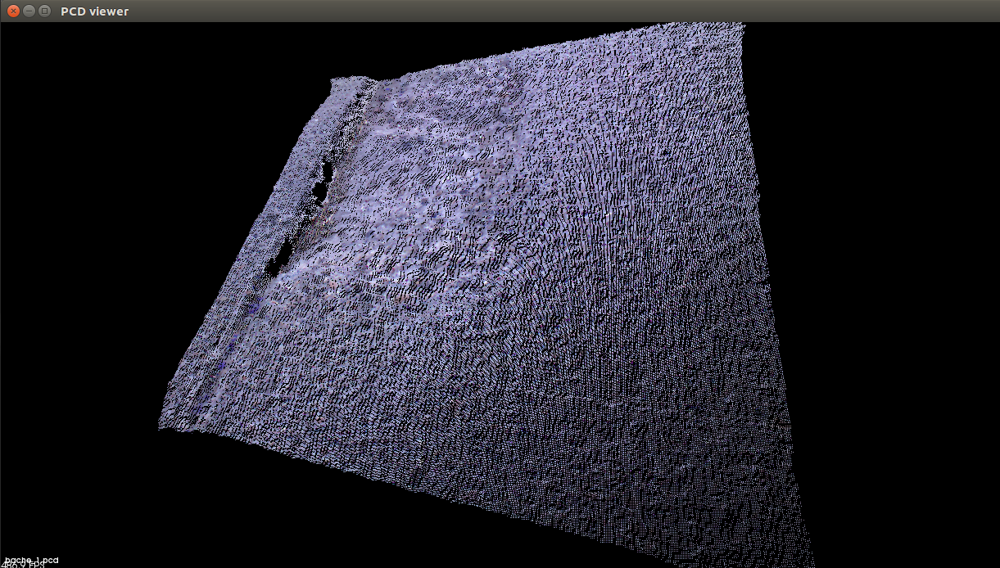

   Ejemplo de visualizador de PCL

Computacion de Bounding Boxes(AABB-OBB)
+++++++++++++++++++++++++++++++++++++++

.. https://en.wikipedia.org/wiki/Minimum_bounding_box
.. http://pointclouds.org/documentation/tutorials/moment_of_inertia.php
.. https://en.wikibooks.org/wiki/Blender_3D:_Noob_to_Pro/Coordinate_Spaces_in_Blender#Global_and_local_coordinates
.. https://en.wikibooks.org/wiki/Blender_3D:_Noob_to_Pro/Coordinate_Spaces_in_Blender#Global_and_local_coordinates
.. http://www.artwork.com/gdsii/gdsfilt/windows/polygon.htm
.. http://www.yaldex.com/games-programming/0672323699_ch08lev1sec10.html

La bounding box mínima (MBB) para el conjunto de puntos que componen un objeto, se considera el rectángulo (o box) formado por las coordenadas mínimas necesarias para contener todos los puntos objeto dentro de ésta y cuya medida (área, volumen o hypervolumen en espacios de más de tres dimensiones) es la mínima. La bounding box de un objeto puede ser computada a través del convex hull, ya que si se dispone de éste, la bounding box mínima para los puntos del objeto es la misma que la bounding box del convex hull. 

.. .. figure:: ../figs/Cap3/ejemplo_bounding_box.png
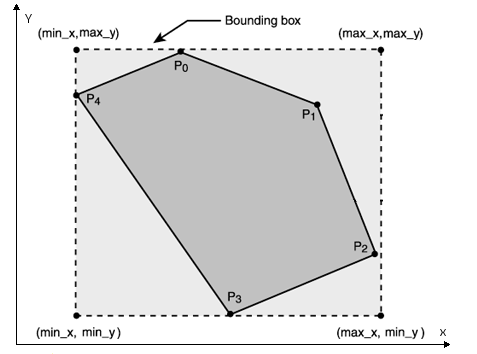

   Ejemplo de conjunto de puntos de un objeto (P0-P4) con su convex hull y el bounding box asociado.

Existen varios tipos de Bounding Box dependiendo del sistema de coordenadas que se considere: Axis Aligned Bounding Box (AABB) y Oriented Bounding Box (OBB). AABB consiste en computar las coordenadas de la caja de manera que los bordes de ésta, sean paralelas a la orientación de los ejes Cartesianos globales en la captura, donde el origen se encuentra en el centro de la escena. Por otro lado, OBB consiste en computar las coordenadas de la caja tomando como referencia un sistema de coordenadas Cartesiano local del objeto, cuya orientación y origen se encuentra definidos en base al centro de los puntos que componen el objeto, de manera que la bounding box se encontrará paralela a los ejes del objeto en sí.

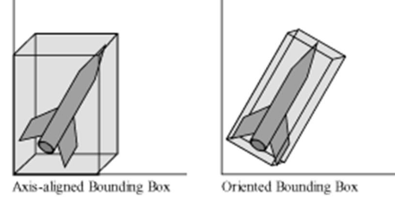

   AABB vs OBB

En PCL este comportamiento se implementa en la clase pcl::MomentOfInertiaEstimation, que a partir de una nube de entrada permite obtener el centro del objeto y los puntos máximos y mínimos en los ejes X,Y,Z de las boxes AABB y OBB. A continuación se muestra un ejemplo de código donde se obtienen las respectivas boxes::

   ...
   // Se instancia el objeto y se envia la nube 'cloud' de entrada inicializada previamente 
   pcl::MomentOfInertiaEstimation <pcl::PointXYZ> feature_extractor;
   feature_extractor.setInputCloud (cloud);
   feature_extractor.compute ();
   
   ...
   // Se definen los puntos máximos y mínimos para AABB y OBB
   pcl::PointXYZ min_point_AABB;
   pcl::PointXYZ max_point_AABB;
   pcl::PointXYZ min_point_OBB;
   pcl::PointXYZ max_point_OBB;
   pcl::PointXYZ position_OBB;

   // Se obtienen los puntos
   feature_extractor.getAABB (min_point_AABB, max_point_AABB);
   feature_extractor.getOBB (min_point_OBB, max_point_OBB, position_OBB, rotational_matrix_OBB);
   
   // Se instancia un visualizador y se agregan los puntos de ambas cajas
   boost::shared_ptr<pcl::visualization::PCLVisualizer> viewer (new pcl::visualization::PCLVisualizer ("3D Viewer")); 

   viewer->addCube (min_point_AABB.x, max_point_AABB.x, min_point_AABB.y, max_point_AABB.y, min_point_AABB.z, max_point_AABB.z, 1.0, 1.0, 0.0, "AABB");
   viewer->addCube (position, quat, max_point_OBB.x - min_point_OBB.x, max_point_OBB.y - min_point_OBB.y, max_point_OBB.z - min_point_OBB.z, "OBB");
   ...

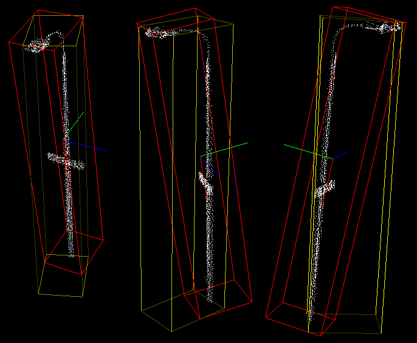

   Ejemplo de poste de luz con AABB en amarillo y OBB en rojo.  

Computación de índices
++++++++++++++++++++++

Algunos de los algoritmos de PCL retornan índices, éstos contienen la posición del punto dentro del vector de puntos que mantiene el objeto PointCloud, sin incluir la información completa de cada punto. Esto permite computar los índices de puntos de interés (o su complemento) que sean relevantes para una operación determinada y, posteriormente, copiarlos a otra nube, reduciendo la cantidad de puntos a procesar. De esta manera, para extraer los índices se emplea la clase pcl::ExtractIndices, que a partir de algún algoritmo aplicado a una PointCloud que proporciona los índices de los puntos filtrados (en una estructura pcl::PointIndices) y la nube de puntos original, permite el filtrado de la información completa de los puntos. Por ejemplo, la segmentación permite obtener los indices de los puntos pertenecientes a un cluster segmentado. A nivel de código fuente la estructura general es la siguiente::

   
   // Objeto para almacenar la nube procesada anteriormente
   pcl::PointCloud<pcl::PointXYZ>::Ptr cloudProcesada(new pcl::PointCloud<pcl::PointXYZ>);
   ...

   // Índices obtenidos
   pcl::PointIndices::Ptr pointIndices(new pcl::PointIndices);

   // Variable para almacenar los puntos extraídos a partir de los índices
   pcl::PointCloud<pcl::PointXYZ>::Ptr nubeExtraida(new pcl::PointCloud<pcl::PointXYZ>);

   pcl::ExtractIndices<pcl::PointXYZ> extract;
   extract.setInputCloud(cloudAll);
   extract.setIndices(pointIndices);
   extract.filter(*cloudExtracted);				
   

Remover valores NaN
+++++++++++++++++++

Durante la captura de nubes de puntos pueden existir inconsistencias en los valores de las coordenadas para determinados puntos debido a problemas de posicionamiento con el sensor o por características de la superficie, estos valores se representan en PCL como NaN. Los valores NaN (Not a Number) son valores numéricos flotantes que no pueden ser representados o que son indefinidos y que, si son utilizados en otros algoritmos de PCL, provocarán un fallo. Por este motivo, los valores NaN deben ser removidos antes de la aplicación de los algoritmos de PCL a una nube de entrada (si el algoritmo en cuestión no ofrece esta funcionalidad), teniendo en cuenta que al eliminar los valores NaN de una nube, esta cambiará su tamaño, por lo que si es necesario que la nube se mantenga organizada será necesario reorganizarla con la cantidad de puntos filtrados. Para realizar esta tarea PCL ofrece la función pcl::removeNaNFromPointCloud() que acepta la nube de entrada, de salida y un mapping (que es un vector de enteros) que permite identificar que punto de la nube original, se corresponde con que punto de la nube filtrada.

# .PCD v0.7 - Point Cloud Data file format
VERSION 0.7
FIELDS x y z rgba
SIZE 4 4 4 4
TYPE F F F U
COUNT 1 1 1 1
WIDTH 640
HEIGHT 480
VIEWPOINT 0 0 0 1 0 0 0
POINTS 307200
DATA ascii
nan nan nan 10135463
nan nan nan 10398635

A continuación se representan las instrucciones básicas para realizar el filtrado de la nube de puntos de entrada::

   //Definición de la nube de puntos
   pcl::PointCloud<pcl::PointXYZ>::Ptr cloud(new pcl::PointCloud<pcl::PointXYZ>);

   //Pasos realizados para leer la nube de puntos de disco
   ...

   //Definición del objeto mapping y aplicación del método para remover NaN
   std::vector<int> mapping;
   pcl::removeNaNFromPointCloud(*cloud, *cloud, mapping);

Descomposición de nubes: KD-Tree y Octree
+++++++++++++++++++++++++++++++++++++++++

.. https://en.wikipedia.org/wiki/K-d_tree
.. http://pointclouds.org/documentation/tutorials/kdtree_search.php
.. http://pointclouds.org/documentation/tutorials/octree.php

.. La descomposición de nubes de puntos consiste en organizar la nube de puntos en una estructura de manera que el filtrado y análisis del entorno de los mismos (búsqueda de vecinos mas cercanos, búsqueda de vecinos en un radio determinado o, el punto más cercano) sea mas eficiente. Para conseguir esto, PCL ofrece dos tipos de estructura: Kd-Tree y Octree. La estructura Kd-Tree es un árbol binario en el que cada nodo es un punto k-dimensional, y donde en cada nivel del árbol se dividen los puntos en una dimensión establecida. Así, en un espacio tridimensional la división comienza por crear el nodo raíz del árbol que divide los puntos en base al eje X en base a un criterio (típicamente la raíz de cada subárbol es el punto medio del conjunto de coordenadas en ese eje), creando un nodo izquierdo que representa a los puntos cuyo valor de X sea menor y un nodo derecho para los valores mayores; Posteriormente, se realiza la división de puntos en el espacio Y para los nodos hijos del nodo raíz empelando el mismo procedimiento y para el espacio Z con los hijos de la división en Y. Al llegar al eje Z, se repite nuevamente todo el proceso para continuar subdividiéndo el espacio hasta que no existan puntos para continuar la división.

La descomposición de nubes de puntos consiste en organizar la nube de puntos en una estructura de manera que el filtrado y análisis del entorno de los mismos (búsqueda de vecinos mas cercanos, búsqueda de vecinos en un radio determinado o, el punto más cercano, etc.) sea mas eficiente. Para conseguir esto, PCL ofrece dos tipos de estructuras: Kd-Tree y Octree. La estructura Kd-Tree es un árbol binario que organiza un conjunto de puntos en un espacio K-dimensional, estando determinada la cantidad de dimensiones por los ejes utilizados para definir las coordenadas de cada punto en la nube. De esta forma, si se emplean nubes de puntos tridimensionales, el árbol kd-tree organizará los puntos por medio de divisiones en los ejes X,Y,Z. En esta estructura, cada nodo representa un punto de la nube y cada nivel del árbol es una separación de puntos en alguna de las dimensiones. Así, en un espacio tridimensional la división comienza por crear el nodo raíz del árbol que divide los puntos respecto al eje X en base a un criterio (típicamente la raíz de cada subárbol es el punto medio del conjunto de coordenadas en ese eje), creando un nodo izquierdo que representa al subárbol de los puntos cuyo valor de X sea menor y un nodo derecho para el subárbol de los valores mayores; Posteriormente, se realiza la división de puntos en el espacio Y para los nodos hijos del nodo raíz empelando el mismo procedimiento y para el espacio Z con los hijos de la división en Y. Al llegar al eje Z, se repite nuevamente todo el proceso para continuar subdividiendo el espacio hasta que no existan puntos para continuar la división.

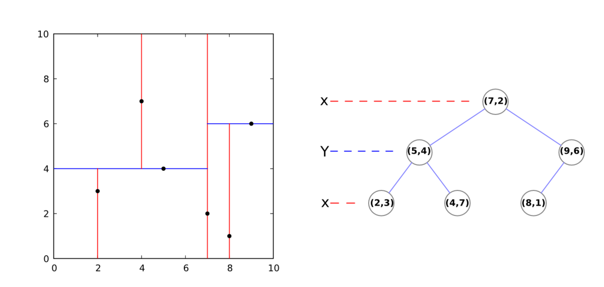

   Ejemplo de división en un espacio 2D, donde los puntos iniciales se encuentran marcados en negro,  las divisiónes en X en rojo y las divisiones en Y en azul. 

En PCL la clase pcl::KdTree implementa este comportamiento para los distintos tipos de puntos y permite realizar la búsqueda por cantidad de vecinos más cercanos (pcl::KdTree::nearestKSearch()) o por radio de búsqueda (pcl::KdTree::radiusSearch()). A continuación, se muestra una porción de código donde se realiza una búsqueda por cantidad de vecinos cercanos a un punto dado::

   // Objeto que almacena la pointcloud
   pcl::PointCloud<pcl::PointXYZ>::Ptr cloud(new pcl::PointCloud<pcl::PointXYZ>);

   // Lectura del archivo .pcd de disco
   if (pcl::io::loadPCDFile<pcl::PointXYZ>(argv[1], *cloud) != 0)
   {
      return -1;
   }

   // Objeto kd-tree que representa a la pointcloud instanciada
   pcl::search::KdTree<pcl::PointXYZ> kdtree;
   kdtree.setInputCloud(cloud);

   // Se define la búsqueda de los 5 vecinos mas cercanos a un punto aleatorio
   pcl::PointXYZ point;
   point.x = 0.0524343;
   point.y = -0.58016;
   point.z = 1.776;
   // Vector para almacenar los índices de los puntos filtrados
   std::vector<int> pointIndices(5);

   // Distancias cuadradas de los vecinos obtenidos hasta el punto aleatorio
   std::vector<float> squaredDistances(5);
   
   // Se realiza la búsqueda y se imprimen resultados
   if (kdtree.nearestKSearch(point, 5, pointIndices, squaredDistances) > 0)
   {
      std::cout << "5 nearest neighbors of the point:" << std::endl;
      for (size_t i = 0; i < pointIndices.size(); ++i)
         std::cout << "\t" << cloud->points[pointIndices[i]].x
                 << " " << cloud->points[pointIndices[i]].y
                 << " " << cloud->points[pointIndices[i]].z
                 << " (squared distance: " << squaredDistances[i] << ")" << std::endl;
   }

.. http://pointclouds.org/documentation/tutorials/octree.php

Por otro lado el Octree es una estructura de datos jerárquica empleada tanto para la búsqueda, como para reducción de la cantidad de puntos (downsampling) o la compresión de nubes de puntos. Un Octree es un árbol en el que cada nodo (pixel 3D o voxel) representa un punto en la nube que se considera el centro de cada voxel y que contiene ocho hijos(o ninguno) que son a su vez los vecinos del punto principal. A diferencia del Kd-Tree donde cada nodo representa una división basándose en las dimensiones, este método realiza una subdivisión por puntos y sus vecinos asociados. Esta estructura se emplea además en motores 3D o en la generación de gráficos tridimensionales.   

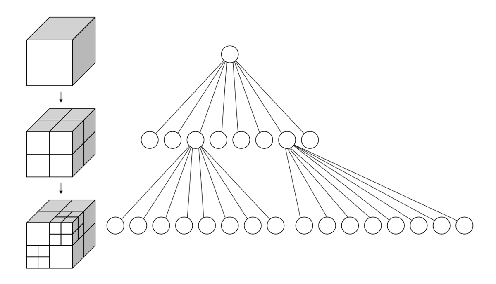
   
   Ejemplo de la organización de un Octree

En PCL el Octree se representa por medio diferentes clases según el tipo de función, encontrándose entre las que se destacan las siguientes:

* pcl::octree::OctreePointCloudSearch para la búsqueda por radio, cantidad de vecinos y dentro de un voxel determinado.
* pcl::io::OctreePointCloudCompression para realizar compresión/descompresión de nubes de puntos.
* pcl::octree::OctreePointCloudChangeDetector para comparar dos nubes de puntos en base a sus Octrees y detectar diferencias, por medio del retorno de índices de puntos que no figuran en una de las nubes.

Estimación de normales
++++++++++++++++++++++

.. https://en.wikipedia.org/wiki/Normal_(geometry)
.. https://www.adelaide.edu.au/mathslearning/bridging/resources/MT3VectorsBook_Feb2013.pdf
.. http://mathworld.wolfram.com/NormalVector.html

Para diferenciar un punto de otro en una nube de puntos, no basta únicamente con su posición, sino que es necesario computar una característica 3D que sea similar para puntos que se encuentran en superficies similares. Para conseguir ésto, PCL ofrece la computación de normales, donde un vector normal *n* de un punto, se define como el vector perpendicular al plano tangente que contiene a ése punto. Estos vectores se emplean para diversas tareas entre las que se destacan:

* La generación de gráficos por computadora tridimensionales, en la detección de la orientación de una fuente de luz y mejorar los efectos visuales en una escena.
* Composición digital, donde se renderizan modelos o imágenes 3D por computadora superponiendo varias imágenes. Las capas renderizadas generadas, contienen información de normales pueden ser modificadas para cambiar la textura de un objeto según la fuente de iluminación.

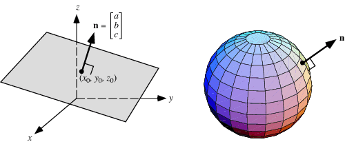

   Ejemplo de vector normal *n*, perpendicular a un punto.

.. http://pointclouds.org/documentation/tutorials/normal_estimation.php
.. http://pointclouds.org/documentation/tutorials/how_features_work.php#id2

Debido a las nubes de puntos proporcionan coordenadas de los puntos que componen la superficie de un objeto, la computación de las normales de éstos, se calcula por medio de la generación de una matriz de vectores y valores propios de cada punto *Pi* (vectores que son invariables a cambios de escala o transformaciones), que es calculada empleando los k vecinos de éste y el centroide de éstos. Los valores de esta matriz se emplean en la técnica de análisis de componentes principales(PCA), que permite obtener las componentes principales con mayor variación, en este caso se obtiene el vector que es más representativo para el punto según sus vecinos más cercanos (vector normal).    
Una vez realizado este cálculo y teniendo los vectores de cada punto, aún es necesario calcular la orientación de las normales, para ésto se utiliza el punto de visión *Vp* para orientar las normales *ni* de todos los puntos, haciendo cumplir siguiente ecuación: 

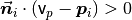

   Fórmula de equivalencia normales

La precisión con que se estimen las normales para una superficie en PCL depende en gran medida de la escala que se utilice para el cálculo, que se establece por medio del radio de búsqueda (pcl::Feature::setRadiusSearch) o de la cantidad de vecinos empleados para la computación de la normal (pcl::Feature::setKSearch). Si se emplea un rango razonablemente bajo, se considerarán menos vecinos para cada punto provocando que exista mayor similitud entre normales de la misma superficie y diferencia entre normales de distintas superficies y, en consecuencia, exista un mayor nivel de detalle las zonas con bordes de los objetos. Por el contrario, si se emplea una escala muy alta, se considerarán más vecinos para la computación de las normales de puntos, provocando que en las regiones límites entre distintas superficies se abarque un mayor rango de vecinos de la zona adyacente, provocando que las normales muestren menor diferencia entre superficies diferentes.

En PCL el cálculo de normales se realiza por medio de la clase pcl::NormalEstimation, que acepta un tipo de punto coordenada y un tipo de punto normal, y puede realizarse para toda la nube completa o, para un subconjunto de puntos, por medio de la utilización de índices. Si se desea realizar la estimación para toda la nube, basta con especificar a la clase de estimación de normales la nube de entrada, el método de búsqueda y el radio de búsqueda o la cantidad de vecinos. A continuación, se muestra un ejemplo de código fuente que realiza la computación de normales::

#include <pcl/point_types.h>
#include <pcl/features/normal_3d.h>

{
  pcl::PointCloud<pcl::PointXYZ>::Ptr cloud (new pcl::PointCloud<pcl::PointXYZ>);

  // Se lee o se crea una nube de puntos
  ...

  // Se instancia la clase de estimación de normales
  pcl::NormalEstimation<pcl::PointXYZ, pcl::Normal> ne;
  ne.setInputCloud (cloud);

  //Se crea una instancia vacía de kd-tree y se pasa al objeto de estimación de normales.

  pcl::search::KdTree<pcl::PointXYZ>::Ptr tree (new pcl::search::KdTree<pcl::PointXYZ> ());
  ne.setSearchMethod (tree);

  // Variable para normales de salida
  pcl::PointCloud<pcl::Normal>::Ptr cloud_normals (new pcl::PointCloud<pcl::Normal>);

  // Se establece el radio de salida en metros
  ne.setRadiusSearch (0.03);

  // El tamaño de las normales tiene que ser el mismo que el de los puntos en la nube de entrada
  ne.compute (*cloud_normals);

}   

Si se desea realizar la computación de las normales de algunos puntos, se debe especificar además la estructura de los índices y asignárselo a pcl::NormalEstimation::

#include <pcl/point_types.h>
#include <pcl/features/normal_3d.h>

{
  pcl::PointCloud<pcl::PointXYZ>::Ptr cloud (new pcl::PointCloud<pcl::PointXYZ>);

  // Se crea el conjunto de índices para ser empleado (10% del total de puntos)
  std::vector<int> indices (floor (cloud->points.size () / 10));
  for (size_t i = 0; indices.size (); ++i) indices[i] = i;

  pcl::NormalEstimation<pcl::PointXYZ, pcl::Normal> ne;
  ne.setInputCloud (cloud);

  // Se pasan los índices
  boost::shared_ptr<std::vector<int> > indicesptr (new std::vector<int> (indices));
  ne.setIndices (indicesptr);

  pcl::search::KdTree<pcl::PointXYZ>::Ptr tree (new pcl::search::KdTree<pcl::PointXYZ> ());
  ne.setSearchMethod (tree);

  // Normales de salida
  pcl::PointCloud<pcl::Normal>::Ptr cloud_normals (new pcl::PointCloud<pcl::Normal>);

  ne.setRadiusSearch (0.03);

  ne.compute (*cloud_normals);

} 

Filtrado de ruido de la nube
++++++++++++++++++++++++++++

Debido a que una captura puede contener valores espurios, debido a baja precisión del sensor, medidas erróneas u falta de puntos en determinadas partes de una nube de puntos, o simplemente es necesario reducir la cantidad de puntos para disminuir el tiempo de computación. Para solucionar ésto, PCL ofrece varios algoritmos de filtrado de nubes de puntos entre los que se encuentran:

* Passthrough Filter
* Conditional Removal
* Outlier Removal

.. http://pointclouds.org/documentation/tutorials/passthrough.php

El algoritmo de Passthrough Filter consiste en remover de la nube aquellos elementos que se encuentran fuera de un rango especificado por el usuario, por lo que este método únicamente requiere especificar el eje de filtrado y el rango sobre ese eje (mínimo y máximo). Este método se realiza por la clase pcl::PassThrough, que requiere el tipo de punto para el filtrado. A continuación, se muestra el proceso de filtrado para una nube existente::

   // Se define la nube cloud para el tipo de punto pcl::PointXYZ 
   ...
   pcl::PassThrough<pcl::PointXYZ> filter;
   filter.setInputCloud(cloud);

   // Se filtran los valores en el eje Z que no se encuentren entre 0-2 mts.
   filter.setFilterFieldName("z");
   filter.setFilterLimits(0.0, 2.0);

   filter.filter(*filteredCloud); 

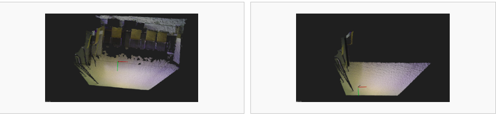

   Ejemplo de nube original a la izquierda y nube filtrada con passthrough en eje Z.

.. http://pointclouds.org/documentation/tutorials/remove_outliers.php

El algoritmo Conditional Removal consiste en crear una o mas condiciones que verifican los valores de los atributos de un punto (tales como las coordenadas sobre un eje) y mantener solo aquellos puntos que cumplen ésta. Para ello, PCL representa las condiciones por clases siendo las condiciones disponibles AND (pcl::ConditionAnd) y OR (pcl::ConditionOr), que por medio del método addComparison() permiten especificar el tipo atributo, el operador de comparación (<,<=,==,>,>=) y el valor de la condición. Finalmente para realizar el filtrado, se crea una instancia de pcl::ConditionalRemoval que recibe las condiciones especificadas y genera la nube de salida. En el siguiente ejemplo se realiza el mismo filtrado que en Passthrough Filter empleando el Conditional Removal::

   pcl::ConditionAnd<pcl::PointXYZ>::Ptr condition(new pcl::ConditionAnd<pcl::PointXYZ>);

   // GT (Greater Than), LT(Less Than)
   condition->addComparison(pcl::FieldComparison<pcl::PointXYZ>::ConstPtr(new pcl::FieldComparison<pcl::PointXYZ>("z", pcl::ComparisonOps::GT, 0.0)));
   condition->addComparison(pcl::FieldComparison<pcl::PointXYZ>::ConstPtr(new pcl::FieldComparison<pcl::PointXYZ>("z", pcl::ComparisonOps::LT, 2.0)));

   // Se filtran los puntos de la nube cloud previamente inicializada,
   // y se guarda el resultado en filteredCloud
   pcl::ConditionalRemoval<pcl::PointXYZ> filter;
   filter.setCondition(condition);
   filter.setInputCloud(cloud);
   filter.filter(*filteredCloud);

Con respecto al algoritmo Outlier Removal, existen dos variantes: Basado en radio y Estadístico. En el método basado en radio se especifica un radio de búsqueda y la cantidad mínima de vecinos que punto debe poseer para no ser considerado como outlier. De esta manera el algoritmo iterará todos los puntos en la nube y  por cada punto verificará que dentro del radio especificado existan al menos la cantidad mínima requerida de vecinos. Este comportamiento se realiza por medio de la clase pcl::RadiusOutlierRemoval.

Por otro lado, el Statistical Outlier Removal itera cada punto en la nube y calcula la distancia media entre el punto y sus vecinos, la cual es comparada con la distancia de una distribución normal Gaussiana con media :math:`{\mu}` y desvío estándar :math:`{\sigma}`, eliminado aquellos puntos que caen fuera del rango de la distribución. Este método se implementa por medio de la clase pcl::StatisticalOutlierRemoval que acepta la nube, la media y el desvío estándar de la distribución de probabilidad. 

Resampling de la nube: Downsampling y Upsampling
++++++++++++++++++++++++++++++++++++++++++++++++

Resampling consiste en modificar la cantidad de puntos en una nube, ya sea aumentando la cantidad de puntos, reconstruyendo la superficie original para que sean suficientes para el análisis (upsampling) o, disminuyéndola sin comprometer significativamente la precisión para que el análisis de la misma sea más eficiente (downsampling). El downsampling en PCL se puede realizar el método de Voxelización o de Uniform Sampling. El método de Voxelización consiste en emplear un conjunto de voxels organizados en una estructura Octree para computar el punto medio del voxel, es decir, aquel punto que es un promedio de las coordenadas de todos los puntos que pertenecen al Voxel Grid. De esta manera, prevalecen solamente aquellos puntos principales que son representativos para cada voxel. PCL implementa este comportamiento por medio de la clase pcl::VoxelGrid, que permite especificar el tamaño de cada voxel (en cm) para cada una de las dimensiones X,Y,Z. En la siguiente porción de código se muestra un ejemplo de voxelización::

   ...
   pcl::VoxelGrid<pcl::PointXYZ> filter;
   filter.setInputCloud(cloud);

   // Se especifica el tamaño del voxel en cada eje
   filter.setLeafSize(0.01f, 0.01f, 0.01f);
   filter.filter(*filteredCloud);
   ...

El método de Uniform Sampling realiza la misma tarea, sin embargo, retorna los índices de los puntos filtrados en lugar del punto y se emplea principalmente como parte del proceso de generación de descriptores::

   pcl::UniformSampling<pcl::PointXYZ> filter;
   filter.setInputCloud(cloud);
   filter.setRadiusSearch(0.01f);
   pcl::PointCloud<int> keypointIndices;
   filter.compute(keypointIndices);

.. https://en.wikipedia.org/wiki/Moving_least_squares
.. https://en.wikipedia.org/wiki/Upsampling
.. http://www.nealen.de/projects/mls/asapmls.pdf

El upsampling en PCL se realiza por medio del método Moving Least Squres(MLS), que es un método empleado para la reconstrucción de una superficie en base a un conjunto de datos de muestra (en este caso puntos). Este método consiste en generar una función continua que representa al conjunto de datos de muestra, empleando los valores de las variables independientes y dependientes para el computo. Para ello, dado un conjunto de muestras *S = { (xi,fi) | f(xi) = fi }*, con *xi, fi* siendo números reales, se computa por cada punto arbitrario *x* el valor mínimo cuadrado ponderado (Mean Least Square) con respecto a cada una de las muestras, produciendo un conjunto de polinomios de grado m *p(xi)*. De todos éstos, se emplea el polinomio que minimice el error mínimo cuadrado para calcular el valor de este punto en la función. 

.. figure:: ../figs/Cap3/formula_MLS_upsampling.png

   Fórmula para el calculo de MLS  

De esta forma, MLS obtiene una función final a partir de un conjunto de funciones locales calculadas en base a los datos de muestra, cuyo valor de precisión es controlado por medio de los pesos :math:`{\theta}`. El método de MLS se implementa en la clase pcl::MovingLeastSquares, que requiere la nube de entrada, un Kd-Tree para estructurar la nube, y un radio de upsampling para generar los nuevos puntos, determinando este valor la cantidad de puntos producidos (si es demasiado grande se generarán menos puntos). 

Algoritmos de segmentación de objetos
"""""""""""""""""""""""""""""""""""""

Segmentación
++++++++++++

La segmentación consiste en dividir una nube de puntos en uno o varios clusters para que puedan ser procesados independientemente (donde cada cluster representa un objeto de interés para ser procesado), lo que en combinación con otras herramientas, permite obtener modelos pertenecientes a objetos individuales en la captura y aislar superficies con distintas formas. PCL ofrece varios métodos alternativos para realizar la segmentación entre los que se encuentran:

* Euclidean Segmentation
* Region Growing Segmentation
* Min-Cut Segmentation 

Euclidean Segmentation, o segmentación Euclidiana, itera cada uno de los puntos de la nube, y por cada uno computa la distancia Euclidiana entre el punto iterado y uno de sus vecinos y, si ésta es menor a un límite (o threshold), significa que ambos pertenecen al mismo cluster, por lo que ambos puntos son marcados como iterados y agregados al mismo cluster. Este proceso continúa por cada uno de los vecinos del punto y luego por los vecinos de éstos, hasta que no existan más puntos que agregar al cluster. Cuando sucede ésto, se crea un nuevo cluster y el proceso se repite con aquellos puntos que no se han agrupado aún en un cluster, hasta iterar todos los puntos en la nube. Este algoritmo se implementa en PCL por medio de la clase pcl::EuclideanClusterExtraction, que acepta como parámetros una nube de puntos de entrada, un tamaño máximo y mínimo para los clusters, un árbol de búsqueda (como Kd-Tree) y un valor de tolerancia para controlar la tolerancia (distancia en cm) para considerar a un punto como perteneciente a un cluster o no; Así, si este valor es pequeño provocará que los objetos en la nube se dividan en varios clusters y, si es demasiado grande para el/los objeto/s que se desean segmentar agrupará todos los puntos de éstos en el mismo cluster.

Este algoritmo posee una variación que se denomina Conditional Euclidean Segmentation, o segmentación Euclidiana condicional, que además de realizar la computación y verificación de distancias, permite que el usuario especifique una condición para cada par de puntos a ser comparados (denominándose *seed* o semilla al punto procesado y *candidate* o candidato al vecino de la semilla que esta siendo iterada). En esta función el usuario recibe una copia de ambos puntos y la distancia cuadrada de éstos y retorna un valor booleano, que en caso de ser verdadero permite que el candidato pueda ser agregado al cluster y falso en caso contrario. Este algoritmo se encuentra implementado en la clase pcl::ConditionalEuclideanClustering, que recibe los mismos parámetros que la función estándar y permite especificar la función de condición por medio del método setConditionFunction().

Region Growing Segmentation, realiza el agrupamiento en clusters en base a una verificación de la suavidad de la superficie, que se determina procesando el ángulo entre las normales y la diferencia de curvaturas entre puntos. Este algoritmo se implementa por medio de la clase pcl::RegionGrowing, que recibe los mismos parámetros de Euclidean Segmentation y adicionalmente emplea la estimación de normales y un valor límite para la curvatura. Este algoritmo tiene una variación conocida como Region Growing RGB, que en lugar de emplear las normales y la curvatura, utiliza los mismos parámetros que Euclidean Segmentation en combinación con el color de la nube. De esta forma, el proceso de segmentación se realiza con una nube con información de color (con puntos pcl::PointXYZRGB o pcl::PointXYZRGBA) y se puede controlar en base a límites de color para generar clusters, tanto entre puntos como entre clusters.

.. https://en.wikipedia.org/wiki/Minimum_cut
.. http://pointclouds.org/documentation/tutorials/min_cut_segmentation.php
.. http://gfx.cs.princeton.edu/pubs/Golovinskiy_2009_MBS/paper_small.pdf

El algoritmo Min-Cut o corte mínimo, se emplea para segmentar una nube de puntos en dos clusters, donde uno pertenece a un objeto cuyas coordenadas se conocen (foreground) y el otro perteneciente a puntos que no forman parte del objeto y se consideran parte del fondo de la escena donde se encuentra posicionado éste (background). Para realizar ésto, el algoritmo genera un grafo en base a la nube de puntos donde cada punto se representa como un nodo del grafo, y adicionalmente agrega al grafo dos vértices globales más denominados sink y source. Los nodos source y sink se encuentran interconectados por medio de aristas a todos los demás puntos de la nube y además cada nodo que representa un punto, se conecta por medio de aristas a sus puntos vecinos más cercanos. Así, el grafo producido por Min-Cut se genera uniendo los nodos que representan puntos de la nube con sus k-vecinos más cercanos (definiéndose *k* por el usuario) y, con los nodos globales sink y source con aristas que contienen un peso, que es calculado de manera diferente según los tipos de nodos que éstas unen. La computación de los pesos de las aristas que conectan distintos tipos de nodos se realiza de la siguiente manera:

*  Primero, se asignan pesos a las aristas que interconectan los nodos que representan los puntos de la nube de puntos (denominados costo de suavidad), cuyo valor depende de la distancia entre éstos y se computa por medio de la fórmula: :math:` smoothCost = e^((-distanciaEntrePtos/\sigma){\gamma})`, donde :math:`{\sigma}` es el espaciado entre los puntos de la nube que depende de la resolución y es establecido por el usuario. De esta forma, mayor será la probabilidad de corte de un borde, cuanto mayor sea la distancia entre puntos en la nube.
*  Luego se establecen las penalidades de foreground y background, donde la penalidad de foreground es el peso que se asigna para las aristas que unen cada punto de la nube con el vértice source (valor definido por el usuario), y la penalidad de background son los pesos de las aristas que unen los puntos de la nube con el vértice sink. Ésta última es un valor calculado en base a la distancia horizontal hacia la ubicación del objeto, por medio de la siguiente fórmula: :math:`{penalidadBackground = distanciaAlCentro/radio}`, donde la distancia al centro del objeto en el plano horizontal es calculada por medio de la ecuación: :math:`{distanciaAlCentro = \sqrt{ (X - CentroX)^2 + (Y - CentroY)^2} }`, donde *X* , *Y* son las coordenadas del punto,  mientras que el radio es un parámetro especificado por el usuario y define el rango fuera del cual, no existen puntos que pertenecezcan al objeto que se esta segmentado (o foreground).

Finalmente, luego de configurar el grafo se realiza la búsqueda del mínimo corte recorriendo los nodos del grafo, considerando tanto las penalidades de background/foreground como el valor de suavidad, al momento de realizar un corte mínimo. Así, cuando el corte mínimo se computa, se logra que los puntos vecinos sean asignados al mismo segmento (empleando el valor de suavidad) y que aquellos puntos que se encuentran débilmente conectados al objeto o, que se encuentran dentro del rango definido por el radio de background, sean asignados al background y no al objeto a segmentar.  

.. http://pointclouds.org/documentation/tutorials/random_sample_consensus.php#random-sample-consensus
.. https://en.wikipedia.org/wiki/Random_sample_consensus

Finalmente, RANSAC (Random Sample Consensus) es un algoritmo de muestreo aleatorio que para un conjunto de datos de entrada con ruido, estima los parámetros que permiten ajustar éstos a un modelo preestablecido. Este algoritmo considera que en la nube de puntos de entrada existen puntos que pueden ser ajustados a un modelo preestablecido con un margen de error especificado  (inliers), y puntos que no se ajustan al modelo de RANSAC(outliers). El funcionamiento de este algoritmo consiste en especificar un tipo de modelo y realizar N iteraciones, donde en cada una:  
   
    1. Se toma un subconjunto de puntos mínimos aleatorios de la nube de entrada ( considerado suficiente para estimar los parámetros del modelo) y, empleando el tipo de modelo especificado, se entrena un modelo para este subconjunto de puntos y se computan los parámetros asociados éste.
    2. A continuación, el algoritmo verifica cuales puntos de la nube de entrada completa son consistentes con el modelo y sus parámetros estimados previamente, empleando una función de costo o función de pérdida específica del modelo (loss function). Los puntos que no se ajusten al modelo instanciado con un margen de error, se consideran outliers, mientras que el resto de puntos que se ajustan al modelo se consideran inliers hipotéticos y forman parte del conjunto de consenso (consensus set).
    3. Se repite de nuevo el paso 1. 

De esta forma, el algoritmo RANSAC se repite una serie de veces hasta que se tengan suficientes inliers como para ser considerada confiable a la estimación. Una ventaja de RANSAC es que es sumamente robusto para estimar los parámetros asociados a un modelo, aún cuando se cuenta con ruido en la muestra. Por otro lado, su desventaja radica en que no existe un límite de tiempo para computar estos parámetros, por lo que si se requiere generar un modelo con pocas iteraciones es posible que la solución obtenida no sea satisfactoria. 

.. figure:: ../figs/Cap3/ejempo_RANSAC.png

   Ejemplo de algoritmo RANSAC. En la figura izquierda se puede observar un conjunto de puntos con outliers para ser ajustado con RANSAC empleando el modelo de línea. Mientras que en la derecha, se puede visualizar los puntos azules considerados por el modelo de línea de RANSAC y los outliers que no se ajustan a este modelo representados en rojo. 

PCL ofrece varios modelos geométricos predefinidos para emplear con RANSAC, entre los que se encuentran: Circulo 2D, Circulo 3D, Cono, Cilindro, Linea, Esfera, Vara(Stick) y Plano.

Algoritmos para generación de descriptores
""""""""""""""""""""""""""""""""""""""""""

.. Organización de features en PCL -->
.. http://pointclouds.org/documentation/tutorials/how_features_work.php
.. https://github.com/PointCloudLibrary/pcl/wiki/Overview-and-Comparison-of-Features
.. http://www.pointclouds.org/assets/icra2013/pcl_features_icra13.pdf

Con respecto a la generación de descriptores, PCL ofrece dos tipos de descriptores: Descriptores locales y descriptores globales. Los descriptores locales, se emplean para describir la geometría alrededor de cada punto, sin considerar la geometría total del objeto del que forma parte ese punto, por lo que cuando se computan éstos, se debe hacer un filtrado previo de los puntos clave del objeto o keypoints que se desean procesar. Estos descriptores se emplean para el reconocimiento de objetos y para la registración (registration), que es una técnica donde se alinean dos nubes de puntos y, por medio de transformaciones lineales, se detecta si existen áreas comunes en ambas nubes de puntos.

Por otro lado, PCL ofrece descriptores globales que describen la geometría de un cluster de puntos que representa un objeto, por lo que para emplear estos descriptores se requiere pre-procesar una nube de puntos, con el fin de aislar el objeto. Estos descriptores se aplican para el reconocimiento de objetos y clasificación, estimación de posición y análisis de geometría (tipo de objeto, forma, etc.). Los descriptores locales que emplean un radio de búsqueda, mayormente pueden ser usados como globales, si se computa un solo punto en el cluster y se modifica el  radio de puntos que se consideran vecinos, para abarcar todos los puntos que componen el objeto. 

Existen varios tipos de descriptores en PCL, cada uno empleando su propia técnica, ya sea empleando los ángulos de las normales o las distancias Euclidianas entre puntos. Sin embargo, con el fin de reducir el tamaño de cada descriptor, todos se organizan en histogramas cuyos rangos de escala se corresponden con la característica que es parte el descriptor (por ejemplo, distancia entre puntos), asociándose cada una de las características del descriptor a un histograma, donde éstos se encuentran divididos en k subdivisiones y, en cada rango del histograma, se representan las ocurrencias de puntos dentro de ese rango. De esta forma, cada algoritmo para la generación de descriptores realiza su propia subdivisión del histograma, dependiendo del rango de valores que sea más representativo en la variable, por lo que éstas se generan dinámicamente y se producen en mayor medida para los valores donde existen mayor cantidad de puntos con esa característica.

.. Ejemplo histograma -->

.. http://citeseerx.ist.psu.edu/viewdoc/download?doi=10.1.1.324.3396&rep=rep1&type=pdf
 
 .. . Con respecto a los baches, se optó por seleccionar aquellos algoritmos que computan features llamadas normales( vectores unidad que son tangentes a un punto en una superficie y perpendiculares al plano en que se encuentra dicho punto).

A continuación, se muestran los descriptores tanto locales como globales, que se ofrecen en PCL junto con el tamaño (en bytes) de los histogramas que componen cada uno:

+---------------------------------------------------------------+------------+-----------+ 
| Descriptor                                                    |     Tipo   | Tamaño    |
+===============================================================+============+===========+ 
| PFH (Point Feature Histogram)                                 |    Local   |    125    |
+---------------------------------------------------------------+------------+-----------+ 
| FPFH (Fast Point Feature Histogram)                           |    Local   |    33     |
+---------------------------------------------------------------+------------+-----------+
| RSD (Radius-Based Surface Descriptor)                         |    Local   |    289    |
+---------------------------------------------------------------+------------+-----------+ 
| 3DSC(3D Shape Context)                                        |    Local   |    1980   |
+---------------------------------------------------------------+------------+-----------+ 
| USC(Unique Shape Context)                                     |    Local   |    1960   |
+---------------------------------------------------------------+------------+-----------+ 
| SHOT(Signatures of Histograms of Orientations)                |    Local   |    352    |
+---------------------------------------------------------------+------------+-----------+ 
| Spin Image                                                    |    Local   |    153    |
+---------------------------------------------------------------+------------+-----------+ 
| RIFT (Rotation-Invariant Feature Histogram)                   |    Local   |    32     |
+---------------------------------------------------------------+------------+-----------+ 
| NARF(Normal Aligned Radial Feature)                           |    Local   |    36     |
+---------------------------------------------------------------+------------+-----------+ 
| RoPs(Rotation Projection Statistics)                          |    Local   |    135    |
+---------------------------------------------------------------+------------+-----------+ 
| VFH(Viewpoint Feature Histogram)                              |    Global  |    308    |
+---------------------------------------------------------------+------------+-----------+ 
| CVFH(Clustered Viewpoint Feature Histogram)                   |    Global  |    308    |
+---------------------------------------------------------------+------------+-----------+ 
| OUR-CVFH(Oriented,Unique and Repeatable CVFH)                 |    Global  |    308    |
+---------------------------------------------------------------+------------+-----------+ 
| ESF(Ensamble Shape Of Functions)                              |    Global  |    640    |
+---------------------------------------------------------------+------------+-----------+ 
| GFPFH(Global Fast Point Feature Histogram)                    |    Global  |    16     |
+---------------------------------------------------------------+------------+-----------+ 
| GRSD(Global Radius-Based Surface Descriptor)                  |    Global  |    21     |
+---------------------------------------------------------------+------------+-----------+ 

En el siguiente capítulo, se expondrá en detalle el funcionamiento de los descriptores que fueron seleccionados para ser empleados en el clasificador de tipos de fallas en la presente tesina.

