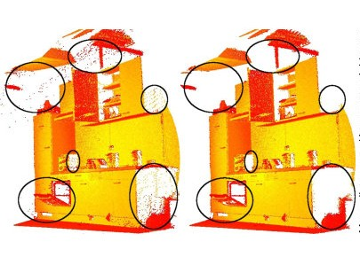
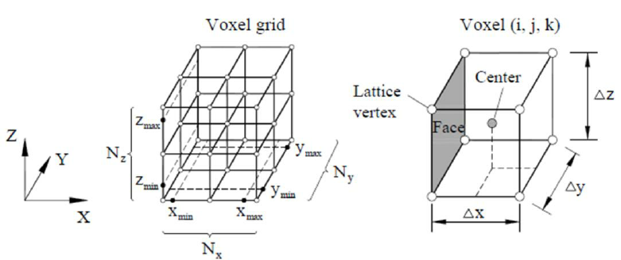
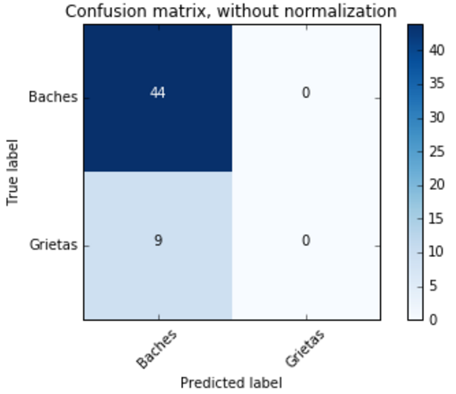
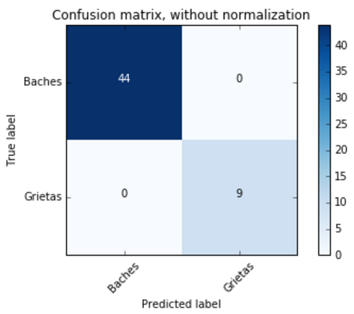
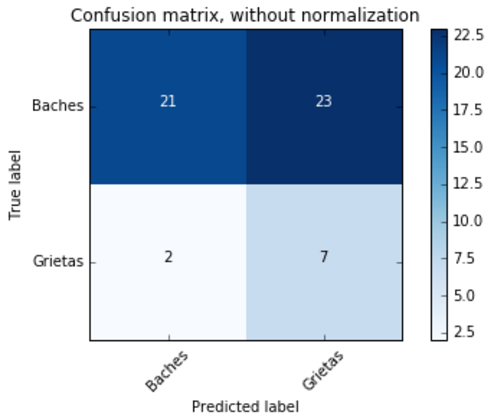

Capítulo 4.Técnicas de reconocimiento y procesamiento de fallas
===============================================================

¿Qué es Machine Learning(ML)?
-----------------------------

.. TODO: Concepto de machine learning, entrenamiento supervisado vs no supervisado.Clasificacion y regresion.
.. TODO: Usos y aplicaciones de ML
.. TODO: Etapa de preprocesamiento de datos
.. TODO: Metricas empleadas en cada uno de los metodos para la clasificación

Mecanismos para Machine Learning(ML)
------------------------------------

Maquinas de sporte de Vectores(SVM)
+++++++++++++++++++++++++++++++++++

.. TODO: Completar!!!

Redes Neuronales(NN)
++++++++++++++++++++

.. TODO: Completar!!!

Árboles de decisión(Tree)
+++++++++++++++++++++++++

.. TODO: Completar!!!

Selección de features para ML en PCL
------------------------------------

.. TODO: ELIMINAR DE ESTE PARRAFO LA DESCRIPCIÓN DE LOS TIPOS DE DESCRIPTORES PCL,YA QUE VA EN CAP3.

Inicialmente se investigó si PCL ofrecía funciones para obtener features de cada punto, de manera que se conozca información respecto de la geometría alrededor de un punto a través del procesamiento de sus vecinos, y se averiguó que PCL ofrecía una variedad de algoritmos que permiten computar "descriptores" que estan pensados para ser empleados en el reconocimiento de objetos 3D dentro de una captura. PCL ofrece dos tipos de descriptores: Descriptores locales que se emplean para describir la geometría alrededor de cada punto, sin considerar la geometría total del objeto que cada punto compone, por lo que cuando se emplean estos descriptores se deben seleccionar los puntos clave del objeto o keypoints que se desean procesar. Estos descriptores se emplean para el reconocimiento de objetos y para la registración(registration), que consiste en alinear dos nubes de puntos y por medio de transformaciones lineales, detectar si existen áreas comunes en ambas nubes de puntos.
Por otro lado, PCL ofrece descriptores globales que describen la geometría de un cluster de puntos que representa un objeto, por lo que para emplear estos descriptores se requiere preprocesar una nube de puntos, con el fin de aislar el objeto. Estos descriptores se aplican para el reoconocimiento de objetos y clasificación, estimación de posición y análisis de geometría (tipo de objeto, forma, etc.). Los descriptores locales que emplean un radio de busqueda, mayormente pueden ser usados como globales, si se computa un solo punto en el cluster y se modifica el radio de busqueda de puntos vecinos, de manera que se abarquen todos los puntos que componen el objeto.

Con respecto a la elección de features para ML, se seleccionó un subconjunto del rango completo de descriptores acorde a las capacidades de computo disponibles y a las características de curvatura y profundidad que son propias de fallas tipo bache y grieta. Con respecto a los baches, se optó por seleccionar aquellos algoritmos que computan features llamadas normales( vectores unidad que son tangentes a un punto en una superficie y perpendiculares al plano en que se encuentra dicho punto).

Debido a que las grietas recolectadas poseen una diversidad de profundidades y algunas de estas no pueden ser detectadas por el sensor, se decidió realizar una 
subdivisión en dos grupos: Aquellas que poseen profunidad y, por lo tanto pueden procesarse con las normales, y aquellas que no poseen una profundidad suficiente como para ser detectadas a traves de normales y, deben ser detectadas empleando algún mecanismo que utilice la diferencia de color entre la región interior y el resto del pavimento. Teniendo ésto en cuenta, se filtraron los siguientes algoritmos:

* Algoritmos que hacen uso de las normales de los puntos de la captura:

    - Fast Point Feature Histogram(FPFH)(Local)
    - ViewPoint Feature Histogram(VFH)(Local)
    - Global Radious-based Surface Descriptor(GRSD)(Global)
    - Ensamble Shape of Functions(ESF)(Global)

* Algoritmos que emplean el color RGB en los puntos de la captura:

    - Rotation Invariant Feature Transform(RIFT)(Local)
      

FPFH
++++
.. TODO: PONER EXPLIACIÓN DE ALGORITMO ACÁ!

VFH
+++
.. TODO: PONER EXPLIACIÓN DE ALGORITMO ACÁ!

ESF
+++
.. TODO: PONER EXPLIACIÓN DE ALGORITMO ACÁ!

GRSD
++++

.. TODO: PONER EXPLIACIÓN DE ALGORITMO ACÁ!

Metodología de preprocesado de muestras (Pipeline de Cropeado)
--------------------------------------------------------------

Debido a la cantidad numerosa de puntos que se encuentran en una captura realizada por el sensor (aproximadamente 300.000 puntos) y, a que se deseaba abstraer solo aquellas caracaterísticas propias de cada tipo de falla, se procedió a aplicar una serie de algoritmos como parte del preprocesado de datos en machine learning o Pipeline de Cropeado, con el fin de reducir la cantidad de puntos de cada muestra y de sólo calcular el descriptor con los puntos principales de una falla.Este Pipleline de cropeado, se compone de los siguientes pasos:

1 - Eliminación de ruido con Statistical Removal: Debido a que la densidad de puntos de una captura puede variar, bajo diversas condiciones tales como: La cantidad de luz solar presente o la posición del sensor con respecto al pavimento, es necesario eliminar para cada captura aquellos valores extremos o outliers, que pueden interferir con la computación features de la muestra. Para ello, PCL ofrece un algoritmo de filtrado denominado Statistical Outlier Removal, el cual para cada punto en la nube de entrada computa la distancia media de éste hacia todos sus vecinos, y asumiendo que las distancias siguen una distribución estadística Gaussiana con una media y desvío estándar, elimina de la nube aquellos puntos cuyas distancias esten fuera del intervalo definido por la media y el desvío estándar de la distribución.
|

   Izquieda: Ejemplo de nube de puntos sin el filtro Statistical Outlier Removal. Derecha: Ejemplo de nube de puntos con el filtro de Statistical Outlier Removal.

2 - Downsampling con Voxel Grid(Extracción de Keypoints): Se conoce con el nombre de vóxel a un conjunto de puntos que forman una mínima unidad cubica (grilla en 3D) de un objeto tridimensional, de la misma forma que un pixel es la mínima unidad en una imagen en 2D. El algoritmo de Voxel Grid en PCL, permite reducir la cantidad de elementos de una nube, realizando una división de una nube de puntos en voxels, y computando en base a éstos el centroide (centro del voxel grid) que se tomará como el punto que representa al resto de los puntos en el voxel grid. Estos puntos se denominan keypoints o puntos de interés y son aquellos  puntos principales que aportan mayor información respecto de la estructura del pavimento a la SVM. Éstos se caracterizan por ser:

* Estables con respecto a interferencias locales y globales en el dominio de la imagen, como variaciones de iluminación y brillo.
* Distintivos para la caracterización efectiva de una superficie, y ricos en contenido en términos de color y textura.
* Tienen una posición claramente definida y se pueden obtener repetidamente con respecto a ruido y variaciones en el punto de visión.
* No es afectado por variaciones de escala, por lo que son ideales para procesamiento en tiempo real como también procesamiento en distintas escalas. 

   Estructura de un voxel y voxel grid en 3D

3 - Segmentación con algoritmo de Planar Segmentation: La segmentación en PCL consiste en dividir una nube de puntos de entrada en varios clusters, donde cada cluster representa un objeto de la captura, que puede ser procesado independientemente. El algoritmo empleado  para la segmentación en PCL fue RANSAC (Random Sample Consensus), este algoritmo considera que en la nube de puntos de entrada existen puntos que pueden ser ajustados al modelo,con un margen de error especificado (inliers), y puntos que no se ajustan al modelo de RANSAC(outliers). Este algoritmo es una algortimo no determinístico, y consiste en realizar N iteraciones, donde en cada una:  
	
		1. Se toma un subconjunto de puntos aleatorios de la nube de entrada y partiendo de un modelo establecido y, utilizando los puntos empleados como muestra, se realiza la computación de parámetros del modelo.
    2. A continuación, el algoritmo verifica cuales puntos del la nube de entrada completa son consistentes con el modelo generado, particularmente con los parámetros tomados como muestra en el paso anterior, empleando una función de costo o función de pérdida(loss function). Los puntos que no se ajusten al modelo instanciado con un margen de error se consideran outliers, mientras que el resto de puntos que se ajustan al modelo se consideran inliers, y forman parte del conjunto de consenso(consensus set).
    3. Se repite de nuevo el paso 1. 

De esta forma, el algoritmo RANSAC se repite una serie de veces hasta que se tengan suficientes inliners como para ser considerada confiable la estimación. PCL ofrece varios modelos geométricos predefinidos para emplear con RANSAC, entre los que se encuentran: Circulo 2D, Circulo 3D, Cono, Cilindro, Linea, Esfera, Vara(Stick) y Plano. Debido a la características geormétrica de los senderos viales y de las fallas, se empleó para este paso RANSAC en combinación con el modelo de plano.  

.. TODO: COMPLETAR ESTA PARTE!!!

4 - Calculo de curvaturas principales (Principal Curvatures Estimation): Una vez realizada la segmentación, se realiza el cálculo de curvaturas para cada uno de los clusters aislados de manera que se filtren solo aquellos que se ubican en un valor dentro del rango de las fallas. PCL ofrece un algoritmo denominado Principal Curvatures Estimation (PCE) donde ...

.. 4 - Filtrado de puntos con Statistical Removal luego de segmentación: Debido a que la segmentación puede producir en la práctica valores espurios, se aplica nuevamente Statistical Outliers Removal con el fin de eliminar valores extremos que puedan haber permanecido en la muestra.

Metodología para el procesamiento de muestras con ML
----------------------------------------------------

Dado que PCL ofrece facilidades para emplear el mecanismo de SVM a través de la librería libsvm (implementada en C y con bindings a Python y compatibilidad con Scikit Learn), se optó por seleccionar este mecanismo en combinación con los descriptores producidos por los algoritmos de ML seleccionados, para las pruebas de clasificación de fallas (detalladas en la sección vitácora de pruebas). La metodología de trabajo para el procesamiento de muestras se dividió en dos fases:

* La fase de preparación del modelo, donde se debió realizar la conversión del descriptor de PCL y las características de la falla a un formato compatible con libsvm, el entrenamiento del modelo con dichos datos y el almacenamiento de éste para su posterior uso en la clasificación. Durante esta etapa, se realiza el entrenamiento de un modelo por cada tipo de descriptor probado. 
* La fase de clasificación de muestras, donde se realiza el aislamiento de la muestra empleando el pipeline de cropeado y se emplea el modelo entrenado previamente para un descriptor para clasificar la muestra aislada previamente.        

Con respecto a la fase de preparación del modelo, los pasos específicos para generar cada moledo en base un descriptor consistieron en los siguientes: 

1. Aplicar el pipeline de cropeado para cada muestra
2. Computación de descriptor (ESF | FPFH | VFH | GRSD | RIFT)
3. Extracción de features (valores del histograma) del descriptor seleccionado 
4. Almacenamiento de las feautes en formato svmlight en archivo de training
5. Entrenamiento y almacenamiento del modelo entrenado con archivo de training
   

Luego de aplicar el pipeline de cropeado y computarse los descriptores de las muestras, se procede a realizar la conversión de las muestras a formato svmlight. Para la clasificación de muestras con svmlight, el formato consiste en especificar cada muestra como una combinación de un numero que especifica la clase a la que petenece la misma separado por un espacio en blanco <SPACE> de sus features <FEATURE_N> con sus respectivos valores <VALOR> y, separada de otras muestras por caracteres de nueva linea <NEW_LINE>:

<LABEL> <FEATURE_1>:<VALOR> <FEATURE_2>:<VALOR> ... <FEATURE_N>:<VALOR><NEW_LINE>
<LABEL> <FEATURE_1>:<VALOR> <FEATURE_2>:<VALOR> ... <FEATURE_N>:<VALOR><NEW_LINE>
"..."

Para el modo de clasificación, la clase a la que la muestra petenece se especifica como un valor positivo (1) si la muestra pertenece a la clase del tipo de elementos que se busca clasificar o, negativo (-1) si ésta no petenece a la clase del tipo de elementos que se desean clasificar. Los features se especifican como una sucesión de valores numéricos que representan las características propias de cada muestra, y que varía según el tamaño del histograma del descriptor que se emplee. Con el fin de realizar la conversión, se empleo un script de generación de muestras que por medio de un archivo de configuración (.cfg), genera los descriptores para cada muestra y lo almacena en un archivo de testing o training según se haya especificado.

Una vez generados ambos archivos de training y testing, se procede a entrenar el modelo empleando el archivo de training, utilizando una de las utilidades provistas por lightsvm (svm-train), que permite generar un modelo de salida para distintos tipos de kernel y distintos tipos de SVM según la tarea para la que se emplee la misma(regresión o clasificación). Debido a que se debe realizar una división de muestras entre clases preestablecidas, se empleó una SVM para clasificación de muestras (SVC) y  debido a que el kernel que mejor precisión brindo fue Linear, éste fue empelado para generar el modelo, en combinación con distintos descriptores.         

Con respecto a la etapa de clasificación, los pasos a seguir fueron los siguientes:

1. Aplicación del pipeline de cropeado a una muestra individual
2. Lectura del modelo entrenado desde disco
3. Computación de las dimensiones de la falla
4. Generación del descriptor final, combinando el descriptor PCL y las dimensiones de la falla
5. Conversión del descriptor final a formato svmlight 
6. Clasificación de la muestra (bache o grieta) empleando el descriptor final
7. Almacenamiento en formato json de las propiedades de la falla
8. Lectura y muestra de las propiedades obtenidas desde la aplicación web

Luego de obtener los clusters válidos desde el pipeline de cropeado, se procede generar el descriptor final computando el descriptor seleccionado en PCL y a calcular las dimensiones (alto-ancho y profundidad para baches y largo-grosor y profundidad para las grietas) en los ejes X,Y y Z por medio de la OBB mínima que contiene a la falla. De esta forma, el descriptor final para cada cluster se compone del descriptor de PCL sumado a la diferencia entre alto y ancho y, posteriormente se adapta al formato que es utilizado por la SVC. 

Una vez obtenida la muestra, se levanta el modelo entrenado desde disco, y se le asigna la muestra para su clasificación, obteniendo el tipo de ésta, el cual, se almacena junto con las dimesiones de la falla según corresponda y el nombre del cluster(generado en base al nombre de la muestra) en formato json. Éste, posteriormente es leído por la aplicación web, que mostrará dicha información en una sección a parte, donde se visualizan las propiedades de la falla. 

Vitácora de pruebas para clasificación
--------------------------------------

Como primera medida, se  procedió a realizar el cálculo de la cantidad de muestras que se dedicarán para traning y testing del total de las muestras que se capturaron, siendo éste de 1000 muestras entre baches y grietas. Se decidió seleccionar un 76,75% de las muestras para training (766) y el 33% para testing (234). Una vez hecha la división, se decidió que se aplicaría un Pipeline de Cropeado que consistirá de varios pasos que abarcan desde la limpieza y asilamiento de la muestra hasta la clasificación, con el fin de disgregar el tipo de falla del plano en el que ésta se encuentra y obtener sólo features inherentes a la falla.

Con respecto a la computación de features de baches y grietas, se optó por investigar cuales de los descriptores de PCL se enfocaban en capturar las diferencias entre distintos tipos formas en superficies semejantes a planos, y debido al tamaño promedio de las nubes de puntos capturadas por el sensor, se seleccionaron aquellos que se definían por un histograma cuyas dimensiones no eran de una magnitud que prolongue el tiempo de procesamiento de manera excesiva.

Una vez aisladas todas las muestras de training, se comenzó con las pruebas de clasificación que consisten generar los descriptores FPFH del conjunto de training que emplea la SVM, tomando para este conjunto, como muestras positivas los baches y como muestras negativas las grietas, con el fin de intentar clasificar sólo entre baches y grietas. Una vez entrenada, la SVM se probó con diversos conjuntos de entrenamiento: Un conejo, un bache, una grieta y un conjunto de muestras mixto (que consistía de 7 baches y 28 elementos que no son baches). El resultado de esta prueba fue negativo, debido a que la muestra de bache no fue reconocida como tal, la del conejo resultó positiva y la del conjunto de training mixto proporcionó resultados positivos para muestras que no eran baches. Posteriormente, se aplicó la misma prueba para el descriptor VFH y GRSD, obteniéndose resultados positivos para muestras que no eran baches y negativos para baches, logrando un accuracy considerablemente inferior al esperado. Luego, se testeó escalando los valores de las features con el mismo dataset, la misma SVM y no se consiguió un aumento de precisión, para los 3 descriptores que emplean normales (FPFH,GRSD,VFH).

Dado que las diferencias entre los descriptores de los distintos tipos de muestra no eran significativas, se realizó una comparación gráfica de los descriptores pertenecientes al mismo conjunto de muestras, observando que el descriptor GRSD contenía mayor diferencia entre distintos tipos de muestra, por lo que se continuó experimentando solamente con este descriptor y se procedió a cambiar el enfoque, distinguiendo baches de planos y por otro lado, grietas y planos, necesitando clasificadores independientes. Con esta aproximación, la precisión aumentó considerablemente. 

Dada la necesidad de utilizar dos clasificadores diferentes por cada clase de muestra, se hizo un análisis de los valores de las curvaturas (por medio del algoritmo de PCL Principal Curvatures Estimation) máximos y mínimos promedio por por cada muestra, con el objetivo de encontrar un parámetro que, sumado al descriptor GRSD, permitiera la diferenciación entre ambos tipos de muestra empleando un único clasificador, y se pudo observar que el rango de curvatura promedio de las grietas estaba contenida dentro del rango de los baches, por lo que los baches contenían valores de curvatura mayores en general. Por esta razón, se decidió emplear el valor de curvatura para mejorar el segmentador y aislar sólo aquellas capturas cuya curvatura promedio se aproxime a la de un bache/grieta.

Luego se agregaron las features de curvatura máxima y mínima promedio de cada muestra al descriptor GRSD, y se entrenó una SVM con capacidad para multiclase (multi labels), dividiendo las muestras utilizadas entre 3 diferentes clases: Baches, Grietas y Planos (utilizados solamente para este experimento). Se confeccionó el conjunto de training final con baches con histogramas GRSD similares, grietas y planos cropeados, (empleando como parametros para un kernel RBF gamma -g 0.0008 y un costo -c 1) obteniendo una precisión del 55% con un subconjunto de muestras del set de testing, aisladas con el segmentador mejorado, por lo que se observó que muchos de los baches se clasificaron como grietas, distinguiéndose así éstos de los planos, pero no de las grietas. Como la precisión obtenida con GRSD resultó ser muy baja, adicionalmente se probó con el descriptor local FPFH que calcula un histograma por punto, agregando los valores de curvatura y, al probarlo con las muestras de testing anteriores, se logró una precisión del 56,47%, observando que el descriptor en combinación con la curvatura, no mejoraba satisfactoriamente la precisión.

Debido a esto, se decidió utiizar otro descriptor global conocido como Ensemble of Shape Functions (ESF) en una SVM multiclase, alcanzándose una precisión del 54.4444% empleando el mismo set de testing, pudiendo conseguir que el clasificador distinguiera las grietas y baches de los planos, pero sin diferenciar baches de grietas, clasificando el resto de las muestras como grietas cuando en realidad eran baches.

Otra prueba realizada, consistió en computar y analizar el área y volumen de cada muestra de training, ya que si bien estos valores mostraban una diferencia inferior al feature de curvaturas, no era lo suficientemente ínfima para no lograr diferenciar baches y grietas.  Al agregar estas características al descriptor GRSD, con SVM con kernel Linear se obtuvo una precisión del 52.94% con el set de testing de baches y grietas, sin incluir planos. Además, se incluyeron aquellos atributos que son referentes a las dimensiones de las grietas y baches de training: ancho, alto, profundidad y volumen, y con éstos se realizó una comparación con el fin de obtener valores que permitieran diferenciar entre baches y grietas. Así, se optó por emplear el descriptor GRSD con la diferencia en valor absoluto de ancho y alto de las fallas, clasificando por este límite a los baches que tienen diferencia | alto - ancho | > 40 como grietas y, los que tienen menor diferencia como baches. De esta forma, se reclasificaron las muestras según este valor y se realizaron las siguientes pruebas con el subconjunto de testing seleccionado obteniendo como resultado:

- Al agregar los valores de alto, profundidad y ancho, con el descriptor GRSD se obtuvo un accuracy de 79.8%.

- Al agregar al GRSD la diferencia entre ancho y alto al descriptor GRSD se logró un accuracy de 100%.
  
- Agregando volumen y profundidad al descriptor GRSD con la diferencia entre ancho y alto, se redujo el accuracy al 75%.

- Al agregar al GRSD la diferencia entre ancho y alto y testeando únicamente con el descritpor GRSD, se logró un accuracy de 75% kernel Linear y 87.5 con kernel RBF (con costo -c 2 y gamma -g 0.00000002).

Ya que al analizar la diferencia entre alto-ancho en el dataset de training de baches y grietas ésta era similar entre el mismo tipo de muestra, por lo que existían muestras (baches y grietas) que poseían una relación similar entre alto-ancho, se realizó una reclasificación de baches y grietas según esta característica. Luego al probar nuevamente la SVM entrenada con el subconjunto de testing incluyendo solamente los valores del descriptor GRSD y la diferencia entre alto-ancho, se consiguió una precisión del 87.5% con kernel RBF y un 100% con kernel Linear.

Al observar que la precisión incrementó reclasificando el dataset de training, se aplicó el mismo procedimiento para el dataset de testing completo y debido a que el ancho y alto calculados se basan en valores máximos y mínimos que son brindados el mecanismo Oriented Bounding Box de PCL en los ejes X-Y, el cual se ajusta y se orienta al tamaño de la muestra, se eliminaron aquellas muestras que contenían outliers que introducían ruido en el cálculo de esta diferencia, filtrando con estos parámetros de un total de 1000 muestras, 806 muestras (753 para training y 53 para testing). Al analizar las estadísticas de dimensiones del dataset de fallas de training, se seleccionó un límite de diferencia entre alto y ancho para divirlas según el tipo (grieta o bache) de 0.49, ya que las grietas contenían una longitud considerablemente mayor al grosor, situación que no ocurría en baches. Al ejecutar nuevamente las pruebas con dataset de training y testing divididos por este límite, se obtuvo 89%  de accuracy con kernel Linear y 71% con kernel RBF (con gamma 0.0000002 y costo C 1500) empleando un cross validation de 5 iteraciones con GRSD. Nuevamente se procedió a experimentar con la diferencia alto-ancho, cambiando únicamente el descriptor con ESF y FPFH, obteniendo para los mismos parámetros y la misma cantidad de iteraciones los siguientes resultados:

* Con FPFH 63% para un kernel Linear y 60% para un kernel RBF.
* Con ESF 98% para un kernel Linear y 54% para un kernel RBF.
 

Finalmente, se realizó una comparación de las métricas de clasificación respecto de los distintos descriptores para la división original de muestras(53 en total), con el fin de constrastar la efectividad de clasificación de éstos y comprobar la superioridad de ESF respecto al resto. Para ello, se calcularon los valores de F1-Score y Recall para ambas clases y la matriz de confusión para exponer la cantidad de elementos efectivamente asignados a cada clase. Los valores de F1-Score y Recall se pueden observar a continuación: 

.. TODO: REALIZAR UN CUADRO COMPARATIVO PARA KERNEL LINEAR Y KERNEL RBF DEL CONJUNTO INICIAL DE TRAIN/TEST

Kernel Linear -->

+------------+------------+-------------------------------+
| Tipo de muestra  | Precision   | Recall  |  F1-Score    |
+============+============+===============================+
| Baches           |  1.0        | 1.0     |  1.0         |   
+------------+------------+-------------------------------+
| Grietas          |  1.0        | 1.0     | 1.0          |
+------------+------------+-------------------------------+
| avg/total        |  1.0        | 1.0     | 1.0          |
+------------+------------+-------------------------------+

*Métricas para descriptor ESF con Kernel Linear*

+------------+------------+---------------------------------+ 
| Tipo de muestra  | Precision   | Recall  |  F1-Score      |
+============+============+=================================+ 
| Baches           |  0.91        | 0.48     |  0.63        |   
+------------+------------+---------------------------------+ 
| Grietas          |  0.23        | 0.78     | 0.36         |
+------------+------------+---------------------------------+ 
| avg/total        |  0.80        | 0.53     | 0.58         |
+------------+------------+---------------------------------+ 

*Métricas para descriptor FPFH con Kernel Linear*

+------------+------------+---------------------------------+ 
| Tipo de muestra  | Precision   | Recall  |  F1-Score      |
+============+============+=================================+ 
| Baches           |  0.83        | 1      |  0.91          |   
+------------+------------+---------------------------------+ 
| Grietas          |  0.23        | 0.78   |  0.36          |
+------------+------------+---------------------------------+ 
| avg/total        |  0.80        | 0.53   | 0.58           |
+------------+------------+---------------------------------+ 

*Métricas para descriptor GRSD con Kernel Linear*

La matriz de confusión para cada uno de los descriptores empleados fue la siguiente:

   Matriz de confusión de SVM con descriptor GRSD

   Matriz de confusión de SVM con descriptor ESF

   Matriz de confusión de SVM con descriptor FPFH

