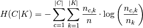

Capítulo 4.Técnicas de reconocimiento y procesamiento de fallas
===============================================================

.. Header H3 -->
¿Qué es Machine Learning(ML)?
-----------------------------

.. TODO: Concepto de machine learning, entrenamiento supervisado vs no supervisado.Clasificacion y regresion.
.. TODO: Usos y aplicaciones de ML
.. TODO: Etapa de pre-procesamiento de datos
.. TODO: Metricas empleadas en cada uno de los metodos para la clasificación

La Inteligencia Artificial(IA) es una disciplina que abarca todos aquellos mecanismos( árboles de decisión, redes neuronales, etc.) que posibilitan a las computadoras imitar la inteligencia humana con el fin de realizar tareas tales como: la toma de decisiones, resolver problemas y el aprendizaje; Considerándose un comportamiento inteligente, a aquél que involucra percibir o deducir información de un contexto y almacenarla en forma de conocimiento, de manera que pueda ser aplicado en futuras situaciones o contextos. Así, Machine Learning (ML) es una rama dentro de IA en la que se emplean mecanismos que se basan en identificar patrones en un conjunto de datos, para generar conocimiento de estas relaciones que puede ser aplicado en futuras predicciones, mientras que Deep Learning es un subconjunto de algoritmos de ML, donde el aprendizaje se realiza por medio de modelos con sucesivas capas que representan el problema, generados automáticamente por medio de la exposición a datos de entrada, que permiten que una máquina aprenda conceptos complicados a través de su descomposición en conceptos más simples. Estas representaciones en Deep Learning se generan por medio de modelos denominados Redes Neuronales expuestas a enormes cantidades de datos, y cuyo funcionamiento se inspira en el funcionamiento del cerebro humano. 

.. figure:: ../figs/Cap4/Diferencia_AI_ML_DL.jpg
   :scale: 60%

   Comparación de AI, ML y Deep Learning

.. TODO: PONER EL FLUJO DE TRABAJO DE ML -->
..  https://livebook.manning.com/#!/book/real-world-machine-learning/chapter-1/104

De esta forma, ML se diferencia del paradigma de programación clásico donde un equipo de desarrollo programa instrucciones que procesan datos y se generan salidas en base a estructuras predefinidas, en que para esta metodología solamente se ingresan datos (y opcionalmente sus respuestas),y se obtienen reglas de salida que pueden ser aplicadas a nuevos datos para realizar predicciones. Por lo tanto en ML, se considera que dado un programa cuyo rendimiento en la predicción sobre un conjunto de datos (o dataset)  se encuentra medido a través de alguna métrica (que indica que tan precisas son sus predicciones sobre ese conjunto de datos), éste aprende de la experiencia si dicho  rendimiento mejora al adquirir más experiencia.

   Paradigma de ML vs paradigma de programación tradicional.

Flujo de trabajo en ML
^^^^^^^^^^^^^^^^^^^^^^

Así, el flujo de trabajo en ML para la generación y prueba de un modelo de predicción se puede subdividir en las siguientes fases:

1. Pre-procesamiento de datos(feature extraction). 
2. Etapa de entrenamiento del modelo (training).
3. Evaluación y optimización del modelo.
4. Etapa de validación (testing).
   
.. TODO: TRADUCIR ESTA IMAGEN DE FLUJO DE TRABAJO

.. figure:: ../figs/Cap4/workflow_ML.png
   :scale: 60%

   Flujo de trabajo general en ML

Debido a que los datos en el mundo real frecuentemente no son aceptables para ser procesados por un algoritmo de ML, dado que contienen valores incorrectos, erróneos o nombres escritos de manera distinta aunque se refieren a la misma entidad, y dado los algoritmos de ML tienen como finalidad descubrir asociaciones y relaciones en un conjunto de datos de entrenamiento históricos (training dataset) para generar un modelo de predicción,  el primer paso para lograr ésto, consiste en realizar el pre-procesado de los datos de manera que se puedan producir datos de alta calidad, ruido leve y correlaciones fácilmente deducibles que permitan generar un modelo predictivo de alta fidelidad. De esta manera, el pre-procesamiento involucra aplicar técnicas y algoritmos para el saneamiento, visualización y transformación de datos a otro rango de valores, de forma que se reduzca la redundancia de features, la variabilidad de valores y el tiempo de procesamiento, conservando únicamente aquellas features con información relevante para el modelo. Durante esta fase se descarta información, por lo que ésta se debe realizar con cautela ya que si atributos relevantes al modelo se descartan, puede verse afectada la capacidad de predicción del mismo. En general, el pre-procesamiento de datos basa en considerar la presencia de las siguientes características en el dataset y aplicar los pasos mencionados:

* Features categóricas: Las features categóricas son aquellos valores no numéricos a los que se les puede asignar un valor numérico, con el fin de que sean de utilidad para los algoritmos, tales como los días de la semana o el género. En general, los algoritmos de machine learning necesitan datos numéricos (salvo algunos casos concretos derivados de los árboles de decisión), por lo que es necesario codificar las features categóricas a través de la creación de clases con valores binarios que representan cada categoría, y luego asignar a cada muestra del dataset un valor (0 o 1) indicando si ésta pertenece o no a una determinada categoría. A continuación, se muestra un ejemplo donde para las categorías de hombre o mujer, se crea una clase binaria y se un valor 1 a la categoría donde se ubica la muestra:
  

   Ejemplo de conversión de feature categórica

* Datos faltantes: En general la información faltante en datasets, ya sea porque no pudo ser recolectada o porque no pudo ser medida, puede ocurrir que estos datos sean significativos para el algoritmo de ML, en cuyo caso se debe asignar un valor no valido entre -1 y -999 y proceder a probar el modelo. Mientras que en caso contrario, se puede proceder a eliminar aquellas muestras de datos en las que el valor del atributo no se encuentre. Si la cantidad de muestras descartadas son suficientes como para disminuir la capacidad de predicción del modelo, se puede simplemente reemplazar aquellos valores faltantes por la media o la mediana del resto de valores de ese feature.

* Datos en distintas escalas de valores (Normalización de datos): Algunos algoritmos de ML requieren que las features se normalicen, de manera que residan en el mismo rango de numérico, debido a que el rango de una feature puede influenciar la importancia de la feature con respecto a otras. La normalización consiste en ajustar los valores para que se distribuyan entre un valor mínimo y máximo, generalmente ubicado entre [-1,1] o [0,1]. Existen varias maneras de realizar ésto, una de ellas es rescaling aunque la mas sencilla consiste en restar al valor mínimo a cada valor del rango de valores y dividir ésto sobre el rango total de valores, lo que brinda valores en el intervalo [0,1] o [-1,1] aplicando la siguiente fórmula:
  

   Fórmula Rescaling

Alternativamente, se puede aplicar la fórmula anterior reemplazando la resta del valor mínimo por la media de los valores:

.. figure:: ../figs/Cap4/formula_mean_normalization.png
   :scale: 60%

   Fórmula normalización por media

Otro método para la normalización de features, es la estandarización que consiste en calcular la media y su desvío estándar para los valores de una feature determinada, y luego por cada valor de esa feature substraer la media y dividir por el desvío estándar

   Fórmula de estandarización

* Verificación de representatividad de los datos (Visualización de datos): Antes de realizar el entrenamiento puede ser necesario realizar la verificación de la relación y validez en las features que componen los datos de entrenamiento (por ejemplo  revisar como se relacionan las muestras y los resultados, si se dispone de ambos), necesitándose para ésto representaciones gráficas que indiquen que tan significativos son las muestras de que disponen y los tipos de muestras que podrían estar faltando.

Una de las herramientas empleadas para ésto son los gráficos de mosaicos, donde se representan las proporciones de instancias y los porcentajes de cada clase respecto del total, entre dos features del dataset. Este diagrama consiste en seleccionar dos features y realizar una subdivisión vertical entre las dos clases generando una columna para cada clase, donde el ancho de cada columna es equivalente a la proporción de los datos de esa clase respecto del total de datos. Luego se realiza la división de estos rectángulos por una línea horizontal, donde la altura de cada rectángulo depende de la cantidad de muestras que pertenecen a esa clase. Así, si la línea horizontal que separa ambos rectángulos se encuentra separada de manera considerable, ambas features se encontrarán fuertemente relacionadas, mientras que si por el contrario, se encuentran juntas significará que ambas features no se encuentran relacionadas. A continuación, se muestra un ejemplo para un dataset con información de pasajeros del Titanic, donde se demuestra que el género y la supervivencia se encuentran relacionadas:

   Ejemplo de gráfico de mosaicos del dataset del Titanic
 

Otra herramienta utilizada para este fin son los gráficos de densidad, que permiten mostrar la distribución de alguna de las features, creando para ésto un estimado de la distribución de probabilidad basándose en los valores de esa feature, considerando que los valores proporcionados son una muestra aleatoria que representa la población de valores. Para esto, se utilizan los datos observados en combinación una técnica estadística conocida como kernel de suavizado (kernel smoothing), la cual dado un conjunto *p* de valores reales, produce un valor real de salida que es un promedio ponderado de los datos vecinos observados. Así, este diagrama permite visualizar la forma de la distribución en el intervalo completo con mayor precisión a como lo haría un histograma, ya que en éste la forma de la distribución depende de la cantidad de intervalos (barras) que se utilicen. A continuación, la distribución de gráfica como una curva que muestra los valores que la variable probablemente puede adoptar. De esta forma, creando un gráfico de densidad por cada categoría que una feature puede adoptar, se pueden visualizar diferencias en el rango de los valores en cada categoría. 

   Ejemplo de diagrama de densidad para las millas por galon (MPG) que consumen autos fabricados por diferentes países, siendo las clases o categorías las siguientes: USA,Europa o Asia. Este gráfico ilustra la densidad de MPG vs el país del fabricante.

Alternativamente, se pueden emplear diagramas de dispersión (scatter plots), donde se grafican los valores de dos features, agregando un punto por cada instancia, lo que permite revelar tanto relaciones lineares como no lineares entre features y determinar si existe una relación útil entre ambas features son para el entrenamiento modelo. 

.. figure:: ../figs/Cap4/ejemplo_diagrama_dispersion.png
   :scale: 60%

   Ejemplo de diagrama de dispersión. En la izquierda se muestra que la relación entre las features de MPG y el peso del vehículo no siguen una relación linear, mientras que en la imagen a la derecha se muestra que MPG y año de fabricación siguen una relación linear. De estas figuras, se deduce que ambas features se encuentran relacionadas a MPG y sirven para la predicción de MPG.

.. https://en.wikipedia.org/wiki/Covariance
.. https://en.wikipedia.org/wiki/Covariance_matrix
.. https://en.wikipedia.org/wiki/Correlation_and_dependence#Correlation_matrices
.. https://machinelearningmastery.com/visualize-machine-learning-data-python-pandas/

Otro mecanismo empleado para visualizar la relación entre features de un dataset es la matriz de correlación (o matriz de covarianza) que es una matriz simétrica que consiste en: Dadas *n* features del dataset, generar una matriz de *n x n* que relaciona cada feature con el resto y donde el elemento (i,j) de la matriz representa la correlación entre ambas features, siendo ésta la relación linear que existe entre ambas variables. Así, si la variabilidad de una feature se encuentra asociada a la variabilidad de la otra, el elemento (i,j) de la matriz contendrá un valor positivo y cuanto más sea esta relación más alto será este valor. Por el contrario, si no existe una relación linear entre ambas features, tenderán a estar negativamente correlacionadas, siendo estos valores inferiores y negativos. 

.. figure:: ../figs/Cap4/Correlation-Matrix-Plot.png
   :scale: 60%

   Ejemplo de gráfico de matriz de correlación para features relacionadas con personas que padecen diabetes. 

.. https://es.wikipedia.org/wiki/An%C3%A1lisis_de_componentes_principales
.. https://es.wikipedia.org/wiki/Teorema_de_descomposici%C3%B3n_espectral
.. https://es.wikipedia.org/wiki/Descomposici%C3%B3n_en_valores_singulares
.. http://scikit-learn.org/stable/modules/generated/sklearn.decomposition.PCA.html#sklearn.decomposition.PCA

Adicionalmente, durante la etapa de pre-procesamiento se puede aplicar un análisis de componentes principales (Principal Component Analysis, PCA) que es un algoritmo que consiste en realizar la transformación de un conjunto de datos, con o sin correlación, a un espacio de menor dimensión sin correlación, denominadas componentes principales. Para ello, aplica a la matriz de correlación la descomposición de valores singulares, que es una factorización donde se computan los eigenvalores(o autovalores) y en base éstos se computa su raíz cuadrada, dando como resultado los valores singulares de la matriz. De esta forma, se busca que al reducir la dimensionalidad de los datos, se conserven solamente aquellos elementos que tengan mayor varianza y por lo tanto, sean los que aporten mayor información al modelo a construir.   

Durante la fase de pre-procesamiento, si es que los datos del dataset no se estructuraron previamente, también se los estructura, separando los datos de entrada que contienen features en una matriz, donde cada columna se asocia con una feature y cada fila se asocia a una muestra individual de esa feature y, si se dispone de las respuestas a éstos (también denominadas labels o targets), se organizan en un vector que alberga el grupo o clase asociado a cada muestra, siendo éste un vector con 1 columna y con tantas filas como muestras existan en el dataset.

.. figure:: ../figs/Cap4/separacion_features_target.png
   :scale: 60%

   Ejemplo de separación de features donde se cuenta con información de clientes de una compañía de telefonía, y como target se especifica el feature "churn" que indica que si este cliente se ha dado de baja del servicio pago ofrecido por la compañía o, si ha cambiado de servicio. 

Una vez pre-procesados los datos, se lleva a cabo la etapa de entrenamiento donde se exponen los algoritmos de ML a los datos pre-procesados y se ajustan las configuraciones del modelo para controlar el comportamiento de éste ante los datos (hyperparámetros del modelo). Estos hyperparámetros no son ajustados por el modelo empleando los datos de entrada sino que deben ser especificados por el desarrollador, ya que en algunos casos los valores de estos pueden ser difíciles de determinar de manera automática. Por otro lado, debido a que el interés de generar un modelo radica en observar la capacidad de predicción sobre datos no solamente de entrenamiento sino también aquellos que no ha recibido anteriormente, ya que esto determinará su rendimiento en un entorno real, durante esta fase el dataset completo se suele subdividir en datos de entrenamiento (entre 70% y 80% del total de muestras) y datos de testing (30%-40% del total de las muestras). 

.. https://machinelearningmastery.com/overfitting-and-underfitting-with-machine-learning-algorithms/

Existen distintos tipos de métodos de entrenamiento según el objetivo perseguido con la generación del modelo, entre los que se distinguen tres clases principales: Aprendizaje supervisado, aprendizaje no supervisado y aprendizaje por refuerzo. El aprendizaje supervisado, consiste en emplear los datos de entrada y los labels (o clases) asociados a éstos para detectar relaciones entre los datos y sus resultados y predecir nuevos valores en base a éstos. Los modelos producidos por este tipo de método se subdividen en modelos de clasificación y de predicción, siendo los modelos de clasificación aquellos donde se asigna un dato de entrada a una clase predefinida, tales como los detectores de Spam que clasifican cada e-mail en la categoría (Spam o No Spam), o los reconocedores de dígitos manuscritos que asignan a un nuevo valor a una clase entre 0 y 9. Mientras que, los modelos de regresión dado un dato de entrada generan un valor numérico continuo, como por ejemplo el valor del dólar en un modelo financiero.

.. figure:: ../figs/Cap4/ejemplo_supervisado_clasificacion.png
   :scale: 60%

   Representación gráfica de modelo clasificador

   Representación gráfica de modelo regresor

Por el contrario, en el aprendizaje no supervisado no se conocen las clases, contando solo con los datos de entrada, por lo que su objetivo es obtener las clases descubriendo grupos de ejemplos similares en los datos (también denominado clustering) o, proyectar los datos desde un espacio de dimensiones superiores a uno de menores dimensiones, con el objetivo de maximizar la varianza entre las features (reducción de dimensionalidad como PCA). En el aprendizaje por refuerzo, el algoritmo no cuenta con muestras que correspondan con una salida correcta, sino que debe descubrirlas por medio de un proceso de prueba y error, transicionando una secuencia de estados que resultan de la interacción con el entorno.

.. Metricas de evaluación para clasificacion, regression y clustering -->
.. http://scikit-learn.org/stable/modules/model_evaluation.html

La fase de evaluación y optimización del modelo se lleva a cabo paralelamente a la fase de entrenamiento y consiste en computar métricas con el dataset de training, para evaluar el desempeño del modelo. Según el tipo de entrenamiento (supervisado o no supervisado), se computan diferentes métricas:

* Clasificación: Accuracy, Precision, Recall, F1-Score, Matriz de confusión.
 .. (TODO: VER SI PONER Root Mean-Squared Error, RMSE en regression) -->
 .. https://en.wikipedia.org/wiki/Mean_absolute_error
 .. Pag. 120 de Real world Machine learning

* Regresión: R2, Variación explicada, Error Medio Cuadrado (Mean Squared Error).
* Clustering: Información mutua(MI), score de homogeneidad, score de completitud.

.. http://scikit-learn.org/stable/modules/model_evaluation.html#precision-recall-f-measure-metrics
.. https://en.wikipedia.org/wiki/Precision_and_recall#Precision

Con respecto a las métricas de modelos de clasificación, el accuracy es la proporción de las muestras para las que el modelo predice el resultado correcto, mientras que la tasa de error es la proporción para las que el modelo clasifica incorrectamente. Si *yi* es el valor del i-ésima muestra, *Yi* es el valor verdadero de la muestra, y *1 (yi = Yi)* simboliza la pertenencia de *yi* en *Yi*, entonces la fracción de predicciones correctas *nsamples* se define como:

   Fórmula para el cálculo del Accuracy

Este valor se indica en el rango de 0-1, por lo que cuanto más próximo es este valor a 1.0 mejor es la capacidad de predicción. Mientras que *precision* indica la capacidad del modelo para clasificar muestras que son positivas como tales y no clasificarlas como negativas, considerando el total de valores positivos y negativos; Este valor se calcula por medio de la siguiente fórmula, donde *tp* son las muestras verdaderas positivas (muestras realmente positivas) y *fp* son las muestras falsas positivas (aquellas muestras que se clasificaron como positivas pero en realidad son negativas):

.. math:: precision = tp/ tp + fp
   :label: ecuacionPrecision

*Recall* es la capacidad del modelo de encontrar cuantas muestras positivas reales existen del total de muestras positivas clasificadas (verdaderas positivas y falsas positivas). Este valor se calcula por medio de la siguiente fórmula, donde *fn* son los falsos negativos (aquellas que son positivas pero son clasificadas como negativas):

.. math:: recall = tp/ tp + fn
   :label: ecuacionRecall

*F1-Score* (o F-measure) es un promedio ponderado de *precision* y *recall* que se calcula por medio de la siguiente ecuación:

.. math:: F1 = 2 * (precision * recall) / (precision + recall) 
   :label: ecuacionF1Score

Las métricas de precision , recall y F1-score se encuentran en el rango 0-1, siendo mejor el desempeño de predicción del clasificador, cuanto más próximo a 1 son estos valores.

.. http://scikit-learn.org/stable/modules/model_evaluation.html#confusion-matrix

Por otro lado, la matriz de confusión es una tabla que permite visualizar y evaluar el accuracy de clasificación, donde cada columna de la matriz representa la cantidad de muestras que fueron predecidas como pertenecientes a una clase y cada fila de la matriz, representa la cantidad de instancias que pertenecen realmente a una clase. Por lo tanto, un elemento *(i,j)* de la matriz se interpreta como el número de observaciones en el grupo *i* que fueron clasificados dentro del grupo *j*, por lo que los elementos que se encuentran en la diagonal de la matriz son la cantidad de muestras para las que el label verdadero fue predecido correctamente, mientras que los elementos que se encuentran fuera de ésta son las muestras clasificadas erróneamente. A continuación, se muestra un ejemplo de la matriz de confusión para un dataset de tipos de planta Iris (Setosa, Versicolor y Virginica):        

   Ejemplo de matriz de confusión.

.. http://scikit-learn.org/stable/modules/model_evaluation.html#r2-score

.. https://en.wikipedia.org/wiki/Coefficient_of_determination

.. https://en.wikibooks.org/wiki/LaTeX/Mathematics#Formatting_mathematics_symbols

Con respecto a la regresión, la métrica R^2 o r^2 también conocido como coeficiente de determinación, es la proporción de la varianza que existe entre los labels predecidos (variable dependiente) utilizando las muestras de entrada (variable independiente) y el verdadero valor de las mismas, brindando una medida de que tan precisamente las salidas son replicadas por el modelo, basadas en la proporción de la variación total de las salidas, lo que permite establecer que tan eficazmente las muestras futuras serán predecidas. El valor de esta métrica puede ser tanto positivo como negativo, por lo que si este es negativo implica que la capacidad del modelo de predicción es peor que la media de éstos, mientras que si es cero indica que no existe una relación entre los datos de entrada y los labels, por lo que el modelo predice siempre el label independientemente de los datos de entrada; Y finalmente, si este es igual a uno implica que el modelo es capaz de predecir exactamente toda la variabilidad en la variable dependiente (labels).
El cálculo de R2 se realiza por medio de la siguiente fórmula, siendo :math:`{\hat{yi}}` el valor predecido de la muestra, *yi* el valor real de la muestra para *n* muestras:  

.. figure:: ../figs/Cap4/formula_R2.png
   :scale: 60%

   Fórmula de R2

donde:

   Fórmula de cálculo de :math:`{\bar{y}}`(y-medio)

La variación explicada mide la proporción en la que un modelo de regresión representa la dispersión (variación) de un conjunto de datos, es decir, entre las predicciones y los valores reales asociados a las muestras. Este score se calcula por medio de la siguiente fórmula, donde *y* es el label asociado a una muestra, :math:`{\hat{y}}` es la salida predecida para ésta y *Var* es la varianza entre ambas variables:

.. figure:: ../figs/Cap4/formula_explained_variance_r2.png
   :scale: 60%

   Fórmula para el cálculo de la variación explicada
 
Cuanto más próximo a 1 es este valor, mejor es la capacidad de predicción del modelo.

.. https://en.wikipedia.org/wiki/Errors_and_residuals
.. https://en.wikipedia.org/wiki/Mean_squared_error
.. https://en.wikipedia.org/wiki/Root-mean-square_deviation
.. https://en.wikipedia.org/wiki/Errors_and_residuals

El error medio cuadrado es una métrica de riesgo que representa el valor esperado del error (o pérdida) cuadrado, que consiste en calcular el promedio de los cuadrados de los errores, es decir, la diferencia entre los labels reales para un conjunto de variables y los valores predecidos para éste conjunto. Así, este método aplica la siguiente fórmula matemática donde  :math:`{\hat{Yi}}` es el valor predecido, *Yi* es el vector de valores observados y *n* es la cantidad de muestras de entrada para las que se realizaron las predicciones: 

.. figure:: ../figs/Cap4/formula_mse_regresion.png
   :scale: 60%

   Fórmula de Mean Squared Error

Si al resultado obtenido de aplicar esta fórmula, se le aplica la raíz cuadrada se obtiene la métrica de Raíz Cuadrada del Error cuadrado medio (Root-Mean Square Error, RMSE) y representa el desvío estándar de las diferencias de las muestras entre los valores estimados y los valores predecidos. Tanto MSE como RMSE, cuanto más próximos sean a cero los valores de éstas métricas, menos error de predicción existirá.

.. http://scikit-learn.org/stable/modules/generated/sklearn.metrics.mutual_info_score.html#sklearn.metrics.mutual_info_score
.. http://scikit-learn.org/stable/modules/clustering.html#mutual-info-score
.. https://en.wikipedia.org/wiki/Adjusted_mutual_information

Por otro lado, con respecto a clustering la métrica de información mutua (Mutual Information, MI) es una medida empleada para comparar la similitud entre dos clases (o labels) para el mismo conjunto de datos. Así, para utilizar esta métrica en un modelo de clustering, se requiere disponer de las clases verdaderas a la que pertenezcan los datos empleados en el entrenamiento del modelo, sin embargo este valor es invariable a los valores absolutos de los labels y a las permutaciones entre de clases. Cuanto más cercano a cero sea este valor, indicará que las asignaciones de clases son independientes y no concuerdan, mientras que cuanto más cercano a uno se observará una mejor concordancia entre asignaciones. Este valor se computa por medio de la siguiente fórmula, donde *|Ui|* es el número de muestras en el cluster *U* y *|Vj|* es el número de muestras en el cluster *V*:

   Fórmula para el cálculo de información mutua entre clusters U y V.

.. http://scikit-learn.org/stable/modules/clustering.html#homogeneity-completeness

El score de homogeneidad requiere al igual que la métrica anterior, el conocimiento de las clases reales de las muestras por adelantado y cuanto más próximo a uno sea, significará que ese cluster contiene únicamente puntos de datos que son miembros de la misma clase. Mientras que el score de completitud, permite establecer si todos los miembros de una clase son asignados al mismo cluster. Estas métricas son independiente a las permutaciones en los clusters, y se calculan por medio de las siguientes fórmulas, donde  H(C|K) es la entropía condicional de las clases dadas las asignaciones de los clusters, H(C) es la entropía de las clases, *nc* y *nk* son las muestras que pertenecen a la clase *C* y al cluster *K* y *Nc,k* es el número de muestras de una clase *c* asignada al cluster *k*:

.. figure:: ../figs/Cap4/formula_homogeneidad_clustering.png
   :scale: 60%

   Ejemplo de fórmula de homogeneidad

.. figure:: ../figs/Cap4/formula_completitud_clustering.png
   :scale: 60%

   Ejemplo de fórmula de completitud

   Ejemplo de fórmula de entropía condicional dadas las asignaciones de las clases

.. figure:: ../figs/Cap4/formula_entropia_clases.png
   :scale: 60%

   Ejemplo de fórmula de entropía de las clases

Finalmente, durante la fase de validación se procede a analizar y mejorar el nivel de generalización del modelo, es decir, con que precisión éste aplica los conceptos aprendidos de los datos de entrenamiento a nuevos datos dentro del dominio del problema. Dos conceptos relacionados a la pérdida de capacidad de generalización en el entrenamiento supervisado son overfitting y underfitting donde:

* Overfitting ocurre cuando el modelo aprende la distribución de los datos y el ruido del dataset y los considera como conceptos, de manera que se ve afectada negativamente la capacidad de predicción, ya que estos conceptos no aplican a nuevos datos. De esta forma, cuando ocurre overfitting el error de predicción disminuye considerablemente con datos de entrenamiento, sin embargo, al contrastarlo con datos de prueba éste aumenta considerablemente.
* Underfitting sucede cuando el modelo no puede aprender conceptos del dataset de training y, por lo tanto, tampoco puede realizar predicciones sobre datos de testing, mostrando un rendimiento pobre incluso en datos de entrenamiento.
  

.. figure:: ../figs/Cap4/plot_underfitting_overfitting_001.png
   :scale: 60%

   En este ejemplo, se muestra la función de tres modelos polinómicos de diferente grado que intentan aproximar parte de la función coseno, representándose éstos por una línea azul, la función real por una línea amarilla y las muestras producidas por puntos azules. En el diagrama de la izquierda, se observa que el modelo (polinomio grado 1) sufre de underfitting, ya que no puede ajustarse a los datos de entrenamiento. En el diagrama de la derecha, se puede observar que el modelo (polinomio de grado 15) sufre de overfitting, ya que aprende cada uno de los datos de prueba incluyendo el ruido y perdiendo la similitud con la función coseno real. En la gráfica del centro, se puede observar que el modelo se ajusta de manera casi perfecta al de la función coseno real, y se ajusta a aquellos datos que la representan, ignorando aquellas muestras que generan ruido.   

De esta manera, en esta fase se emplean distintos métodos para evaluar la capacidad de generalización del modelo entrenado con respecto a los datos de prueba, entre los que se destacan los siguientes:

.. Real world machine learning. pag 105. Metodos de evaluación y validación del modelo!!!
.. k-fold y CROSS-VALIDATION, Curva ROC para validacion!
.. https://www.cs.cmu.edu/~schneide/tut5/node42.html
.. https://es.wikipedia.org/wiki/Validaci%C3%B3n_cruzada

* Cross-validation: Esta técnica se emplea para evitar problemas como el overfitting y en situaciones donde no se cuenta con suficientes muestras para particionar el dataset en training y testing, perdiendo información relevante para el modelo o para el testing de éste. Este método consiste en realizar particiones en un conjunto de muestras en subconjuntos complementarios de entrenamiento y prueba y, efectuar el entrenamiento sobre la partición de training y realizar la evaluación del rendimiento del modelo sobre la partición de testing. Así, esta técnica busca garantizar que los resultados del predictor son independientes de las particiones de training y testing. Adicionalmente, este método puede ejecutarse repetidas veces, generando diferentes particiones con distintos resultados y luego combinarse éstos(por ejemplo, a través del promediado) con el fin de reducir la variabilidad. Dentro de las aproximaciones para realizar cross validation se distinguen las siguientes:

   * Método Holdout: Este método es el más trivial y consiste en simplemente particionar de manera aleatoria el conjunto de muestras total en subconjuntos complementarios de entrenamiento y prueba, considerando entre el 20% y 40% para testing y el resto para training, y posteriormente realizar el entrenamiento y validación con éstos.
   
   Este método tiene la desventaja de que puede existir alta variación al ejecutarse sobre distintos conjuntos de prueba, ya que el resultado depende en gran parte de como se realiza la partición de los datos, sin embargo, tiene la ventaja de ser rápido de computar.
  
   .. .. figure:: ../figs/Cap4/holdout_cross_validation.jpg
   .. figure:: ../figs/Cap4/cross_validation_holdout_ejemplo.png
      :scale: 60%

      Representación gráfica de la retención
   
   * K-Fold cross-validation: Cross validation de *K* iteraciones consiste en realizar *k* divisiones complementarias de los datos de prueba (denominados *folds*), empleando uno de los subconjuntos para validación y los restantes *k-1* como datos de entrenamiento y ejecutar el proceso de training y testing. Este proceso se repite *K* veces, con distintos datasets de training y testing, computando en cada una de las iteraciones el accuracy, que finalmente es promediado para obtener un resultado final. Este método tiene la ventaja de que cada muestra esta en el subconjunto de testing una única vez y en el dataset de training *k-1* veces, por lo que la variación en las predicciones con distintas muestras se incrementa a medida que *k* crece. Sin embargo, tiene la desventaja de ser computacionalmente costoso.
  
   .. figure:: ../figs/Cap4/K-fold_cross_validation.jpg
      :scale: 60%

      Ejemplo gráfico de los subconjuntos generados con K-Fold cross-validation
  
   
   * Leave-one-out cross-validation (LOO CV): Éste método consiste en realizar una partición de *k-1* muestras como la partición de entrenamiento y emplear únicamente una muestra para la partición de testing y luego, realizar el entrenamiento y la validación para esa muestra en particular. Este proceso se repite *K* veces, con distintas muestras asignadas a la partición de testing, y al igual que K-fold, se obtiene la media de los resultados predecidos para computar el resultado final.   
     
   .. figure:: ../figs/Cap4/Leave-one-out_cross_validation.jpg
      :scale: 60%

      Representación gráfica de la generación de subconjuntos para LOO CV
   
   Una variación de éste método es Leave p-out cross-validation, donde se realiza el mismo proceso pero se consideran *p* elementos para el conjunto de testing en lugar de uno solo.
       
  
.. https://es.wikipedia.org/wiki/Curva_ROC

* Curva ROC: Receiver Operating Characteristic curve o ROC, es una representación gráfica que muestra la eficiencia de uno o varios métodos de clasificación, representando en el eje Y la tasa de verdaderos positivos (TP) y en el eje X la tasa de falsos positivos(FP). De esta manera, empleando los valores proporcionados por distintas matrices de confusión, se puede comparar la eficiencia de clasificación donde cuanto más pronunciada sea la curva hacia la esquina superior izquierda del diagrama, mayor será la cantidad de muestras clasificadas correctamente. Mientras que, si la curva del clasificador se encuentra por debajo de la línea diagonal que divide la esquina inferior izquierda y superior derecha, significará que los resultados proporcionados por éste son peores que un valor aleatorio. Adicionalmente, extrayendo características de la curva se puede comparar el rendimiento del clasificador de manera numérica, uno de los valores empleados es el área de bajo de la curva (Area Under the ROC Curve,AUC) cuyo valor se encuentra en el rango 0-1, mejorando la eficiencia de clasificación cuanto más cercano a 1 es esta métrica.  

   Ejemplo de curva ROC

.. Header H4 -->

Aplicaciones de ML
^^^^^^^^^^^^^^^^^^
.. MIT-Machine Learning Book -cap5
.. Introduction to machine learning- alex smola,vishwanathan- cap1
.. Tom Mitchell - Machine learning - pag. 29.

Machine Learning cuenta con un amplio campo de aplicaciones entre las que se encuentran:

* Transcripción de caracteres, donde el modelo observa una representación no estructurada de datos y lo transcribe una forma textual discreta. Un ejemplo de ésto es el reconocimiento óptico de caracteres, donde al modelo le son presentados imágenes conteniendo un texto y se solicita que retorne la representación numérica de éste(por ejemplo en formato Unicode o ASCII). O en el reconocimiento de voz, donde el modelo en base a ondas de sonoras debe emitir una secuencia de caracteres o decodificar las palabras que fueron habladas en el audio de entrada.
* Traducción de idiomas, donde a partir de un conjunto de símbolos en algún idioma, el modelo debe convertirlos en una secuencia de símbolos en otro idioma, aplicado generalmente a procesamiento de lenguaje natural.
*  Salidas estructuradas de información, que involucran tareas donde la salida es una estructura de datos que contiene múltiples valores (como un vector) que describe relaciones entre los datos. Un ejemplo de ésto es el parseo, donde se mapea una sentencia en lenguaje natural en un árbol que describe la estructura gramatical etiquetando nodos de árboles como verbos, sustantivos o adverbios; Otro caso de aplicación, es la segmentación de imágenes donde se asigna a cada pixel una categoría específica, como por ejemplo una red neuronal, que es usada para anotar las ubicaciones de las calles en una fotografía aérea.
*  Data Mining, donde se cuenta con grandes cantidades de información en bases de datos y éstas contienen información valiosa para el negocio, acerca de las relaciones de los datos, que pueden ser descubiertas automáticamente. Un ejemplo de ésto es aprender reglas generales que ayuden a realizar la evaluación de otorgación de créditos a un posible solicitante, por medio del análisis de información de bases de datos financieras.
* Ranking de páginas web, donde el usuario envía una consulta a un motor de búsqueda, que proporciona paginas web ordenadas según el nivel relevancia. Para lograr ésto el motor de búsqueda necesita conocer  cuales páginas son relevantes y concuerdan con la consulta especificada, adquiriendo para ésto información de distintas fuentes: la dirección web de cada página, el contenido de la misma, la frecuencia con la que varios usuarios entran a estos sitios para la misma consulta, o desde ejemplos de consultas similares en combinación páginas web rankeadas manualmente. Machine Learning es usada durante este proceso para automatizar y mejorar la precisión de las consultas al momento de diseñar un motor de búsqueda.
* Aplicaciones de reserva por Internet que emplean filtrado colaborativo, donde se analiza la información relacionada a productos consumidos anteriormente por un usuario, con el fin de predecir futuros hábitos de consumo y de esta manera ofrecerle productos similares. Un ejemplo de aplicaciones que emplean este tipo de característica son Amazon y Netflix, donde los productos o servicios que se ofrecen a un usuario se predicen empleando los datos de consumo de otros usuarios con preferencias de consumo similares.  
* Aplicaciones donde los desarrolladores no cuentan con suficiente conocimiento del dominio como para programar algoritmos efectivos, como son por ejemplo las aplicaciones de control de seguridad, que emplean el reconocimiento facial en base a imágenes o grabaciones de video. Estas aplicaciones deben realizar una clasificación del rostro en una imagen para determinar si es un usuario registrado o un desconocido, lidiando con diferentes condiciones de iluminación, expresiones faciales, diferentes corte de pelo,etc. debiendo para ello, aprender las características más relevantes de cada rostro con el fin sortear estas dificultades.

Beneficios del uso de ML
^^^^^^^^^^^^^^^^^^^^^^^^

Dentro de los beneficios que provienen de la utilización de ML respecto a las alternativas de análisis manual de datos, instrucciones programadas explícitamente y modelos estadísticos simples se encuentran:

* Precisión. ML emplea datos para descubrir el modelo con desempeño óptimo para el problema del dominio y medida que se disponga de más datos, mejor definido estará el problema y, en consecuencia, se incrementará la precisión de éste automáticamente.
* Automatizado. A medida que las respuestas se validan o se descartan, el modelo de ML aprenderá nuevos patrones automáticamente, por lo que los usuarios del modelo contribuirán a su mejora incrementalmente.
* Rapidez. ML puede generar respuestas en cuestión de milisegundos a medida que ingresan mayor cantidad de muestras de datos, permitiendo que el sistema mejore en tiempo real.
* Personalizable. Varios problemas dirigidos por datos pueden ser resueltos con ML, ya que el modelo es construido basándose en datos propios, y puede ser configurado para optimizar aquellas métricas que sean de valor para el negocio.
* Escalable. A medida que el negocio donde se aplica el modelo de ML crece, el modelo escala para manejar tasas de datos que crecen incrementalmente, llegando a maneja grandes cantidades de datos si se dispone del hardware apropiado.  

En la siguiente sección, se exponen el funcionamiento particular de los principales algoritmos empleados en ML para la generación de modelos de predicción.

Mecanismos para Machine Learning(ML)
------------------------------------

Árboles de decisión(Tree)
^^^^^^^^^^^^^^^^^^^^^^^^^

.. https://machinelearningmastery.com/classification-and-regression-trees-for-machine-learning/
.. http://www.saedsayad.com/decision_tree.htm

Los árboles de decisión (Classification And Regression Tree,CART) son un mecanismo de ML de aprendizaje supervisado que permite generar un modelo realiza predicciones en base a un conjunto de reglas inferidas de los datos de entrenamiento, las cuales pueden ser representadas por un diagrama de árbol. Los árboles de decisión clasifican instancias ordenándolas desde un nodo raíz hasta llegar a nodos hoja, lo que en última instancia proporciona la predicción de una muestra, de esta manera cada nodo en el árbol especifica alguna prueba de algún atributo de la muestra de entrada y, cada rama que desciende de ese nodo corresponde a uno de los posibles valores para este atributo. De esta forma, el conjunto de reglas desde la raíz a una hoja del árbol representan las reglas de clasificación. Entonces, la clasificación de una instancia comienza en el nodo raíz del árbol testeando el atributo especificado por este nodo, y luego desplazándose por la rama del árbol correspondiente al valor del atributo en el el ejemplo dado y, este proceso se repite nuevamente para el nodo actual, hasta llegar a un nodo hoja del árbol. 

La construcción del árbol se puede realizar por medio de distintos algoritmos, aunque la mayoría se basa en un algoritmo base top-down de búsqueda ambiciosa, que consiste en probar cada una de las features individualmente, para determinar cual de todas éstas clasifica de manera más eficiente las muestras de entrenamiento, computando para ésto una métrica denominada ganancia de la información (information gain), que mide que tan eficazmente un atributo separa las muestras del dataset de entrenamiento según sus labels. De esta forma, el atributo con la mejor división es seleccionado y establecido como la raíz del árbol. Luego, un nodo hijo del nodo raíz es creado para cada posible valor del nodo raíz y, las muestras de entrenamiento se ordenan de acuerdo al nodo hijo al que pertenecen. Este proceso se repite para cada una de las muestras de entrenamiento asociadas a cada nodo hijo, con el fin de seleccionar el mejor atributo posible para realizar la prueba en ese punto en el árbol. Este proceso continua hasta que la creación de ramas en el árbol no produce una mejora de predicción significativa, o hasta que la cantidad de muestras en cada uno de los nodos hoja del árbol es menor que un valor mínimo previamente establecido.
Este proceso es un método de búsqueda ambicioso en el cual el algoritmo nunca retrocede sobre divisiones realizadas anteriormente en el árbol, para reconsiderar otras alternativas.

.. figure:: ../figs/Cap4/ejemplo_decision_tree.png

   Ejemplo gráfico de la organización de un árbol de decisión 

Los árboles de decision también pueden sufrir de overfitting, ya que éstos pueden ser creados con estructuras complejas de división que no generalicen de manera eficiente nuevos datos de prueba, por lo que existen varias aproximaciones para evitarlo denominadas poda o pruning, donde se eliminan ramas del árbol con el fin eliminar relaciones redundantes. Dependiendo del momento en que se realiza la poda éstas se clasifican en dos clases principales:

* Poda temprana (early pruning), donde el crecimiento del árbol se detiene, antes de que alcance el punto donde memoriza el ruido y los datos de entrenamiento. Una de las aproximaciones de este tipo denominada reduced-error pruning consiste en dividir el dataset en subconjuntos complementarios de training y testing. Luego, se considera cada uno de los nodos en el árbol como un candidado a ser podado, donde podar un nodo implica remover el subarbol que se encuentra debajo de éste, convertirlo en un nodo hoja y asignarle los resultados de clasificación asociados al subárbol de ese nodo. Así, los nodos se remueven si el árbol luego de la poda de un nodo tiene un desempeño de predicción menor que el árbol original sobre el dataset de testing. Ésto tiene el efecto de que cualquier nodo hoja agregado debido a regularidades coincidentes en el dataset de training es probable que sea podado, ya que es improbable que estas coincidencias también estén presentes en el dataset de testing. De esta forma se podan los nodos de manera iterativa, siempre seleccionando aquellos que incrementen el rendimiento del árbol sobre el dataset de testing, hasta que la poda de nodos produzca un decremento de la precisión del modelo.  

  
* Poda tardía (post pruning) que permiten que el árbol se construya con overfitting y luego se realiza la poda para eliminar esta característica. Estos métodos, luego de que se entrenó con el dataset de training permitiendo el overfitting, se convierte el árbol en un conjunto de reglas construyendo una regla por cada camino desde la raíz del árbol hasta un nodo hoja. A continuación, se poda cada regla, removiendo cualquier otra precondición (secuencia de tests de atributos de la raíz al nodo hoja) que produzcan una mejora del accuracy de la misma, dejando intactas las reglas empeoran esta métrica. Finalmente, se ordenan las reglas podadas por su accuracy estimada, y se las considera en esta secuencia cuando se clasifican posteriores muestras.

Redes Neuronales(ANN)
^^^^^^^^^^^^^^^^^^^^^

.. http://neuralnetworksanddeeplearning.com/chap1.html
.. https://medium.com/@xenonstack/overview-of-artificial-neural-networks-and-its-applications-2525c1addff7
.. https://en.wikipedia.org/wiki/Biological_neural_network
.. https://en.wikipedia.org/wiki/Artificial_neural_network
.. Tom Mitchell - Machine Learning. pag. 98

Las redes neuronales artificiales (Artificial Neural Network, ANN) son modelos inspirados en los sistemas neuronales de los cerebros animales, que se encuentran constituidos por neuronas interconectadas, que forman una red, comunicada a través de impulsos eléctricos. Análogamente, las redes neuronales artificiales se componen de neuronas artificiales, que aceptan un conjunto de valores de entrada reales, regulados por un conjunto de pesos *wi* que determinan la relevancia de la contribución cada una de las entradas y que se ajustan automáticamente, durante la etapa de aprendizaje de la red. Estas neuronas computan una función en base a los valores de entrada y los pesos, y dependiendo de la relevancia de estos valores con respecto al problema, ésta se activa retornando un valor 1 si el valor computado supera cierto límite (threshold) y -1 en caso contrario.     

   Ejemplo de neurona artificial

Por lo general, las redes neuronales se organizan en capas, donde cada una de las capas se compone de un conjunto de neuronas artificiales interconectadas con neuronas de la capa anterior y la siguiente, con el fin de recibir solamente información desde la capa de procesamiento anterior y solo enviar información a la capa de procesamiento siguiente. Entre estas capas se distinguen la capa de entrada (input layer) donde se ubican las neuronas que reciben los datos de las muestras que la red procesará, la capa de salida (output layer) que contiene las neuronas que brindan el resultado final y las capas ocultas o intermedias (hidden layers) que solamente contienen información intermedia empleada durante el procesamiento. Las redes neuronales pueden contar con varias capas ocultas, dependiendo de que tan complejo sean las relaciones del problema que se busca resolver.

.. figure:: ../figs/Cap4/ejemplo_capas_ann.jpg

   Ejemplo de ANN multicapa
 

Maquinas de soporte de Vectores(SVM)
^^^^^^^^^^^^^^^^^^^^^^^^^^^^^^^^^^^^
.. Introduction to statistical learning.James Witten. pag 351.
.. https://en.wikipedia.org/wiki/Support_vector_machine
.. http://www.analiticaweb.es/machine-learning-y-support-vector-machines-porque-el-tiempo-es-dinero-2/
.. https://www.analyticsvidhya.com/blog/2017/09/understaing-support-vector-machine-example-code/

Las máquinas de soporte de vectores (Support Vector Machines, SVM) son un mecanismo empleado durante el aprendizaje supervisado para resolver problemas de clasificación y regresión, basadas en la utilización de hyperplanos. En esta técnica las *p* features asociadas a una cantidad *n* de muestras de entrenamiento, se organizan en un espacio *p-dimensional* (siendo cada muestra considerada como un vector de dimensión *p*) donde cada una de las features representa la coordenada de una muestra en particular. De esta forma, SVM consiste en realizar una separación de los datos en el espacio *p-dimensional* por medio de hyperplanos, donde un hyperplano para un espacio de dimensión *p* es un subespacio de dimensión *p-1* que es capaz de separar los datos de entrenamiento en diferentes clases (para clasificación) o, encontrar la función que define la distribución de las muestras (en regresión), según las features especificadas para las muestras. 

Así, la generación de un modelo de SVM consiste en computar y evaluar varios hyperplanos separadores de los datos de entrada y seleccionar de entre éstos, un hyperplano óptimo (o hyperplano de margen máximo) cuya distancia hacia las muestras más cercanas, sea la mayor. Por lo tanto, para obtener el valor de éste se calcula la distancia perpendicular entre el hyperplano divisor y las muestras de todas las clases y se consideran las muestras de ambas clases, cuya distancia al hyperplano sea menor. Estas distancias se conocen como margen (margin). 
Así el hyperplano óptimo, es el hyperplano separador cuyo margen entre las muestras a menor distancia es el mayor, por lo que mantiene una distancia mayor a las muestras de entrenamiento mas cercanas de ambas clases, y establece la mayor distancia de separación entre ambas clases. De esta forma las coordenadas de las muestras más cercanas al hyperplano conforman los vectores de soporte en el espacio *p*-dimensional y, soportan el hyperplano óptimo ya que si estos puntos fueran movidos levemente, entonces el hyperplano óptimo también se movería para mantener este margen, por lo que este hyperplano depende de los vectores de soporte. Mientras que, si las coordenadas de cualquier otra muestra se modifican, desplazandose en el *p*-espacio no afectaría el margen del hyperplano óptimo, siempre y cuando no se modifique la clase a la que ésta fue asignada.

.. Así, la generación de un modelo de SVM consiste en computar y evaluar varios hyperplanos separadores de los datos de entrada y seleccionar de entre éstos, un hyperplano óptimo con el margen máximo hacia las muestras, el cual se obtiene computando la distancia perpendicular entre el hyperplano divisor para cada muestra y encontrando las dos muestras de ambas clases para las que la distancia es la mínima, ésto se conoce como margen (margin). Así el hyperplano de margen máximo, es el hyperplano separador para el que el margen es el valor máximo, esto es, el hyperplano que tiene la distancia mínima más grande a las muestras de entrenamiento. De esta forma los puntos que se encuentran en el margen máximo al hyperplano conforman los vectores de soporte en el espacio *p*-dimensional y  soportan el hyperplano de margen máximo en el sentido en que, si estos puntos fueran movidos levemente, entonces el hyperplano de margen máximo también se movería.

   Ejemplo de hyperplano separador. La línea negra es el hyperplano que divide las muestras de entrenamiento, y las coordenadas de las tres muestras que son atravesadas por la línea punteada constituyen los vectores de soporte para ese hyperplano.

.. https://en.wikipedia.org/wiki/Kernel_method
.. https://en.wikipedia.org/wiki/Support_vector_machine
.. http://www.cogsys.wiai.uni-bamberg.de/teaching/ss06/hs_svm/slides/SVM_Seminarbericht_Hofmann.pdf
.. http://crsouza.com/2010/03/17/kernel-functions-for-machine-learning-applications/#linear

De esta forma, las SVMs permiten realizar la clasificación con hyperplanos en conjuntos de datos que se encuentran separados linearmente, sin embargo existen situaciones donde éstos no se pueden dividir linearlmente,  por lo que el desempeño de un clasificador linear sería considerablemente bajo en estas cirunstancias. Para solucionar este problema, las SVM emplean funciones de kernel que convierten el espacio de las features de entrada a un espacio de mayores dimensiones, siendo éstos cuadráticos, cúbicos , polinomiales o de orden superior, con el fin de lograr encontrar un hyperplano en este nuevo espacio, que separe las muestras con una mejor precisión. Existen diferentes tipos de kernels que se emplean para lograr ésto, entre los que se encuentran:

.. https://en.wikipedia.org/wiki/Radial_basis_function_kernel
.. https://en.wikipedia.org/wiki/Polynomial_kernel
.. http://scikit-learn.org/stable/modules/svm.html

* Kernel Linear: Donde para dos vectores *x*, *y* correspondientes a las muestras entrada sin modificar la función de kernel, se define de la siguiente forma:
  
.. math:: K(x,y) = (x,y)
   :label: ecuacionKernelLinear

* Kernel Radial Basis Function(RBF): Este kernel dados dos vectores *x*, *y* correspondientes a dos muestras representadas como vectores en el espacio de entrada, se define por medio de la siguiente fórmula, donde :math:`{\gamma}` es un parámetro libre mayor a cero ajustable al problema, y *||x-y ||^2*

.. math:: K(x,y) = exp(-{\gamma}||x-y ||^2)
   :label: ecuacionKernelRBF

* Kernel Polynomial: El kernel polinomial para polinomios de grado *d* se computa por medio de la siguiente fórmula, donde *c* es un parámetro libre que ajusta la influencia del orden superior de la función contra términos de orden superior en el polinomio, *x*,*y* son las representaciones vectoriales de las muestras de entrada:

.. math:: K(x,y) = (xy + c)^d
   :label: ecuacionKernelPoly

.. https://en.wikipedia.org/wiki/Multiclass_classification
.. Introduction to statistical learning. pag. 370

Debido a que SVM es solamente una algoritmo de clasificación binario, se han desarrollado estrategias para la clasificación multiclase (o multilabel), con el fin de discriminar entre más de dos clases, entre las que se encuentran las siguientes:
  
* Uno contra el Uno (One-vs-One,OvO): En esta aproximación, dadas *N* clases se deben entrenar N(N-1)/2 clasificadores binarios, generando uno por cada posible combinación de clases y posteriormente, entrenarlos con datos de entrenamiento asociados a las clases que deben predecir. Luego, durante la etapa de predicción se emplea un esquema de votación, donde todos los clasificadores predicen la misma muestra de testing y, la clase que tenga mayor cantidad de votos positivos es la clase a la pertenece la muestra.
  
* Uno contra el Resto (One-vs-Rest,OvR,OvA): Esta técnica consiste en para un problema con *N* clases, entrenar *N* clasificadores que emplean todas las muestras del dataset de training, clasificando como positivas aquellas que pertenecen a la clase que el clasificador tiene asignada y negativa si pertenece a cualquier otra clase. Así, al recibir una muestra de entrada, cada uno de los clasificadores genera un valor real, que es un score de confianza que indica la probabilidad de que esa muestra pertenezca a esa clase, y la clase para la que la muestra de testing genera el score más alto, es la clase en la que ésta se asigna.

.. VISTO HASTA ACA!!!!!
.. ..................................................................................

Selección de features para ML en PCL
------------------------------------

Con respecto a la elección de features para ML, debido a que únicamente algunas grietas podían ser aisladas aplicando la metodología de cropeado de muestras (Ver pipeline de cropeado), ya que durante la recolección de muestras se observó que en la práctica existían grietas que no poseían profundidad significativa para ser detectadas por el sensor, sino solamente grosor y largo suficiente para ser apreciadas como grietas. Por lo tanto, se optó por clasificar solo aquellos tipos de fallas que poseen profundidad necesaria para ser aisladas por descriptores que computan información geométrica relacionada con los ángulos entre las normales de la superficie. Debido a ésto, se seleccionó un subconjunto del rango completo de descriptores locales y globales que PCL ofrece, acorde a las capacidades de computo disponibles y a las propiedades de las normales que éstos computan, siendo los descriptores testeados los siguientes: 

* Fast Point Feature Histogram(FPFH)(Local)
* ViewPoint Feature Histogram(VFH)(Local)
* Global Radious-based Surface Descriptor(GRSD)(Global)
* Ensamble Shape of Functions(ESF)(Global)

PFH-FPFH
^^^^^^^^

Los puntos orientados, compuestos por el vector de coordenadas y el vector normal del punto, son computacionalmente eficientes y rápidos de generar, sin embargo, no son capaces de capturar  información geométrica significativa alrededor de un punto, por lo que se necesita un descriptor que sea capaz de capturar información geométrica respecto de la curvatura, en base a los vecinos de un punto. Para ello se diseño Point Feature Histogram(PFH), que permite generalizar la curvatura media en base a los k-vecinos de un punto, empleando histograma de múltiples valores, que se caracteriza por ser invariante a la posición que adopta la superficie, robusto ante ruido y diferentes tipos de densidades en las muestras, e invariante a las rotaciones y traslaciones 3D. La implementación de este descriptor en PCL, se basa en el trabajo en :cite:`FPFH1` donde se define formalmente la metodología para computar las características locales geométricas partiendo desde una malla de triángulos.

El funcionamiento de PFH consiste en representar las relaciones entre puntos en un k-vecindario dados los puntos y sus normales estimadas, de manera que se capture con la mayor precisión posible las variaciones en la superficie tomando en consideración todas las interacciones entre las direcciones de las normales estimadas. De esta forma, las features de un punto dependen en gran parte de las estimaciones de las normales para los puntos. Formalmente, PFH para cada punto *p*, perteneciente a una nube de puntos realiza los siguientes pasos:
* Primero, considera aquellos *k* vecinos que se encuentran a una distancia menor a un radio *r* para el procesamiento, ubicándose en el centro de la esfera el punto de entrada *p*, y produciendo un conjunto de puntos *P = {pj1,pj2,...,pjn}*, y un conjunto de normales asociadas a cada punto *N = {Nj1,Nj2,...,Njn}*:

.. figure:: ../figs/Cap4/pfh_k_vecinos.png

   Ejemplo de los pk-vecinos considerados como entrada al algoritmo

* Luego, para cada par de puntos en el conjunto P de vecinos e incluyendo el punto central *p*,*pj1* y *pj2*, y sus normales estimadas se selecciona un punto *ps* como origen  y un punto *pt* como objetivo, siendo el punto origen el que tiene el menor ángulo entre la normal de ese punto y un vector imaginario que conecta *ps* y *pt*; Matemáticamente hablando, se debe cumplir la siguiente ecuación: :math:`|n1 \cdot (p2-p1)| <= |n2 \cdot (p2-p1)| `. Posteriormente, para computar las diferencias entre los puntos y sus normales, se procede a definir 3 vectores base *u*, *v* y *w* alrededor del punto origen, siendo *u* el vector normal *ns* asociado al punto origen y definiéndose estos vectores por medio de las siguientes fórmulas, donde *x* es el producto cruz entre dos vectores y *|| . ||* es la norma Euclidiana del vector:
  

.. math:: U = ns
   :label: ecuacionVectorU

.. math:: v = u x (pt - ps)/ || pt - ps ||
   :label: ecuacionVectorV

.. math:: w = u x v
   :label: ecuacionVectorW

.. figure:: ../figs/Cap4/esquema_ejes_punto_origen.png

   Asignación de ejes al punto origen 

* A continuación, empleando los vectores *uvw* y las coordenadas y normales de los puntos se pueden calcular la diferencia entre las dos normales de la siguiente manera, siendo :math:`{\cdot}` el producto escalar entre dos vectores y *d* la distancia Euclidiana entre ps y pt, *d* = || ps-pt ||:
  
.. math:: {\alpha} = v \cdot nt
          {\phi}  = u \cdot (pt-ps)/d
          {\theta} = arctan( w \cdot nt, u \cdot nt)
   :label: ecuacionesFeatures

.. figure:: esquema_ejes_angulos.png

   Ángulos y sus correspondencias con las normales

* Finalmente, las frecuencias de las tuplas (:math:`{\alpha}`,:math:`{\phi}`,:math:`{\theta}`,*d*) por cada punto se organizan en un histograma, y se divide cada una de los rangos de las  características en *b* subdivisiones y se cuentan las frecuencias de valores en cada subdivisión. Así, el número de subdivisiones por cada feature del histograma, que se pueden formar utilizando las 4 features es *d^⁴*. La implementación PFH de PCL, emplea 5 subdivisiones de histograma por feature (cada uno de los 4 valores de features empleará estos 5 valores como rangos de intervalo) y no incluye las distancias, lo que resulta en 5^3 = 125 valores float de features.

Debido a que la complejidad computacional de PFH es del orden O(n), esto puede resultar en cuellos de botella de procesamiento para aplicaciones en tiempo real o con considerable cantidad de muestras, por lo que para solventar este inconveniente se puede emplear FPFH. FPFH consiste en calcular para cada punto *p* de la nube, los valores de (:math:`{\alpha}`, :math:`{\phi}`, :math:`{\theta}`) análogamente a como se realiza con PFH, solo que este cálculo se realiza solamente entre el punto *p* y los k-vecinos de éste, denominando este valor como SPFH(p). A continuación, el valor SPFH(p) es ponderado calculando los features para los puntos vecinos *pk*, SPFH(pk), y utilizando las distancias *wk* entre cada punto *pk* y el punto *p*, empleando la siguiente fórmula:

   Fórmula para calculo de descriptor FPFH(p) 

.. figure:: ../figs/Cap4/fpfh_relaciones.png

   Esquema relaciones que se consideran para calcular las features de FPFH. El punto central *p* o *pq* se encuentra en el centro, las relaciones entre *p* y sus k-vecinos empleados para computar SPFH(p) se encuentran resaltados en rojo y las relaciones entre los k-vecinos empleadas para ponderación se encuentran remarcadas en negro.   

VFH
^^^

VFH es una variación de FPFH que se emplea para la identificación y reconocimiento de posición, donde se aprovecha la velocidad de procesamiento y la potencia de este descriptor y, se agrega el componente de punto de visión, que no es afectado por variaciones en la escala de los datos. VFH   agrega el punto de visión  a FPFH, computando un histograma de ángulos con la diferencia de ángulos entre la normal del punto de visión y cada uno de los puntos de la superficie capturada:

 
    Representación gráfica del primer componente entre el punto de visión y cada uno de puntos de la superficie.

Además se agrega un componente de forma de superficie, generando para ésto un histograma FPFH extendido, donde se incorpora la computación de los ángulos relativos entre las normales en cada punto de la captura y el centroide del objeto (punto central):

.. figure:: VFH_segundo_componente.jpg

   Incorporación de la diferencia entre normales de puntos y centroide del objeto 

La implementación de PCL utiliza 45 subdivisiones para cada uno de los valores de FPFH extendido, además de 45 subdivisiones para las distancias entre cada punto y el centroide y 128 subdivisiones para el punto de visión, lo que da como resultado un arreglo de 308 valores.

GRSD
^^^^

Este descriptor emplea el descriptor local Radious-based Surface Descriptor (RSD), que se basa en la descripción geométrica de una superficie por medio del cálculo de información radial, computada a través de información inherente a los puntos vecinos. El funcionamiento de este algoritmo se basa en establecer una relación entre los ángulos de las normales :math:`{\lambda}`, la distancia entre éstas *d* y el radio de una superficie *r* por medio de la siguiente fórmula: 

.. math:: `d = r* {\alpha}`
   :label: ecuacionRadio

   Representación gráfica el ángulo, el radio y la esfera

Por lo tanto, para un punto punto *p* dado y cada uno de sus puntos vecinos, se calcula la diferencia entre normales, por medio del cálculo del ángulo :math:`{\alpha}`, la distancia entre las normales *d*y con estos valores, se obtiene el radio *r* de la esfera que engloba tanto a *p*  y su normal como  a uno de sus puntos vecinos y su normal asociada. Este proceso genera un conjunto de radios de las esferas que contienen a *p* y cada uno de sus vecinos, y sólo se agregan al descriptor de ese punto los radios máximos y mínimos.

.. figure:: ../figs/Cap4/diagrama_densidad_grsd.png

   En el gráfico de densidad, se muestra un gráfico de número /densidad de puntos en un rango de 1cm para diferentes objetos, ejemplificando la delimitación del tipo de superficie (plano,esfera,cilindro,ruido) según el rango de radios mínimo y máximo.

Esta método cuenta con la ventaja de ser fácil de computar y aún así mantener su capacidad de descripción, y se emplea principalmente para la detección de puntos que pertenecen a distintas superficies.

GRSD consiste en generar agrupamiento de puntos(o voxels) en lugar de puntos individuales, donde cada voxel tiene un ancho de 2.5 cm, y se procede a computar los radios máximos y mínimos entre y a etiquetar cada uno de los voxels según su valor de radio, siendo un plano si el radio_minimo > 0.1, una superficie cilíndrica si no es un plano y radio_máximo > 0.175, un borde/esquina o ruido, si no es cilíndrico y radio_mínimo < 0.015, esférico si no es un borde y radio_maximo - radio_minimo < 0.05 y otra superficie si no es ninguna de las anteriores. Una vez etiquetados todos los voxels, se computa un histograma global que describe las relaciones entre los clusters, en base a las intersecciones de cada superficie con el resto.

ESF
^^^

Este descriptor no emplea ningún tipo de pre-procesamiento, como las normales, sino que inicialmente emplea un conjunto de voxeles de la superficie(voxel grid). Este algoritmo consiste en iterar a través de cada uno de los puntos de la nube y, en de cada punto seleccionado, se eligen 3 puntos aleatorios y se computan las funciones de forma: D2,proporción D2(D2 ratio), D3 y A3, donde cada función genera histogramas que describen la relación geométrica entre puntos de la figura, produciendo un total de 10 sub-histogramas cada uno de 64 divisiones, por lo que el tamaño del histograma final es de 640. A continuación se detallan las funciones de forma:

* La función D2, computa las distancias entre los 3 puntos elegidos, formando 3 pares distintos, y para cada par verifica si la linea que conecta ambos puntos yacen completamente dentro de la superficie, enteramente afuera de la figura (no formando parte del objeto) o, abarcando una porción del objeto y una porción del espacio libre. Dependiendo de esta condición, se asigna el valor de distancia a un histograma IN, OUT o MIXED respectivamente.
  

   Representación gráfica de la función D2

* La proporción D2, consiste en generar un histograma que represente la proporción entre partes de la línea dentro de la superficie y fuera de ésta, donde el valor será cero si la línea esta completamente afuera, uno si esta completamente adentro, y un valor intermedio si se encuentra tanto dentro como fuera.

* La función D3, computa la raíz cuadrada del área del triángulo formada por los 3 puntos, y es agrupado, al igual que D2, en 3 histogramas IN,OUT y MIXED independientes de los que emplea D2.
  

.. figure:: ../figs/Cap4/Funcion_D3.png

   Representación gráfica de la función D3
  
* Finalmente, la función A3 computa el ángulo formado por los puntos del triángulo, y luego este valor es asignado a un histograma IN,OUT o MIXED, dependiendo de que superficie abarca la línea que se encuentra opuesta al ángulo calculado. Estos 3 histogramas son independientes de los que se emplean en D2 y D3.

.. figure:: ../figs/Cap4/Funcion_A3.png

   Representación gráfica de la función A3

Metodología de pre-procesado de muestras (Pipeline de Cropeado)
---------------------------------------------------------------

Debido a la cantidad numerosa de puntos que se encuentran en una captura realizada por el sensor (aproximadamente 300.000 puntos) y, a que se deseaba abstraer solo aquellas características propias de cada tipo de falla, se procedió a aplicar una serie de algoritmos como parte del pre-procesado de datos en machine learning o Pipeline de Cropeado, con el fin de reducir la cantidad de puntos de cada muestra y de sólo calcular el descriptor con los puntos principales de una falla.Este Pipleline de cropeado, se compone de los siguientes pasos:

1 - Eliminación de ruido con Statistical Removal: Debido a que la densidad de puntos de una captura puede variar, bajo diversas condiciones tales como: La cantidad de luz solar presente o la posición del sensor con respecto al pavimento, es necesario eliminar para cada captura aquellos valores extremos o outliers, que pueden interferir con la computación features de la muestra. Para ello, PCL ofrece un algoritmo de filtrado denominado Statistical Outlier Removal, el cual para cada punto en la nube de entrada computa la distancia media de éste hacia todos sus vecinos, y asumiendo que las distancias siguen una distribución estadística Gaussiana con una media y desvío estándar, elimina de la nube aquellos puntos cuyas distancias estén fuera del intervalo definido por la media y el desvío estándar de la distribución.
|

.. figure:: ../figs/Cap4/statistical_removal_ejemplo.jpg
   :scale:	70 %

   Izquierda: Ejemplo de nube de puntos sin el filtro Statistical Outlier Removal. Derecha: Ejemplo de nube de puntos con el filtro de Statistical Outlier Removal.

2 - Downsampling con Voxel Grid(Extracción de Keypoints): Se conoce con el nombre de voxel a un conjunto de puntos que forman una mínima unidad cubica (grilla en 3D) de un objeto tridimensional, de la misma forma que un pixel es la mínima unidad en una imagen en 2D. El algoritmo de Voxel Grid en PCL, permite reducir la cantidad de elementos de una nube, realizando una división de una nube de puntos en voxels, y computando en base a éstos el centroide (centro del voxel grid) que se tomará como el punto que representa al resto de los puntos en el voxel grid. Estos puntos se denominan keypoints o puntos de interés y son aquellos  puntos principales que aportan mayor información respecto de la estructura del pavimento a la SVM. Éstos se caracterizan por ser:

* Estables con respecto a interferencias locales y globales en el dominio de la imagen, como variaciones de iluminación y brillo.
* Distintivos para la caracterización efectiva de una superficie, y ricos en contenido en términos de color y textura.
* Tienen una posición claramente definida y se pueden obtener repetidamente con respecto a ruido y variaciones en el punto de visión.
* No es afectado por variaciones de escala, por lo que son ideales para procesamiento en tiempo real como también procesamiento en distintas escalas. 

.. figure:: ../figs/Cap4/voxel_grid_estructura.png
   :scale:	60 %

   Estructura de un voxel y voxel grid en 3D

3 - Segmentación con algoritmo de Planar Segmentation: El algoritmo empleado para la segmentación en PCL fue RANSAC (Random Sample Consensus) configurado para el modelo de plano (PLANE), ya que se deseaba de aislar los planos asociados a las depresiones que representan a los tipos de fallas seleccionadas(baches y grietas profundos).

4 - Cálculo de curvaturas principales (Principal Curvatures Estimation): Una vez realizada la segmentación, se realiza el cálculo de curvaturas promedio para cada uno de los clusters aislados, de manera que se filtren solo aquellos que se ubican en un valor dentro del rango de las fallas, siendo estos valores establecidos a partir del análisis de valores de curvaturas para baches y grietas. PCL ofrece un algoritmo denominado Principal Curvatures Estimation (PCE) para calcular curvaturas principales mínimas y máximas de cada punto, empleando eigenvectores y eigenvalores asociados, en base a un conjunto de puntos y sus normales asociadas. Los eigenvectores (o vectores propios), son un concepto relacionado con el álgebra lineal, y son aquellos vectores no nulos tales que al ser transformados por un operador lineal,no modifican su escala o producen un vector múltiplo de si mismo,manteniendo su dirección; Siendo el escalar que los multiplica :math:`{\lambda}` el eigenvector asociado con este valor. Matemáticamente, dada una matriz *A* n dimensional, se dice que  un vector *v* es un eigenvector y :math:`{\lambda}` es un eigenvalor asociado al eigenvector, si se cumple la siguiente equivalencia:

.. math:: A*v = {\lambda}*v
   :label: ecuacionEigenVector

Así, las curvaturas principales se calculan como los eigenvalores para un eigenvector en un punto dado y permiten indicar el grado de torcedura en una superficie para un punto establecido. Gráficamente, las curvaturas principales se pueden visualizar como: Para un punto *p* sobre una superficie dada y un vector unidad normal asociado, este contendrá un plano tangente que entre el punto y el vector normal unidad y, existirán diversos planos que contendrán al vector normal unidad y que cortarán a la superficie de manera distinta, lo que generará diversas curvas con distintos valores por plano. De esta forma, los valores de curvatura seleccionados serán aquellos máximos y mínimos que representen mayor grado de variación de ese conjunto.

.. figure:: ../figs/Cap4/curvaturas-principales.png
   :scale: 60%

   Representación gráfica de las curvaturas principales

Por lo tanto, el algoritmo de PCE en PCL para el plano tangente a la normal de un punto dado, aplica PCA sobre las normales de los puntos en un área dada (tomando k-vecinos del punto), siendo primero estas normales trasladadas al plano tangente, y finalmente retorna la curvatura principal (eigenvector del máximo eigenvalor), junto con los valores de curvatura mínimos y máximos (eigenvalores).

.. 4 - Filtrado de puntos con Statistical Removal luego de segmentación: Debido a que la segmentación puede producir en la práctica valores espurios, se aplica nuevamente Statistical Outliers Removal con el fin de eliminar valores extremos que puedan haber permanecido en la muestra.

Metodología para el procesamiento de muestras con ML
----------------------------------------------------

Dado que PCL ofrece facilidades para emplear el mecanismo de SVM a través de la librería libsvm (implementada en C y con bindings a Python y compatibilidad con Scikit Learn), se optó por seleccionar este mecanismo en combinación con los descriptores producidos por los algoritmos de ML seleccionados, para las pruebas de clasificación de fallas (detalladas en la sección bitácora de pruebas). La metodología de trabajo para el procesamiento de muestras se dividió en dos fases:

* La fase de preparación del modelo, donde se debió realizar la conversión del descriptor de PCL y las características de la falla a un formato compatible con libsvm, el entrenamiento del modelo con dichos datos y el almacenamiento de éste para su posterior uso en la clasificación. Durante esta etapa, se realiza el entrenamiento de un modelo por cada tipo de descriptor probado. 
* La fase de clasificación de muestras, donde se realiza el aislamiento de la muestra empleando el pipeline de cropeado y se emplea el modelo entrenado previamente para un descriptor para clasificar la muestra aislada previamente.        

Con respecto a la fase de preparación del modelo, los pasos específicos para generar cada modelo en base un descriptor consistieron en los siguientes: 

1. Aplicar el pipeline de cropeado para cada muestra
2. Computación de descriptor (ESF | FPFH | VFH | GRSD | RIFT)
3. Extracción de features (valores del histograma) del descriptor seleccionado 
4. Almacenamiento de las features en formato svmlight en archivo de training
5. Entrenamiento y almacenamiento del modelo entrenado con archivo de training
   

Luego de aplicar el pipeline de cropeado y computarse los descriptores de las muestras, se procede a realizar la conversión de las muestras a formato svmlight. Para la clasificación de muestras con svmlight, el formato consiste en especificar cada muestra como una combinación de un numero que especifica la clase a la que pertenece la misma separado por un espacio en blanco <SPACE> de sus features <FEATURE_N> con sus respectivos valores <VALOR> y, separada de otras muestras por caracteres de nueva linea <NEW_LINE>:

<LABEL> <FEATURE_1>:<VALOR> <FEATURE_2>:<VALOR> ... <FEATURE_N>:<VALOR><NEW_LINE>
<LABEL> <FEATURE_1>:<VALOR> <FEATURE_2>:<VALOR> ... <FEATURE_N>:<VALOR><NEW_LINE>
"..."

Para el modo de clasificación, la clase a la que la muestra pertenece se especifica como un valor positivo (1) si la muestra pertenece a la clase del tipo de elementos que se busca clasificar o, negativo (-1) si ésta no pertenece a la clase del tipo de elementos que se desean clasificar. Los features se especifican como una sucesión de valores numéricos que representan las características propias de cada muestra, y que varía según el tamaño del histograma del descriptor que se emplee. Con el fin de realizar la conversión, se empleo un script de generación de muestras que por medio de un archivo de configuración (.cfg), genera los descriptores para cada muestra y lo almacena en un archivo de testing o training según se haya especificado.

Una vez generados ambos archivos de training y testing, se procede a entrenar el modelo empleando el archivo de training, utilizando una de las utilidades provistas por svm-light (svm-train), que permite generar un modelo de salida para distintos tipos de kernel y distintos tipos de SVM según la tarea para la que se emplee la misma(regresión o clasificación). Debido a que se debe realizar una división de muestras entre clases preestablecidas, se empleó una SVM para clasificación de muestras (SVC) y  debido a que el kernel que mejor precisión brindo fue Linear, éste fue empelado para generar el modelo, en combinación con distintos descriptores.         

Con respecto a la etapa de clasificación, los pasos a seguir fueron los siguientes:

1. Aplicación del pipeline de cropeado a una muestra individual
2. Lectura del modelo entrenado desde disco
3. Computación de las dimensiones de la falla
4. Generación del descriptor final, combinando el descriptor PCL y las dimensiones de la falla
5. Conversión del descriptor final a formato svmlight 
6. Clasificación de la muestra (bache o grieta) empleando el descriptor final
7. Almacenamiento en formato json de las propiedades de la falla
8. Lectura y muestra de las propiedades obtenidas desde la aplicación web

Luego de obtener los clusters válidos desde el pipeline de cropeado, se procede generar el descriptor final computando el descriptor seleccionado en PCL y a calcular las dimensiones (alto-ancho y profundidad para baches y largo-grosor y profundidad para las grietas) en los ejes X,Y y Z por medio de la OBB mínima que contiene a la falla. De esta forma, el descriptor final para cada cluster se compone del descriptor de PCL sumado a la diferencia entre alto y ancho y, posteriormente se adapta al formato que es utilizado por la SVC. 

Una vez obtenida la muestra, se levanta el modelo entrenado desde disco, y se le asigna la muestra para su clasificación, obteniendo el tipo de ésta, el cual, se almacena junto con las dimensiones de la falla según corresponda y el nombre del cluster(generado en base al nombre de la muestra) en formato json. Éste, posteriormente es leído por la aplicación web, que mostrará dicha información en una sección a parte, donde se visualizan las propiedades de la falla. 

Bitácora de pruebas para clasificación
--------------------------------------

Como primera medida, se  procedió a realizar el cálculo de la cantidad de muestras que se dedicarán para training y testing del total de las muestras que se capturaron, siendo éste de 1000 muestras entre baches y grietas. Se decidió seleccionar un 76,75% de las muestras para training (766) y el 33% para testing (234). Una vez hecha la división, se decidió que se aplicaría un Pipeline de Cropeado que consistirá de varios pasos que abarcan desde la limpieza y aislamiento de la muestra hasta la clasificación, con el fin de disgregar el tipo de falla del plano en el que ésta se encuentra y obtener sólo features inherentes a la falla.

Con respecto a la computación de features de baches y grietas, se optó por investigar cuales de los descriptores de PCL se enfocaban en capturar las diferencias entre distintos tipos formas en superficies semejantes a planos, y debido al tamaño promedio de las nubes de puntos capturadas por el sensor, se seleccionaron aquellos que se definían por un histograma cuyas dimensiones no eran de una magnitud que prolongue el tiempo de procesamiento de manera excesiva.

Una vez aisladas todas las muestras de training, se comenzó con las pruebas de clasificación que consisten generar los descriptores FPFH del conjunto de training que emplea la SVM, tomando para este conjunto, como muestras positivas los baches y como muestras negativas las grietas, con el fin de intentar clasificar sólo entre baches y grietas. Una vez entrenada, la SVM se probó con diversos conjuntos de entrenamiento: Un conejo, un bache, una grieta y un conjunto de muestras mixto (que consistía de 7 baches y 28 elementos que no son baches). El resultado de esta prueba fue negativo, debido a que la muestra de bache no fue reconocida como tal, la del conejo resultó positiva y la del conjunto de training mixto proporcionó resultados positivos para muestras que no eran baches. Posteriormente, se aplicó la misma prueba para el descriptor VFH y GRSD, obteniéndose resultados positivos para muestras que no eran baches y negativos para baches, logrando un accuracy considerablemente inferior al esperado. Luego, se testeó escalando los valores de las features con el mismo dataset, la misma SVM y no se consiguió un aumento de precisión, para los 3 descriptores que emplean normales (FPFH,GRSD,VFH).

Dado que las diferencias entre los descriptores de los distintos tipos de muestra no eran significativas, se realizó una comparación gráfica de los descriptores pertenecientes al mismo conjunto de muestras, observando que el descriptor GRSD contenía mayor diferencia entre distintos tipos de muestra, por lo que se continuó experimentando solamente con este descriptor y se procedió a cambiar el enfoque, distinguiendo baches de planos y por otro lado, grietas y planos, necesitando clasificadores independientes. Con esta aproximación, la precisión aumentó considerablemente. 

Dada la necesidad de utilizar dos clasificadores diferentes por cada clase de muestra, se hizo un análisis de los valores de las curvaturas (por medio del algoritmo de PCL Principal Curvatures Estimation) máximos y mínimos promedio por por cada muestra, con el objetivo de encontrar un parámetro que, sumado al descriptor GRSD, permitiera la diferenciación entre ambos tipos de muestra empleando un único clasificador, y se pudo observar que el rango de curvatura promedio de las grietas estaba contenida dentro del rango de los baches, por lo que los baches contenían valores de curvatura mayores en general. Por esta razón, se decidió emplear el valor de curvatura para mejorar el segmentador y aislar sólo aquellas capturas cuya curvatura promedio se aproxime a la de un bache/grieta.

Luego se agregaron las features de curvatura máxima y mínima promedio de cada muestra al descriptor GRSD, y se entrenó una SVM con capacidad para multiclase (multi-labels), dividiendo las muestras utilizadas entre 3 diferentes clases: Baches, Grietas y Planos (utilizados solamente para este experimento). Se confeccionó el conjunto de training final con baches con histogramas GRSD similares, grietas y planos cropeados, (empleando como parámetros para un kernel RBF gamma -g 0.0008 y un costo -c 1) obteniendo una precisión del 55% con un subconjunto de muestras del set de testing, aisladas con el segmentador mejorado, por lo que se observó que muchos de los baches se clasificaron como grietas, distinguiéndose así éstos de los planos, pero no de las grietas. Como la precisión obtenida con GRSD resultó ser muy baja, adicionalmente se probó con el descriptor local FPFH que calcula un histograma por punto, agregando los valores de curvatura y, al probarlo con las muestras de testing anteriores, se logró una precisión del 56,47%, observando que el descriptor en combinación con la curvatura, no mejoraba satisfactoriamente la precisión.

Debido a esto, se decidió utilizar otro descriptor global conocido como Ensemble Shape of Functions (ESF) en una SVM multiclase, alcanzándose una precisión del 54.4444% empleando el mismo set de testing, pudiendo conseguir que el clasificador distinguiera las grietas y baches de los planos, pero sin diferenciar baches de grietas, clasificando el resto de las muestras como grietas cuando en realidad eran baches.

Otra prueba realizada, consistió en computar y analizar el área y volumen de cada muestra de training, ya que si bien estos valores mostraban una diferencia inferior al feature de curvaturas, no era lo suficientemente ínfima para no lograr diferenciar baches y grietas.  Al agregar estas características al descriptor GRSD, con SVM con kernel Linear se obtuvo una precisión del 52.94% con el set de testing de baches y grietas, sin incluir planos. Además, se incluyeron aquellos atributos que son referentes a las dimensiones de las grietas y baches de training: ancho, alto, profundidad y volumen, y con éstos se realizó una comparación con el fin de obtener valores que permitieran diferenciar entre baches y grietas. Así, se optó por emplear el descriptor GRSD con la diferencia en valor absoluto de ancho y alto de las fallas, clasificando por este límite a los baches que tienen diferencia | alto - ancho | > 40 como grietas y, los que tienen menor diferencia como baches. De esta forma, se reclasificaron las muestras según este valor y se realizaron las siguientes pruebas con el subconjunto de testing seleccionado obteniendo como resultado:

- Al agregar los valores de alto, profundidad y ancho, con el descriptor GRSD se obtuvo un accuracy de 79.8%.

- Al agregar al GRSD la diferencia entre ancho y alto al descriptor GRSD se logró un accuracy de 100%.
  
- Agregando volumen y profundidad al descriptor GRSD con la diferencia entre ancho y alto, se redujo el accuracy al 75%.

- Al agregar al GRSD la diferencia entre ancho y alto y testeando únicamente con el descriptor GRSD, se logró un accuracy de 75% kernel Linear y 87.5 con kernel RBF (con costo -c 2 y gamma -g 0.00000002).

Ya que al analizar la diferencia entre alto-ancho en el dataset de training de baches y grietas ésta era similar entre el mismo tipo de muestra, por lo que existían muestras (baches y grietas) que poseían una relación similar entre alto-ancho, se realizó una reclasificación de baches y grietas según esta característica. Luego al probar nuevamente la SVM entrenada con el subconjunto de testing incluyendo solamente los valores del descriptor GRSD y la diferencia entre alto-ancho, se consiguió una precisión del 87.5% con kernel RBF y un 100% con kernel Linear.

Al observar que la precisión incrementó reclasificando el dataset de training, se aplicó el mismo procedimiento para el dataset de testing completo y debido a que el ancho y alto calculados se basan en valores máximos y mínimos que son brindados el mecanismo Oriented Bounding Box de PCL en los ejes X-Y, el cual se ajusta y se orienta al tamaño de la muestra, se eliminaron aquellas muestras que contenían outliers que introducían ruido en el cálculo de esta diferencia, filtrando con estos parámetros de un total de 1000 muestras, 806 muestras (753 para training y 53 para testing). Al analizar las estadísticas de dimensiones del dataset de fallas de training, se seleccionó un límite de diferencia entre alto y ancho para dividirlas según el tipo (grieta o bache) de 0.49, ya que las grietas contenían una longitud considerablemente mayor al grosor, situación que no ocurría en baches. Al ejecutar nuevamente las pruebas con dataset de training y testing divididos por este límite, se obtuvo 89%  de accuracy con kernel Linear y 71% con kernel RBF (con gamma 0.0000002 y costo C 1500) empleando un cross validation de 5 iteraciones con GRSD. Nuevamente se procedió a experimentar con la diferencia alto-ancho, cambiando únicamente el descriptor con ESF y FPFH, obteniendo para los mismos parámetros y la misma cantidad de iteraciones los siguientes resultados:

* Con FPFH 63% para un kernel Linear y 60% para un kernel RBF.
* Con ESF 98% para un kernel Linear y 54% para un kernel RBF.
 

Finalmente, se realizó una comparación de las métricas de clasificación respecto de los distintos descriptores para la división original de muestras(53 en total), con el fin de contrastar la efectividad de clasificación de éstos y comprobar la superioridad de ESF respecto al resto. Para ello, se calcularon los valores de F1-Score y Recall para ambas clases y la matriz de confusión para exponer la cantidad de elementos efectivamente asignados a cada clase. Los valores de F1-Score y Recall para la partición del dataset inicial, con los kernels linear y RBF, se puede observar a continuación: 

+------------------+----------------------------------------+------------------------------------+
|                  |              Kernel Linear             |             Kernel RBF             |
+------------------+-------------+---------+----------------+-------------+---------+------------+
| Tipo de muestra  | Precision   | Recall  |  F1-Score      | Precision   | Recall  |  F1-Score  |
+==================+=============+=========+================+=============+=========+============+
| Baches           |  1.0        | 1.0     |  1.0           |     0.0     |   0.0   |     0.0    | 
+------------------+-------------+---------+----------------+-------------+---------+------------+
| Grietas          |  1.0        | 1.0     |  1.0           |     0.17    |   1.0   |     0.29   |
+------------------+-------------+---------+----------------+-------------+---------+------------+
| avg/total        |  1.0        | 1.0     |  1.0           |     0.03    |   0.17  |     0.05   |
+------------------+-------------+---------+----------------+-------------+---------+------------+ 

*Métricas para descriptor ESF con Kernel Linear-RBF*

+------------------+----------------------------------------+------------------------------------+
|                  |              Kernel Linear             |             Kernel RBF             |
+------------------+-------------+---------+----------------+-------------+---------+------------+ 
| Tipo de muestra  | Precision   | Recall  |  F1-Score      | Precision   | Recall  |  F1-Score  |
+==================+=============+=========+================+=============+=========+============+ 
| Baches           |  0.83       | 1       |  0.91          |     0.00    |   0.00  |    0.00    |
+------------------+-------------+---------+----------------+-------------+---------+------------+   
| Grietas          |  0.23       | 0.78    |  0.36          |     0.17    |   1.00  |    0.29    |
+------------------+-------------+---------+----------------+-------------+---------+------------+ 
| avg/total        |  0.80       | 0.53    |  0.58          |     0.03    |   0.17  |    0.05    |
+------------------+-------------+---------+----------------+-------------+---------+------------+  

*Métricas para descriptor GRSD con Kernel Linear-RBF*

+------------------+----------------------------------------+------------------------------------+
|                  |              Kernel Linear             |             Kernel RBF             |
+------------------+-------------+---------+----------------+-------------+---------+------------+ 
| Tipo de muestra  | Precision   | Recall  |  F1-Score      | Precision   | Recall  |  F1-Score  |
+==================+=============+=========+================+=============+=========+============+ 
| Baches           |  0.91       | 0.48    |  0.63          |      1.00   |   0.09  |  0.17      |
+------------------+-------------+---------+----------------+-------------+---------+------------+  
| Grietas          |  0.23       | 0.78    |  0.36          |      0.18   |   1.00  |  0.31      |
+------------------+-------------+---------+----------------+-------------+---------+------------+  
| avg/total        |  0.80       | 0.53    |  0.58          |      0.86   |   0.25  |  0.19      |
+------------------+-------------+---------+----------------+-------------+---------+------------+  

*Métricas para descriptor FPFH con Kernel Linear-RBF*

La matriz de confusión para cada uno de los descriptores empleados, con la partición de datos inicial, fue la siguiente:

.. figure:: ../figs/Cap4/matriz_confusion_GRSD.png 
   :scale: 70%

   Matriz de confusión de SVM con descriptor GRSD

.. figure:: ../figs/Cap4/matriz_confusion_ESF.png 
   :scale: 70%

   Matriz de confusión de SVM con descriptor ESF

.. figure:: ../figs/Cap4/matriz_confusion_FPFH.png 
   :scale: 70%

   Matriz de confusión de SVM con descriptor FPFH

Finalmente, se realizó una comparación de la precisión promedio del k-folding de cada uno de los métodos con la precisión brindada por un clasificador Dummy, para comprobar realmente que la eficiencia de clasificación del clasificador (con kernel linear) sobrepasa la de un clasificador aleatorio:

+----------------------+----------------------------+------------------------------+---------------+ 
|   Tipo de descriptor |           ESF              |          GRSD                |     FPFH      |
+----------------------+----------------------------+------------------------------+---------------+ 
| Tipo de clasificador | ClasificadorESF | DummyESF | ClasificadorGRSD | DummyGRSD | ClasificadorFPFH | DummyFPFH |
+======================+==================+=========+==================+===========+==================+=========+ 
| Precision            |       0.98      |   0.45   |         0.89    |    0.516   |       0.63      | 0.494      |   
+----------------------+------------------+---------+------------------+-----------+-----------------+--------------+ 

