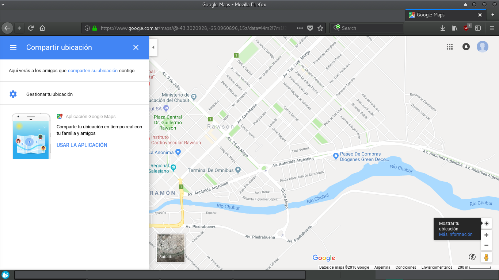

Capítulo 5. Herramientas GPS y Geocoding
========================================

El objetivo principal del siguiente capítulo será la determinación de posiciones sobre la superficie terrestre. Para poder alcanzar este objetivo, se describirá el contexto matemático básico para expresar un punto sobre la Tierra, además, de los sistemas de coordenadas y las proyecciones cartográficas.

Geodesia. Forma y representación de la Tierra
---------------------------------------------

La Geodesia es la ciencia que se encarga del estudio de la figura, las dimensiones y el campo gravitatorio de la Tierra, así como su variación a través del tiempo.

Friedrich Robert Helmert (1880) define la Geodesia como "la ciencia de la medida y representación de la Tierra".

El diccionario de la Real Academia Española define la Geodesia como "Ciencia matemática que tiene por objeto determinar la figura y magnitud del globo terrestre o de gran parte de él, y construir los mapas correspondientes".

La razón de estudiar la forma de la Tierra se debe a que esta es redonda, aunque no por completo, por lo que debe estudiarse su figura realmente cómo es para obtener mapas precisos. Los mapas ayudan a comprender los tipos de información de la que disponemos.

En la actualidad, el ámbito de la Geodesia es mucho más amplio que la definición clásica de Helmert, dado que como se mencionó anteriormente incluye el campo gravitatorio de la Tierra y su variación en el tiempo.

La Geodesia se puede dividir en varias ramas:

* Geodesia Física
Constituida por las teorías y modelos para la determinación de la figura del geoide mediante gravimetría, determinación del geoide mediante el campo gravitatorio y sus anomalías.

* Geodesia Geométrica
Determina la figura terrestre a través de mediciones en su aspecto geométrico, incluyendo la determinación de coordenadas de puntos en su superficie.

* Astronomía Geodésica
Constituida por métodos astronómicos, los cuales permiten la determinación de coordenadas geográficas sobre la superficie terrestre a partir de mediciones de los astros (se tiene en cuenta una serie de puntos fundamentales a partir de los cuales se arman redes geodésicas, se mencionarán más adelante).

* Geodesia Espacial
Determina de coordenadas geográficas mediante mediciones tomadas a través de satélites artificiales, objetos naturales o artificiales exteriores a la Tierra.

Las superficies de referencia de la Tierra utilizadas por la geodesia clásica son la elipsoide y geoide.

Geoide
^^^^^^

Es el objeto geométrico irregular utilizado para hacer referencia a la Tierra. Se define como una superficie en la que todos los puntos experimentan la misma atracción gravitatoria siendo esta equivalente a la experimentada al nivel del mar.

En la actualidad se dice que el Geoide es una superficie equipotencial [#e1]_ del campo de gravedad terrestre ajustado a determinaciones del nivel medio del mar corregidas por los mejores modelos de circulación oceánica, de las perturbaciones atmosféricas y toda influencia no periódica que afecte el nivel del agua.

Se trata de una superficie que no es totalmente estable debido a varios ajustes incorporados, por lo cual ciertas descargas fluviales o desprendimientos de barreras de hielo pueden influir en el cálculo de la superficie del mismo Geoide. Aunque esta concepción es muy reciente (1980), se encuentra apoyada por detalladas investigaciones que surgen de sensores montados en satélites artificiales.

.. figure:: ../figs/Cap5/geoide_elipsoide.png
   :scale: 50%

   Elipsoide y geoide.

.. rubric:: Footnotes

.. [#e1] Una superficie equipotencial es el lugar geométrico de los puntos de un campo escalar en los cuales el "potencial de campo" o valor numérico de la función que representa el campo, es constante.

Elipsoide
^^^^^^^^^

Es el objeto regular utilizado para hacer referencia a la Tierra. Se encuentra definido por dos parámetros: el semieje mayor y el semieje menor. En el caso de la Tierra estos ejes se corresponden con el readio ecuatorial y el radio polar. La relación existente entre estas dos medidas define el grado de achatamiento del elipsoide, dado por:

.. math:: f = \frac {r_{1} - r_{2}} {r_{1}}

siendo :math:`r_{1}` el semieje mayor y :math:`r_{2}` el menor.

   Elipsoide.
.. http://volaya.github.io/libro-sig/chapters/Fundamentos_cartograficos.html

Elipsoides de uso habitual. Teniendo en cuenta la irregularidad de la superficie terrestre es posible utilizar distintos elipsoides según el lugar o región de ubicación.

+-----------------------+------------------+------------------+
|                                                             |
+=======================+==================+==================+
|      Elipsoide        |      WGS84       |   Clarke 1858    |
+-----------------------+------------------+------------------+
|      Eje Mayor        |     63781137     |   6378293.645    |
+-----------------------+------------------+------------------+
| Inverso aplastamiento |   298.2572236    |      294.26      |
+-----------------------+------------------+------------------+
|     Aplastamiento     |   0.003352811    |   0.003398355    |
+-----------------------+------------------+------------------+
|      Eje Menor        |  6356752.314     |   6356617.938    |
+-----------------------+------------------+------------------+
|     Excentricidad     | 0.0818119190843  |  0.082372092204  |
+-----------------------+------------------+------------------+

Datum
^^^^^

Es definido como aquel punto tangente al elipsoide y al Geoide, en el cual ambos son coincidentes.

Compuesto por:

* los parámetros *r1* y *r2* del elipsoide.

* un punto denominado fundamental. A este punto se le define sus coordenadas geográficas (latitud, longitud) y el acimut (ver definición en :ref:`_acimut`) de una dirección con origen en este punto. Esta desviación se la denomina:

   * desviación de la vertical (Eta), dada por la no coincidencia de la vertical entre el geoide y el elipsoide.
   * desviación en el meridiano (Xi)

La altura geoidal en el punto fundamental es, como cabe esperar, igual a cero. La vertical al geoide y al elipsoide son idénticas en el punto fundamental.

Como ya hemos mencionado la superficie terrestre no es esférica. Por lo que dicha irregularidad, hace que cada país, región, escoja un modelo de cuerpo (definible matemáticamente) ajustado a la figura de la Tierra en su territorio.
Para un mismo elipsoide pueden utilizarse distintos puntos fundamentales, que darán lugar a distintos datum y a distintas coordenadas para un mismo punto.

+--------------------+------------------+----------------+----------------+---------------+
|      Datum         |      Area        |    Latitud     |    Longitud    |   Elipsoide   |
+====================+==================+================+================+===============+
|   Campo Inchauspe  |    Argentina     | 30 58 16.56 S  | 62 10 12.03 W  | Internacional |
+--------------------+------------------+----------------+----------------+---------------+
|   Corrego Alegre   |     Brasil       | 19 50 15.14 S  | 48 57 42.75 W  | Internacional |
+--------------------+------------------+----------------+----------------+---------------+
| Norte América 1927 |  Norte América   | 39 13 26.686 S | 98 32 30.506 W |  Clarke 1866  |
+--------------------+------------------+----------------+----------------+---------------+

   Datums de uso habitual

Coordenadas geográficas
-----------------------

El sistema de coordenadas natural de un esferoide o elipsoide es el de coordenadas angulares (latitud y longitud) que suele denominarse coordenadas geográficas.

**Coordenadas geodésicas**

Son aquellas coordenadas geográficas que están referidas al elipsoide de referencia.

**Coordenadas geocéntricas**

Son aquellas coordenadas geográficas que están definidas con respecto al centro de gravedad de la Tierra. Para poder definir latitud y longitud, es necesario identificar el eje de rotación terrestre.

Paralelos y latitud
^^^^^^^^^^^^^^^^^^^

El plano perpendicular al eje de rotación que corta la Tierra atravesándola por su centro define el Ecuador en su intersección con el esferoide. Por lo tanto, el resto de las líneas de intersección con la superficie terrestre de los infinitos planos perpendiculares al eje de rotación definen los diferentes *paralelos* o líneas de *latitud* constantes.
Latitud es la distancia angular entre el paralelo de un lugar y el Ecuador, se expresa en grados, minutos y segundos de arco y se mide de 0 a 90° hacia el Norte o el Sur.

Meridianos y longitud
^^^^^^^^^^^^^^^^^^^^^

Los meridianos pueden definirse como las líneas de intersección con la superficie terrestre de los infinitos planos que contiene al eje de rotación.
Longitud es la distancia angular entre el meridiano de un lugar y el de Greenwich, expresado en grados, minutos y segundos de arco y se mide de 0 a 180° hacia al Este o hacia el Oeste desde el meridiano de Greenwich.

.. _acimut:

Direcciones
^^^^^^^^^^^
.. Cartografía básica aplicada Jorge Alirio Mendieta Ocampo, Ramón Elías Valencia Céspedes Editorial Universidad de Caldas

Se denomina dirección de una recta, al ángulo horizontal existente esa recta y otra que se toma como referencia.

Hay dos formas para definir la dirección entre dos puntos:

**Azimuth o acimut**

Es el ángulo formado por la línea que une el punto de partida y el Norte y la línea que une el punto de partida con el de llegada. Se mide desde 0° (Norte), siguiendo el sentido horario hasta 360°.

**Rumbo**

Es el ángulo agudo que forma las direcciones Norte o Sur desde el punto de partida y la línea que une ambos puntos.

Teniendo en cuenta lo anterior, todo punto localizado entre el sur (S) y el este (E) tendrá un rumbo entre 0° y 90° y este número correspondiente en grados se forma precediéndolo de las letras SE (sureste). De la misma manera, los puntos localizados entre el sur y el oeste tendrán un rumbo entre 0° y 90° y en este caso, el número correspondiente en grados se lo precede de las letras SW (suroeste).

.. figure:: ../figs/Cap5/rumbo-y-azimut.png
   :scale: 50%

   Rumbo y Azimut. En esta figura se pueden ver los puntos *A,B,C,D* y sus respectivos ángulos.

Sistemas de Proyección cartográfica
-----------------------------------

La proyección cartográfica es el proceso de convertir los puntos de una esfera o elipsoide en sus transformados en una superficie definida, por ejemplo, un plano. Se trata de la aplicación de una función *f* que a cada par de coordenadas geográficas (puntos de la esfera o elipsoide) le hace corresponder un par de coordenadas cartesianas (punto en la superfice de proyección definida), dado por

.. math:: x = f(\theta,\lambda) ; y = f(\theta,\lambda)

De igual manera, a partir de las coordenadas cartesianas puede obtenerse las coordenadas geográficas según

.. math:: \theta = g(x,y) ; \lambda = g(x,y)

Otras superficies pueden ser utilizadas para definir una proyección. Las más habituales son el cono y el cilindro (junto con, por supuesto, el plano), las cuales, situadas en una posición dada en relación con el objeto a proyectar (esto es, la Tierra), definen un tipo dado de proyección. Por lo que se puede distinguir las siguientes proyecciones: cónicas, cilíndricas y planas azimutales.

* Cónicas

La superficie desarrollable que se utiliza es un cono, el cual se arrolla sobre la superficie del elipsoide y se poyecta los puntos sobre él. Se puede utilizar dos tipos de conos en contacto con la superficie definida. Cuando se utiliza un cono tangente, el eje que vincula a los polos es utilizado como vértice y se produce un paralelo llamado estándar a lo largo. Por otro lado, se puede utilizar un cono secante, para el cual se produce dos paralelos estándar.

.. TODO: CORREGIR LA FIGURA, POR LA FIGURA EN QUE SE ENCUENTRAN MARCADAS LAS PROYECCIONES CÓNICAS CON VERDE!!!

.. figure:: ../figs/Cap5/proyeccion-conica.jpg
   :scale: 40%

   En esta firgura se puede observar los paralelos estándares. A la izquierda se marca con una línea verde el paralelo producido. A la derecha se puede visualizar dos paralelos estándares, marcados con verde los puntos de contacto en ellos.

En general, una proyección secante tiene menos distorsión total que una proyección tangente. Algunas de las proyecciones más conocidas de este grupo son la proyección cónica equiárea de Albers y la proyección conforme cónica de Lambert.

.. http://pdi.topografia.upm.es/mab/tematica/htmls/proyecciones.html

.. http://arquimedes.matem.unam.mx/PUEMAC/PUEMAC_2008/mapas/html/proyecciones/pconica.html

.. http://desktop.arcgis.com/es/arcmap/10.3/guide-books/map-projections/conic-projections.htm

   Proyecciones cónicas.

.. https://www.blinklearning.com/Cursos/c536159_c24567759__Metodos_de_representacion.php

* Cilíndricas

La superficie desarrollable es un cilindro, el cual se circunscribe alrededor de la superficie del elipsoide. Se trata de un cilindro tangente, donde al proyectar, los meridianos se convierten en líneas paralelas, así como los paralelos, aunque la distancia entre estos últimos no es constante.

En su concepción más simple, el cilindro se sitúa de forma tangente al ecuador (proyección normal o simple), aunque puede situarse secante y hacerlo a los meridianos (proyección transversa) o a otros puntos (proyección oblicua).

La proyección de Mercator, la transversa de Mercator, la cilíndrica de Miller o la cilíndrica equiárea de Lambert son ejemplos relativamente comunes de este tipo de proyecciones.

.. figure:: ../figs/Cap5/cilindricas.png
   :scale: 40%

   Proyecciones cilíndricas.

.. https://www.blinklearning.com/Cursos/c536159_c24567759__Metodos_de_representacion.php

* Planas o azimutales

La superficie desarrollable es directamente un plano. Por lo que tenemos distintos tipos en función de la posición del punto de fuga.

   Proyecciones planas o azimutales.

* Sin superficie desarrollable

Algunas proyecciones no se ajustan exactamente al esquema planteado, y no utilizan una superficie desarrollable como tal sino modificaciones a esta idea. Por ejemplo, las proyecciones policónicas utilizan la misma filosofía que las cónicas, empleando conos, pero en lugar de ser este único, se usan varios conos, cada uno de los cuales se aplica a una franja concreta de la zona proyectada. La unión de todas esas franjas, cada una de ellas proyectada de forma distinta (aunque siempre con una proyección cónica), forma el resultado de la proyección.

Del mismo modo, encontramos proyecciones como la proyección sinusoidal, una proyección de tipo pseudocilíndrico, o la proyección de Werner, cuya superficie desarrollable tiene forma de corazón. Estas proyecciones son, no obstante, de uso menos habitual, y surgen en algunos casos como respuesta a una necesidad cartográfica concreta.

Otra forma distinta de clasificar las proyecciones es según las propiedades métricas que conserven. Toda proyección implica alguna distorsión (denominada anamorfosis), y según cómo sea esta y a qué propiedad métrica afecte o no, podemos definir los siguientes tipos de proyecciones: equiárea, conformes y equidistantes.

* Equiárea

En este tipo de proyecciones se mantiene una escala constante. Es decir, la relación entre un área terrestre y el área proyectada es la misma independientemente de la localización, con lo que la representación proyectada puede emplearse para comparar superficies.

* Conformes

Estas proyecciones mantienen la forma de los objetos, ya que no provocan distorsión de los ángulos. Los meridianos y los paralelos se cortan en la proyección en ángulo recto, igual que sucede en la realidad. Su principal desventaja es que introducen una gran distorsión en el tamaño, y objetos que aparecen proyectados con un tamaño mucho mayor que otros pueden ser en la realidad mucho menores que estos.

* Equidistantes

En estas proyecciones se mantienen las distancias.

Georreferenciación o Geocodificación
------------------------------------

La georeferenciación es un proceso de localización geográfica, dentro de un sistema de coordenadas. En términos más sencillos es asignar coordenadas geográficas a un objeto o estructura.

Este concepto puede ser aplicado a una imagen digital, a la cual aplicamos un conjunto de operaciones geométricas que permiten asignar a cada píxel de la misma un par de coordenadas *(x,y)* en un sistema de proyección. Por ejemplo, Google Earth [#e2]_ es un sistema de georreferenciación, el cual nos permite situar en un mapa puntos concretos de la geografía.

La plataforma web Google Maps nos permite georeferenciar direcciones como "650, 25 de Mayo, Trelew, Chubut" convirtiéndola en coordenadas geográficas. Por ejemplo, la dirección mencionada anteriormente se puede convertir en la siguiente coordenada geográfica latitud -43.254537 y longitud -65.315206, la cual se puede utilizar para disponer marcadores en un mapa o posicionarse en dicho mapa.

.. [#e2] plataforma web que permite ver y utilizar contenido de datos de mapas y de relieves, imágenes yotros datos proporcionados por Google.

Geocodificación inversa
-----------------------

Es el proceso mediante el cual se convierte coordenadas geográficas en direcciones en lenguaje natural. Se puede mencionar el sistema de geocodificación inversa de Google Maps que, a través del servicio Geocoding API permite realizar este procedimiento mediante solicitudes HTTP.

Geolocalización
---------------

Se define como la identificación de la ubicación geográfica de cualquier tipo de objeto, por ejemplo un radar, teléfono móvil o cualquier aparato tecnológico conectado a internet. Está relacionada con los sistemas de detección de posición, pero añade datos como información de la zona, calles, locales, etc.

La geolocalización por su parte tiene una característica muy específica: nos permite localizar un dispositivo en el mapa en tiempo real. Por ejemplo, lo que hace Google Maps [#e3]_ es geolocalizar nuestro dispositivo, es decir, acceder a nuestra ubicación exacta y ofrecernos las diferentes funciones de la aplicación a partir de esto.

.. [#e3] servidor de mapas web. Ofrece mapas desplazables, además de fotografías satelitales.

   Ver ubicación actual del dispositivo en el mapa utilizando Google Maps.

GPS (Global Positioning System)
-------------------------------

Es un sistema de localización, diseñado por el Departamento de Defensa de los Estados Unidos. Se encuentra en funcionamiento desde 1995, el cual permite determinarla posición de un objeto en la Tierra (un dispositivo móvil, un vehículo) con una precisión de hasta centímetros utilizando GPS diferencial, aunque por lo general son unos pocos metros de precisión. Para poder determinar las posiciones en el globo, el sistema GPS se sirve de 24 satélites y utiliza la trilateración (Ver  ).

Funcionamiento
^^^^^^^^^^^^^^

.. _trilateracion_satelital:

Trilateración Satelital
"""""""""""""""""""""""

Método por el cual obtener las coordenadas de un punto del que se ignora su posición a partir de mediciones de distancias a puntos de coordenadas conocidos previamente.

Se trata de un método matemático que determina las posiciones relativas de objetos utilizando geometría de triángulos de forma análoga a la triangulación. Para precisar la posición relativa de un punto mediante la trilateración se utiliza las localizaciones de tres o más puntos de referencia (a mayor puntos de referencia mayor precisión), y la distancia medida entre el sujeto y cada punto de referencia.

Teniendo en cuenta :ref:`trilateracion_img`. Ubicándonos en el punto B, necesitamos conocer su posición relativa a los siguientes punntos de referencia *P1*, *P2* y *P3* en un plano bidimensional. Si se mide *r1* podemos reducir nuestra posición a una circunferencia. A continuación, si medimos *r2*, reducimos la posición a dos punto, *A* y *B*. Por último, si medimos, *r3*, podemos obtener nuestras coordenadas en el punto B. También, se puede realizar una cuarta medición para reducir y estimar el error.

.. _trilateracion_img:
.. figure:: ../figs/Cap5/trilateracion.png
   :scale: 50%

   Trilateración.

Arquitectura del sistema GPS
""""""""""""""""""""""""""""

El Sistema de Posicinamiento Global se encuentra conformada por 3 componentes básicos:

* Componente espacial formada por 24 satélites que conforman la red de GPS, con trayectorias sincronizadas para cubrir la totalidad del globo terrestre. Éstos se encuentra organizados en 6 órbitas circulares con 4 satélites cada una, alimentados por paneles solares ubicados a cada uno de los lados de los satélites, a una altitud aproximada de 20.000 km, circulando a una velocidad de 14.500 Km/h y repitiendo el mismo recorrido de manera continua, al mismo tiempo que la Tierra rota sobre su eje, por lo que en aproximadamente 24 hs, cada satélite vuelve a posicionarse sobre el mismo punto. Debido a que el tiempo es necesario para el cálculo, cada satélite posee un reloj atómico de alta precisión (mide el tiempo en nanosegundos). Este componente también es necesario en el dispositivo GPS receptor terrestre, pero debido a que el costo de éstos se incrementaría considerablemente si se añadiera dicho reloj y a que la utilización de un reloj ordinario introduciría un error, el error se corrige por medio del empleo de un satélite adicional.

* Componente de control que cuenta con 10 estaciones de monitoreo encargadas de mantener en órbita los satélites y de la supervisión de su funcionamiento.
  
* Componente de usuario formado por aquellas antenas receptoras situadas en la Tierra y los complementos GPS software y hardware, que permiten determinar la posición, velocidad y tiempo del usuario en un instante dado.

**Ubicación a través de GPS**

.. http://www.mailxmail.com/curso-introduccion-gps/como-funciona-gps-trilateracion

El objetivo del calculo del sistema GPS es proporcionar las coordenadas de un receptor GPS sobre la superficie terrestre, dando como resultado la latitud y longitud de éste. Para este fin, el sistema GPS se utiliza la trilateración satelital que tiene su base en el método matemático trilateración (comentado previamente) y se denomina trilateración satelital porque los puntos de referencia son satélites en el espacio. Para llevar a cabo este proceso, cada uno de los cuatro satélites emite una señal al receptor GPS, enviando el instante de tiempo en que estas partieron de cada satélite. El dispositivo receptor, contiene en su memoria las coordenadas respecto de las órbitas de los satélites, al llegar cada una de éstas al dispositivo GPS, éste identifica el satélite que ha emitido cada señal y calcula el tiempo que ha tardado la señal en llegar. Sabiendo que la onda electromagnética del satélite en el vacío espacial se propaga a la velocidad de la luz (300.000 km/seg), procede a aplicar la fórmula :math:`distancia = velocidad / tiempo` obteniendo la distancia que lo separa del satélite. Finalmente, con éstos datos se puede aplicar el método de trilateración satelital para obtener las coordenadas del receptor, donde el centro de las esferas empleadas en este método, es la ubicación de cada uno de los satélites que envían la señal al receptor GPS. De esta forma, cuantos más satélites se empleen para el cálculo se logrará mayor precisión.

   Ubicación por medio de GPS. En esta imagen se pueden observar 3 satélites y sus circunferencias asociados y el punto *X* del cual se calculará su posición.

   Empleo de cuatro satélites para el cálculo de la posición de un punto.

Fuentes de error
""""""""""""""""

Al tratar de obtener de la posición mediante la técnica de trilateración satelital, diferentes fuentes de error pueden presentarse entre las señales emitidas entre el aparato emisor y el satélite receptor, estos degradan la precisión de la posición obtenida en algunos metros, hasta algunas decenas de metros. Para el cálculo de posición, se debe tener en cuenta las siguientes fuentes de error:

.. http://detopografia.blogspot.com.ar/2012/11/principales-fuentes-de-error-en-gps-i.html

**Errores debido a la atmósfera**

Este tipo de error se produce cuando la señal emitida desde un satélite atraviesa la ionosfera [#e5]_ provocando una disminución en la velocidad de esta señal.

.. [#e5] capa de la atmósfera terrestre ubicada desde una altitud de 50 a 1000 Km aproximadamente, en la cual las radiaciones ultravioleta, solar y otras, ionizan una porción de las moléculas gaseosas liberando electrones.

**Errores en el reloj del GPS.**

En algunos momentos se puede presentar una pequeña variación en la velocidad de marcha de los relojes de los satélites que producen pequeños errores, afectando la precisión de la posición. Estos relojes son observados por el Departamento de Defensa de los Estados Unidos a través del componente de control y corrige cualquier deriva que se puede llegar a encontrar.

**Interferencias por la reflexión de las señales (multipath effect).**

Este tipo de error se produce, ya que la señal emitida desde el satélite puede rebotar varias veces en la superficie terrestre debido a obstrucciones locales antes de ser captada por el receptor GPS.

**Errores de orbitales**

Se trata de un error o variación de los parámetros orbitales del satélite consultado. Esto es debido que, los satélites siguen órbitas estables fuera de la atmósfera terrestre y las fuerzas que actúan sobre ellos son demasiadas (por ejemplo, variaciones en el campo gravitatorio) que es difícil los cambios que estos pueden sufrir. Por otro lado, muchos de estos errores son puestos a propósito por el Departamento de Defensa de los Estados Unidos y pueden ser diferentes por cada consulta que le hiciera a dicho saélite.

**Geometría de los satélites visibles**

En este tipo de error, es necesario tener en cuenta el pricncipio de Dilución Geométrica de la Precisión *DGDP*.

Para comprender el *DGDP*, hay que tener en cuenta que suele haber más satélites disponibles que los que el recptor GPS necesita para fijar una posición, por lo que el receptor toma datos sólo de algunos e ignora el resto. Si el receptor toma datos de satélites que están muy juntos, las circunferencias de intersección que definen  la posición se cruzarán a ángulos con muy escasa diferencia entre sí, incrementando el margen de error. Por otro lado, si el receptor toma datos de satélites que se encuentran ampliamente separados, las circunferencias se intersectan a ángulos rectos, minimizando el margen de error.

Por lo tanto, este tipo de error se ve incrementado cuando las diferencias de los vectores entre el receptor y los satélites. Un buen receptor GPS debería ser capaz de determinar cuales son los satélites que otorgan el menor error por *DGDP*.

Uso del receptor GPS
""""""""""""""""""""

En este apartado se analizarán las categorías y formas de representación de cualquier evento en territorio, a partir del uso del receptor GPS. Se pondrá a tención sobre aquellos de civil convencional.

Se debe tener en cuenta que la clasificación que se realiza de la información geográfica es puntos, líneas y polígonos. Se hablará  a continuación de **waypoints** en vez de puntos, **track** por línea y **ruta** que consiste en una línea conformada por **waypoints** interconectados y ubicados de manera secuencial. Por lo que, una vez registrados ciertos **waypoints**, luego puedo realizar una ruta, siguiendo de manera secuencial los **waypoints**.

**Waypoint**

Se trata de un punto de referencia con coordenadas que representa puntos concretos en la superficie terrestre. Este se debe marcar en el navegador del receptor GPS, al encontrarse inmóvil en el sitio a registrar.

**Track**

Es un conjunto de puntos de posiciones que pueden o no almacenarse automáticamente en la memoria del receptor GPS a medda que se produce un desplazamiento y, estos se unen a través de un línea.

**Ruta**

Como se mencionó anteriormente, una ruta se encuentra conformada por un conjunto de waypoints interconectados, los cuales pueden definir un camino unido por líneas rectas.

Herramientas
^^^^^^^^^^^^

A continuación, se mencionará aquellas herramientas software utlizadas en el marco del presente trabajo.

A continuación, se presenta a ShareGPS, aplicación utilizada en el marco de esta tesina como soporte de captura de datos de localización a través de un dispositvo móvil que cuente con un GPS integrado.

ShareGPS
""""""""

.. figure:: ../figs/Cap5/share-gps.png
   :scale: 40%

   ShareGPS.

Aplicación para el sistema operativo Android que permite compartir datos de localización en tiempo real desde un dispositivo móvil vía Bluetooth, 3G/4G, USB y TCP/IP.

Para utilización de operaciones básicas de la aplicación ver :cite:`ShareGPS`.

Tipos de datos
""""""""""""""

Formato mediante el cual se estructuran los datos de localización que son compartidos desde el aplicativo hacia otra aplicación o dispositivo. Los tipos de datos son los siguientes:

* NMEA 0183

Estándar de interfaz que define los requisitos de señal eléctrica, tiempo y protocolo de transmisión de datos y el formato de las sentencias de caracteres ASCII transmitidos a través de un bus de datos en serie.

Cada una de las sentencias transmitida comienza con el carácter "$" y termina "<CR><LF>" (CR: Carriage Return, LF: Line Feed). Los dos primeros caracteres identifican al equipo (por ejemplo "GP" utilizado para  identificar los datos GPS) y los siguientes tres caracteres se utilizan para identificar el tipo de sentencia enviada.

Para conocer más detalles acerca de NMEA 0183 ver http://www.gpsinformation.org/dale/nmea.htm.

* OGC KML (Keyhole Markup Language)

Estándar que permite compartir datos de información geográfica, enfocándose en la visualizaciones de estos. La estructura de KML consta de etiquetas con atributos y elementos anidados y está basdo en XML.

.. http://kml4earth.appspot.com/kmlErrata.html
.. http://www.opengeospatial.org/standards/kml/
.. https://earthdata.nasa.gov/user-resources/standards-and-references/ogc-kml
.. KML refrence: https://developers.google.com/kml/documentation/kmlreference?hl=es-419

Tipos de conexión
"""""""""""""""""

Este software ofrece una gran variedad de tipos de conexiones que se pueden realizar para el envío de información geográfica hacia diferentes aplicaciones o dispositivos. Se mencionará aquellas todas aquellas que provee haciendo énfasis sobre el tipo de conexión utilizada para el desarrollo del presente trabajo.

Los distintos tipos de conexión son:

* Connecting NMEA data to a Linux PC via USB (Ver :ref:`_conexion_usb`)

* Connecting NMEA data to a PC via Bluetooth

En este apartado se explicará cómo establecer una conexión entre un computador bajo un sistema operativo Linux y un dispositivo móvil a través de Bluetooth, para compartidor datos de localización utilizando NMEA como formato de datos.

.. http://www.jillybunch.com/sharegps/nmea-bluetooth.html

* TCP/IP

Este tipo de conexión permite el envío de datos NMEA entre un computador y otro dispositivo que soporte este tipo de conexión. ShareGPS puede utilizarse tanto como servidor de datos así como cliente.

Para más detalles ver `TCP/IP RFC <https://www.rfc-es.org/rfc/rfc1180-es.txt>`_.

* SCP

Permite el envío de datos KMZ desde un computador y otro dispositivo que ejecute un servidor SSH.

Para más detalles ver `SSH RFC <https://www.ietf.org/rfc/rfc4251.txt>`_.

* GoogleDrive, Dropbox, LocalFile

Las plataformas Drive y Dropbox online que permite compartir y actualizar en tiempo real los archivos KMZ capturados.

A través de LocalFile, ShareGPS permite guardar los datos KMZ a la tarjeta de memoria (SD Card) del dispositivo móvil.

* SendTo

Esta opción se puede utilizar para compartir datos entre aplicaciones del dispositivo móvil. Por ejemplo, si se elige Gmail [#e7]_, los datos KMZ se enviarán como un mail.

.. [#e7] servicio de correo electrónico gratuito proporcionado por Google.

Para más detalle acerca de los tipos de conexión, visitar el siguiente enlace `ShareGPS <http://www.jillybunch.com/sharegps/index.html>`_.

.. _conexion_usb:
Conexión vía USB
################

Connecting NMEA data to a Linux PC via USB

En este apartado se explicará cómo establecer una conexión entre un computador bajo un sistema operativo Linux y un dispositivo móvil a través de cableado USB, para compartidor datos de localización utilizando NMEA como formato de datos.

Como primer paso, es necesario instalar el software ShareGPS en el dispositvo móvil a utilizar a través de alguna plataforma de distribución digital de aplicaciones como por ejemplo, Google Play Store, Uptodown, Aptoide.

Segundo paso, es necesario los siguientes paquetes de software en el dispositivo receptor (Linux PC en este caso):

GPS daemon
   Arch Linux:
      $ sudo pacman -S gpsd

Android Tools
   Arch Linux:
      $ sudo pacman -S android-tools
      $ sudo pacman -S android-udev

Opcional, para el caso del presente trabajo, se utilizó el siguiente módulo de Python [#e6]_ para capturar los datos obtenidos desde el GPS del dispositivo móvil.

.. [#e6] lenguaje de progamación interpretado.

Tercer paso, una vez instalado el software necesario, asegurarse que el dispositivo móvil al cual se conectará tenga habilitado la opción de depuración de USB. Luego, proceder a la conexiones a través del cable USB.
 
Cuarto paso, abrir la aplicación ShareGPS en el dispositivo móvil y crear una conexión NMEA USB (ver :num:`Fig. #sharegps1` y :num:`Fig. #sharegps2`).

.. _sharegps1:

   Pasos para agregar conexión a ShareGPS, primera parte. (1) Comenzar agregando una conexión, click ADD. (2) Seleccionar el tipo de conexión (GPS using NMEA). (3) Muestra el tipo de conexión seleccionada. Si no es la conexión que desea utilizar, click en Activity para vovler a cambiar.

.. _sharegps2:

   Pasos para agregar conexión a ShareGPS, segunda parte. (4) Después, de hacer click en Conection Method seleccionamos USB. (5) Luego, de seleccionar el métod de conexión, en el caso de USB, pedirá la asignación de un número de Port. (6) Por último, le asignamos un nombre a la conexión haciendo click en Name. Click en Next y tendremos una conexión configurada. 

$ adb devices

$ adb forward tcp:20175 tcp:50000

Utilizando netcat para verificar si se están compartiendo datos entre Linux PC y el dispositivo móvil.
$ nc localhost 20175

$ gpsd -D5 -N -n -b tcp://localhost:20175

$ gpsd -b tcp://localhost:20175

Por último, el consumo de los datos se utilizó como base el siguiente script escrito en lenguaje de programación Python:

Ejemplo::

   #!/usr/bin/env python
   # -*- coding: utf-8 -*-
   import time
   import gps
   import sys

   # python gpsd.py ./gps.kml 
   def main(gpsd_report):
       '''http://code.google.com/apis/kml/documentation/kmlreference.html
          for official kml document'''

       if len (sys.argv) < 2:
            print "Usage: gpsd.py [kml-file]"
            sys.exit();

       print gpsd_report
       if not 'lat' in gpsd_report.keys():
           return
       kml_file = sys.argv[1]
       latitude =  gpsd_report['lat']
       longitude = gpsd_report['lon']

           output = """<?xml version="1.0" encoding="UTF-8"?>
       <kml xmlns="http://earth.google.com/kml/2.0">
       <Placemark>
           <description>Realtime GPS feeding</description>
           <LookAt>
               <longitude>%s</longitude>
               <latitude>%s</latitude>
           </LookAt>
           <Point>
               <coordinates>%s,%s</coordinates>
           </Point>
       </Placemark>
       </kml>""" % (longitude,latitude,longitude,latitude)

           #status_line = '<{0}> Speed: {1:.2f} Km/h, Heading: {2:.0f}'.format(time_str,
           #                                                      speed, heading)
           #print status_line
           f = open(kml_file, 'w')
           f.write(output)
           f.close()

       if __name__ == "__main__":
           session = gps.gps()
           session.stream(gps.WATCH_ENABLE|gps.WATCH_NEWSTYLE)

           try:
               while True:
                   report = session.next()
                   print report
                   if report['class'] == 'TPV':
                       main(report)
           except StopIteration:
               print 'GPSD has terminated'

.. http://www.jillybunch.com/sharegps/nmea-usb-linux.html

.. Sistemas de Información Geográfica - Un libro de Víctor Olaya - http://volaya.github.io/libro-sig/