Antecedentes de software para la gestión de fallas viales
=========================================================

Pavimento
---------

El pavimento de una calle o autopista, es una estructura compuesta de un conjunto de capas de materiales procesados sobre el suelo, cuya función consiste en distribuir las cargas de los vehículos al sub-suelo y permitir el tránsito de los mismos. La estructura del pavimento debería proveer una superficie de calidad aceptable para la circulación de vehículos, resistencia adecuada al resbalamiento,reducir la contaminación de ruido producto de la circulación de los vehículos, una superficie impermeable, de manera que el suelo que esta debajo de las capas de material este bien protegido, resistencia estructural (con el fin de soportar todo tipo de fuerza aplicada sobre él) y un diseño con un ciclo de vida prolongado y bajo costo de mantenimiento.

Los pavimentos se pueden clasificar en dos tipos diferentes:

* Pavimento de rígido: Es una estructura compuesta por losas de hormigón cuya resistencia a la flexión es relativamente elevada.
Los pavimentos rígidos se integran por una losa de concreto de cemento portland, que se encuentra situada por encima de una capa base de grava, y ésta a la vez descansa en una capa de suelo compactado, denominada subrasante.

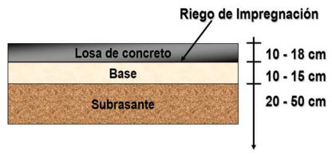

   Estructura del pavimento rígido

* Pavimento flexible: Es una estructura compuesta por capas donde uno de los materiales presentes es el asfalto, lo que permite la deflexión (la deformación que del material como producto de una fuerza externa) bajo las cargas.
Los pavimentos flexibles se componen de una capa de mezcla asfáltica u hormigón asfáltico, que consiste en un agregado de asfalto y materiales minerales (como áridos) compactados y extendidos. ;Ésta se expone a las condiciones más severas debido al clima y tráfico, una capa base que se compone de materiales áridos (conjunto de materiales obtenidos de la fragmentación de rocas y arenas, tales como la grava, la gravilla y la arena), una capa de sub-base con materiales de calidad inferior a los empleados en la capa base.

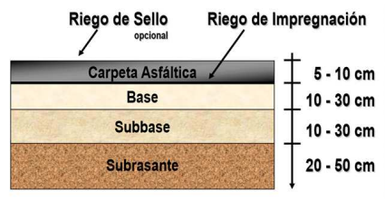

   Estructura de pavimento flexible

Tipos de juntas
---------------

Los senderos viales, tales como calles, autopistas, se encuentran sometidos a diversos cambios de temperatura durante el día, a diferencias de temperatura considerables entre las distintas estaciones del año, a cambios de humedad constante, y durante su construcción, a los tiempos de parada debido a las jornadas de trabajo con horas fijas, provocan que el material sufra dilataciones y contracciones y, si este material se encuentra extendido en una porción considerable de terreno, se producirá el agrietamiento aleatorio e irregular del mismo, a corto plazo. Para evitar ésto, se emplean juntas en el pavimento,como mecanismo de control de fisuras, que consisten en cortes realizada con maquinaria especial a lo largo y ancho del material, a una profundidad establecida según las propiedades de éste y de la calle, que lo divide en losas. Estas divisiones, se realizan a una distancia aproximada a la que aparecerían las fisuras, ya que en caso contrario, se fisurarían aquellas losas con dimensiones excesivas.

En base a la posición de las juntas respecto del avance del hormigonado, las juntas en el pavimento se pueden clasificar en juntas longitudinales, que son aquellas paralelas a dicho avance, o juntas transversales, que son aquellas perpendiculares según el avance del mismo. Por otro lado, las juntas se pueden clasificar respecto del tipo de función que cumplen como:

* Juntas de contracción: Pueden ser juntas tanto transversales como longitudinales, y su fin es limitar el tamaño de las losas, disminuyendo hasta valores aceptables, el nivel de tensión producida por fenómenos de retracción como por la variación de temperatura por distancia(gradiente térmico), de manera de evitar roturas en el material.
   
* Juntas de construcción: Son las juntas que se producen entre bandas del pavimento, o también en una misma banda, entre losas que se encuentran de manera contigua que se construyen con un tiempo de parada prolongado.

* Juntas de dilatación: Son las juntas que se realizan con el fin de absorber las expansiones del material como consecuencia de los aumentos de temperatura, evitando empujes sobre éste que podrían producir la rotura del mismo. En este tipo de junta,se emplea un material compresible (madera, poliestireno expandido, laminas de poliuretano,etc.) entre las losas con contacto, o entre la losa y otros elementos, como muros y arquetas. 
  
  
Tipos de fallas sobre pavimentos rígidos y flexibles
----------------------------------------------------

Fallas sobre pavimentos rígidos
^^^^^^^^^^^^^^^^^^^^^^^^^^^^^^^

Dentro de los tipos de fallas que pueden ocurrir en pavimentos rígidos se encuentran los siguientes:

* Deficiencia de sellado: Este tipo de falla se ocasiona cuando se deterioran el sello de las juntas, por ejemplo, cuando existe fluencia fuera de la caja, despegado de ambas paredes, incrustación de materiales ajenos. El método de reparación de este tipo de falla consiste en realizar un sellado de juntas y de las grietas.

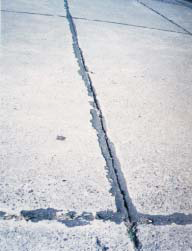

   Deficiencia de sellado

* Losas desniveladas:  Ocurre cuando se desintegran las aristas de una junta, ya sea de manera longitudinal o transversal, con pérdida de trozos. Para este tipo de falla el método de reparación consiste en un sellado de juntas y grietas, o reparación de espesor parcial, que consiste en reponer las saltaduras de material superficial en juntas y grietas.

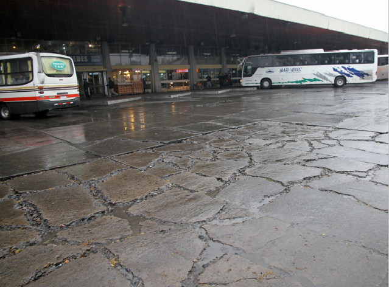

   Losas desniveladas

* Grietas: Una grieta se define como una abertura larga y estrecha en una losa de material, y ésta dependiendo de su ubicación en la losa, puede ser una grieta de esquina, longitudinal (si se extiende a lo largo de una losa) o transversal (si se extiende de manera perpendicular al volcado del material de la losa). El método de reparación para este tipo de falla, consiste en el sellado de juntas y grietas, y la reparación en todo el espesor. 
  
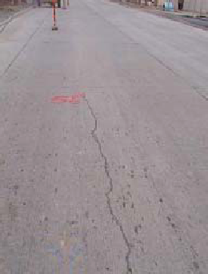

   Grieta longitudinal

* Desintegración: Esta falla se produce cuando ocurre un desgaste progresivo de la superficie, dejando al material árido expuesto. El método de reparación de este tipo de falla, consiste en realizar una reparación de espesor parcial, en la que se corta la porción de la zona a reparar con una profundidad de corte preestablecida, se limpia la zona y se rellena la zona con un material especial de sellado de juntas.

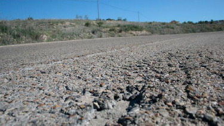

   Desintegración

* Baches: Un bache se define como una cabidad, generalmente de forma redondeada producto de la pérdida o hundimiento del pavimento en una parte de la superficie. El método de reparación para este tipo de falla depende del deterioro del mismo, y es especial para cada caso.
  
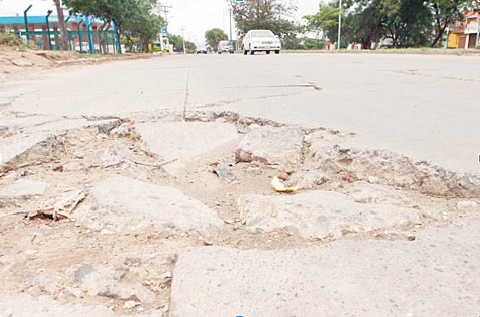

   Bache

* Levantamiento: Es el levantamiento de una porción de la losa, localizado en ambos lados de una junta transversal o grieta.El método de reparación consiste en realizar una reparación en todo el espesor, en la que se remueve y reemplaza una porción de la losa en todo su espesor, con el fin de reparar aquellas partes de la losa con un alto grado de daño.
|
   
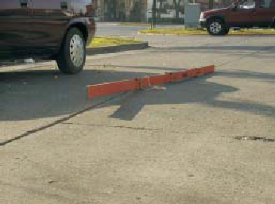

   Levantamiento de juntas

* Escalonamiento de juntas o grietas: Este tipo de falla ocurre cuando existe un desnivel entre dos superficies del pavimento, separadas por una junta transversal o grieta. El método de reparación para este tipo de falla es el fresado de la superficie, donde se separan las partes defectuosas del pavimento, de las que se encuentran en buen estado.
  
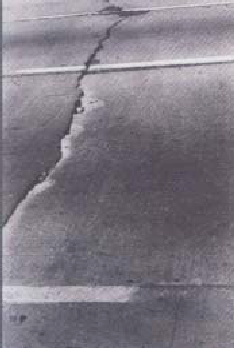

   Escalonamiento de juntas

* Descenso de banquinas: Es la diferencia de alturas que existe entre el borde del pavimento y la banquina. El método de reparación de este tipo de falla, consiste en realizar el nivelamiento de las banquinas no revestidas.

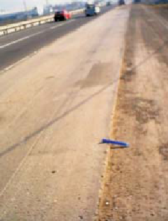

   Descenso de banquinas

.. raw:: latex
	
	\newpage

* Separación banquina-pavimento: Consiste en una rajadura entre el borde del pavimento y la banquina del sendero vial.El método de reparación consiste en realizar un sellado de juntas y grietas.

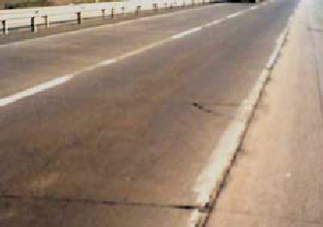

   Separación banquina-pavimento

* Parches deteriorados: Este tipo de falla surge cuando una porción de la superficie del asfalto ha sido removido y reemplazado por otro (como hormigón o asfalto), y ésta se ha dañado. El método de reparación de este tipo de falla, varía según el deterioro, y requiere una reparación especial.

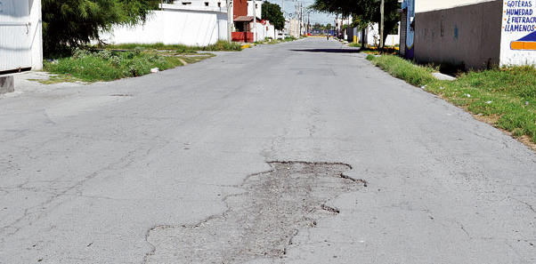

   Parches deteriorados

Fallas sobre pavimentos flexibles
^^^^^^^^^^^^^^^^^^^^^^^^^^^^^^^^^

* Exudación: Este tipo de falla se presenta cuando el asfalto pierde sus agregados pétreos en la superficie. El tipo de reparación para esta falla consiste en enarenar y realizar una reparación superficial.

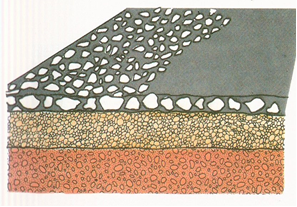

   Exudación

* Ahuellamiento y depresiones: El ahuellamiento es producido por el hundimiento de manera longitudinal del pavimento, y éste coincide con el área donde la mayor parte de los vehículos circula. Mientras que depresión, se considera un ahuellamiento de longitud menor al del ahuellamiento.
Si la profundidad máxima del ahuellamiento es inferior a los 20 mm, se realiza perfilado del pavimento, si la profundidad máxima es mayor a 20 mm pero inferior a 40 mm se realiza relleno de la rodadera, y si ésta es superior a 40 mm, se realiza una reparación local del pavimento.

.. raw:: latex
	
	\newpage

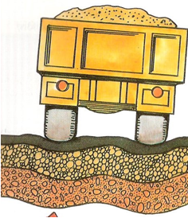

   Ahuellamiento y depresión

* Grietas: Este tipo de falla tiene las mismas características que para pavimento rígido.

  
* Hundimiento del borde y ahuellamiento: Ocurre cuando se hunde el borde del material que limita con el margen.El método de reparación depende de la profundidad máxima del mismo, si ésta es menor a 20 mm se emplea perfilado del pavimento, si es superior a 20 mm pero inferior a 40 mm se emplea la técnica de relleno de rodadera, si es mayor a 40 mm se realiza una reparación local de la estructura del pavimento.

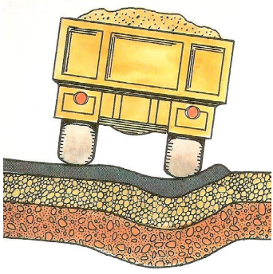

   Hundimiento del borde y ahuellamiento

* Baches: Este tipo de falla produce un hundimiento local del sendero vial, con agrietamiento  en malla cerrada y generalmente pérdida parcial de bloques de la capa de rodadura.Las técnicas de reparación de este tipo de falla consisten en restauración local de la estructura del pavimento, o bacheo sobre la base.
  
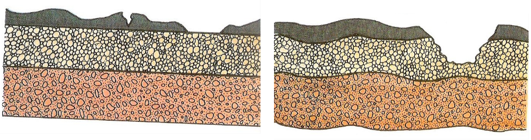

   Baches

.. raw:: latex
	
	\newpage

* Pérdida local de áridos: Este tipo de falla se presenta cuando ocurre una pérdida de una porción de la capa superficial. El método de reparación para este tipo de falla consiste en reemplazar el material afirmado.

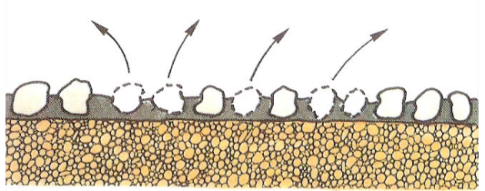

   Pérdida local de áridos

* Pulimiento o peladuras: Produce desprendimientos de la última capa de tratamientos superficiales. El método de reparación varía según la severidad, siendo un método de tratamiento superficial simple con una profundidad menor a 25 mm y área menor a 0,8 m2, y siendo nivelación con sobrecarpeta para profundidad o área mayores a 25 mm y 0,8 m2 respectivamente.

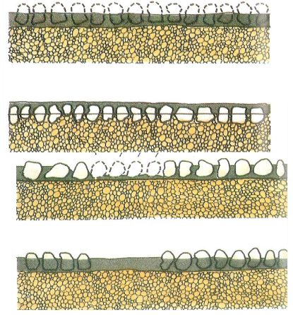

   Pulimiento o peladuras

* Deformación: Se visualiza en pavimentos donde se produce una desviación longitudinal del material con respecto a su perfil original (asentamientos en el pavimento). El método de reparación con profundidad de la flecha de 13 a 25 mm o entre 25 mm y 50 mm es tratamiento superficial con medida preventiva, mientras que si se superan los 50 mm, se emplea bacheo seguido por aplicación de tratamiento superficial.
  
.. raw:: latex
	
	\newpage

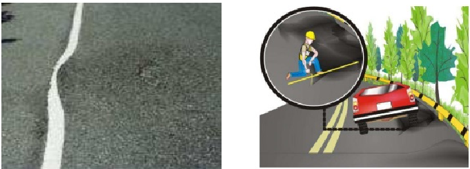

   Deformación

Proyectos de software anteriores para la detección de fallas sobre el pavimento
-------------------------------------------------------------------------------

Debido a que la recolección manual de fallas es una tarea costosa con respecto al tiempo y al esfuerzo, durante años se  han publicado varios papers y tesis con el fin de automatizar esta tarea, a través del uso de distintos dispositivos para el sensado, combinados con distintas técnicas de localización, registro de fallas y análisis de la información sensada. Los papers y tesis publicados hasta la fecha se pueden clasificar según el tipo de sensor que emplean, en tres grandes grupos:

* Detección de fallas por medio de sensores de vibración(acelerómetro)
* Detección de fallas utilizando técnicas basadas en procesamiento de video/imagen
* Detección de fallas empleando reconstrucción 3D

Proyectos basados en procesamiento de video e imagen
^^^^^^^^^^^^^^^^^^^^^^^^^^^^^^^^^^^^^^^^^^^^^^^^^^^^

En lo que respecta al procesamiento de imágenes, una de las aproximaciones que se han empleado dentro de esta área es la de Korch y Brikalis :cite:`antecedentesProcImg1`, donde el reconocimiento de los tipos de falla consiste caracterizar los distintos tipos de falla  por medio de sus propiedades visuales (como las sombras alrededor de la misma, la forma aproximada, la apariencia visual de la textura dentro de la falla) y emplearlas en conjunto con un modelo que cuenta con tres fases de procesamiento: Segmentación de la imagen, extracción de forma y comparación de texturas.

Proyectos basados en sensores de vibración
^^^^^^^^^^^^^^^^^^^^^^^^^^^^^^^^^^^^^^^^^^

AGREGAR INFO DE 2 O 3 PAPERS

Proyectos basados en el uso de reconstrucción 3D
^^^^^^^^^^^^^^^^^^^^^^^^^^^^^^^^^^^^^^^^^^^^^^^^

AGREGAR INFO DE 2 O 3 PAPERS

Aplicaciones web y móviles existentes para la notificación de fallas
--------------------------------------------------------------------

ACA INCLUIR LOS SISTEMAS WEB EN "Ejemplos de otros sistemas para el registro de fallas.txt"

