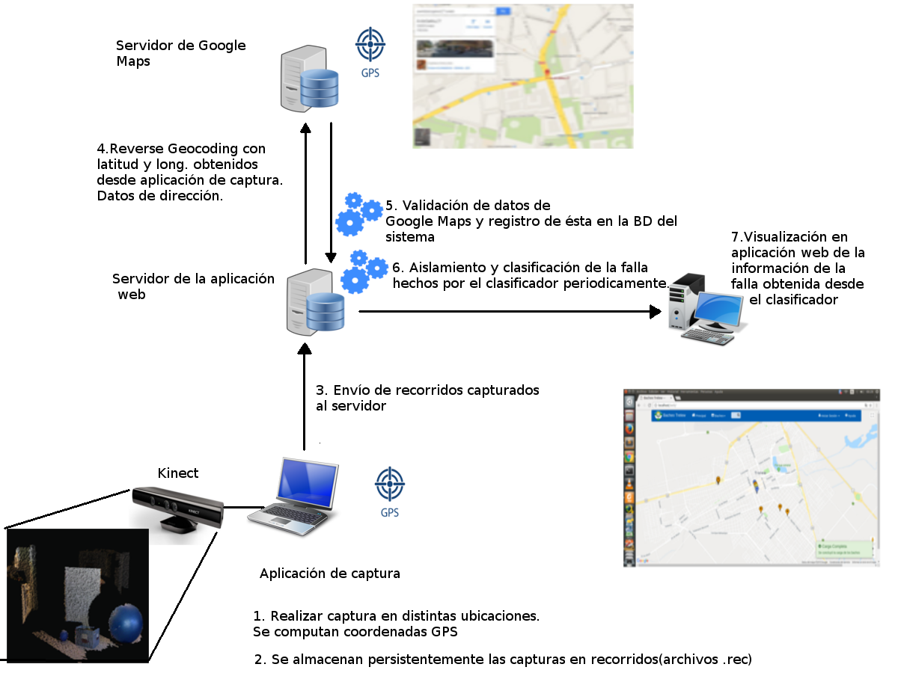
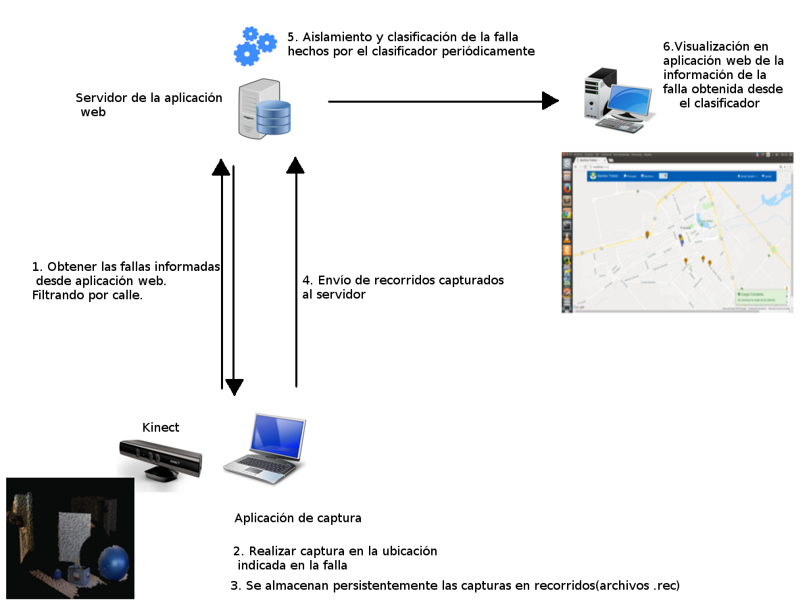
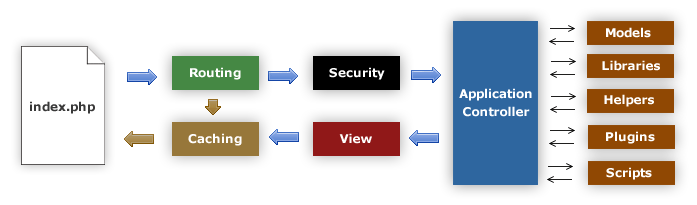
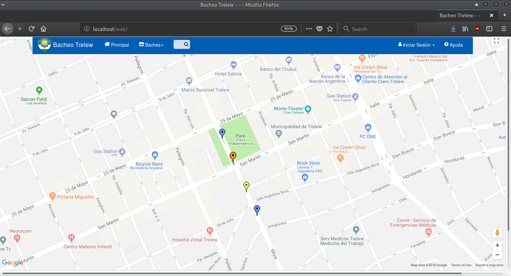
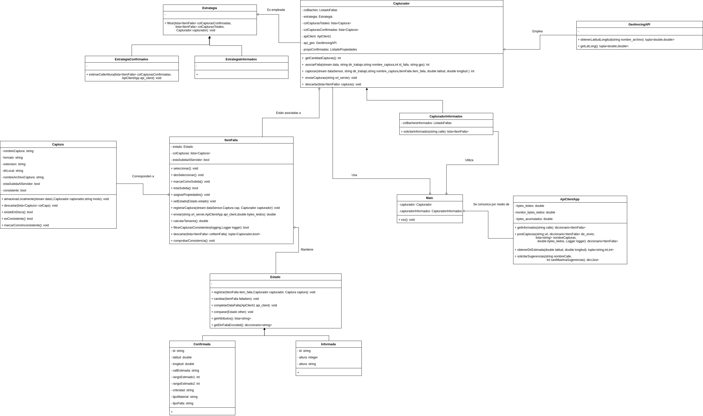
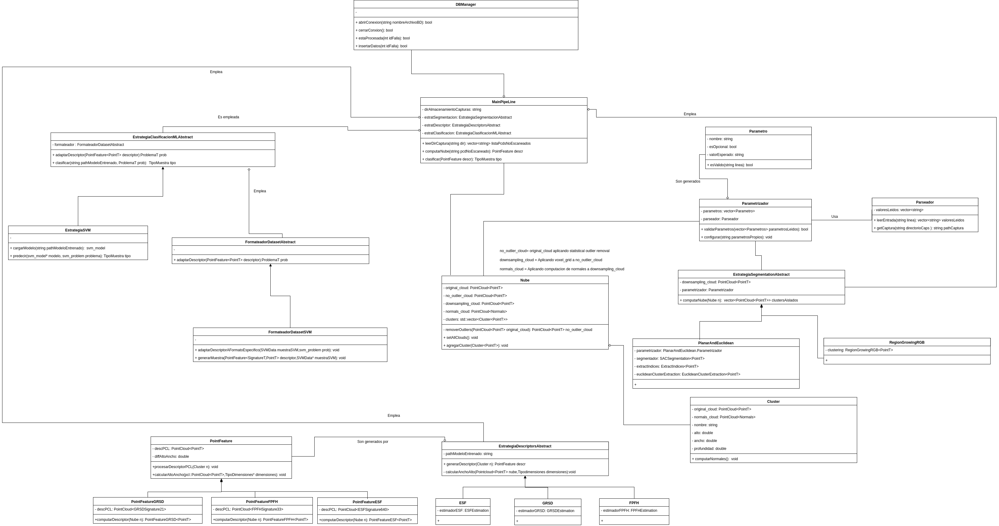

Capítulo 6. Caso de aplicación
==============================

Arquitectura global del sistema de administración de fallas
-----------------------------------------------------------

.. TODO: Se da una explicación de la estructura general de las 3 aplicaciones y como éstas interactúan mutuamente para conseguir el objetivo de la tesina.

Antes de comenzar a detallar los diferentes componentes del sistema de administración de fallas, es necesario tener en cuenta que los tipos de fallas administrados por ésta, desde que son notificadas hasta que concluye su reparación, atraviesan por un conjunto de estados que son secuenciales, excluyentes y una vez superado un estado, la falla no puede regresar a un estado previo. Estos tipos de estado son:

* **Informado**: Son aquellas fallas que fueron cargadas por usuarios desde la aplicación web.
  
* **Confirmado**: Son aquellas fallas que realmente fueron cargadas por personal autorizado o aquellas fallas informadas que fueron validadas por los mismos y modificadas en el sistema.
  
* **En reparación**: Son aquellas fallas a las que se les ha asignado una fecha de finalización estimada y un procedimiento de reparación.
  
* **Reparado**: Son aquellas fallas que realmente han sido reparadas y que poseen un costo real de reparación y una fecha de finalización efectiva de la reparación.
  

La arquitectura general del sistema de registro y administración de fallas sobre circuitos viales, se compone de tres aplicaciones independientes: Aplicación web, aplicación de captura y aplicación de clasificación, con diferentes funcionalidades, que por medio de la interacción permiten llevar a cabo el registro, clasificación y obtención de información inherente a distintos tipos de fallas. La forma en que éstas interactúan y la frecuencia de ejecución se encuentra predefinida por medio de archivos de configuración específicos de cada una y, el lugar de ejecución (cliente o servidor) se encuentra condicionada por la funcionalidad que proporcionan al sistema global de administración de fallas. Así, las interacciones definen flujos de trabajo que involucran tanto a la máquina cliente de captura de fallas como al servidor que las procesa, siendo los flujos principales los siguientes:

* Flujo de trabajo para fallas Confirmadas
* Flujo de trabajo para fallas Informadas

El flujo de trabajo para fallas confirmadas se describe en la siguiente figura:

   Flujo de trabajo para fallas con estado "Confirmada".

1. En esta etapa la aplicación de captura fue configurada previamente en una notebook/netbook/ultrabook o algún dispositivo con espacio suficiente y conexión USB para interactuar con el dispositivo Kinect y un GPS. Así, en esta etapa se realiza la  captura de fallas en algún vehículo en distintas ubicaciones y para cada falla se computan su latitud y longitud. 
2. Una vez realizada la captura de un conjunto de fallas a lo largo de una calle completa, se las puede almacenar de manera persistente en un recorrido. Un recorrido o archivo de recorrido, es un archivo con extensión .rec que permite almacenar un conjunto de fallas en disco, registrando para cada falla la siguiente información: geolocalización, capturas asociadas a la falla, tipo de falla, nivel de criticidad y tipo de material, siendo éstos últimos tres especificados por el usuario de la aplicación al momento de posicionarse sobre la falla. 
3. Luego de haber almacenado varios recorridos en disco y de contar con conexión a Internet, estos se cargan nuevamente desde la aplicación y se envían al servidor web, para la computación de la información faltante de la falla.   
4. Durante este paso, con la latitud y longitud obtenidas por cada falla, se realiza reverse geocoding a Google Maps con el fin de obtener los datos de la dirección principal (nombre de calle y rango de altura) y, debido a que Google Maps no provee la información respecto de los nombres de las calles que forman parte de la intersección más cercana a la ubicación, ésta se solicita a los servidores de Geonames.org que ofrece dicha funcionalidad. 
5. De esta forma, con la información obtenida por ambos servidores, se realiza una validación de los datos obtenidos, se los adapta al formato de la base de datos del sistema y finalmente, se los registra en sistema de administración y registro de fallas.  
6. La aplicación de clasificación o clasificador, se encuentra alojada en el mismo servidor donde reside la aplicación web, configurada como un cron job (o tarea programada) que se ejecuta con una frecuencia de 5 min., por lo que la información de clasificación de una falla puede demorar un tiempo extra y no estar disponible de manera instantánea, al contrario de lo que ocurre con la información de las fallas subidas en un recorrido. Debido a que en la práctica algunas fallas no cuentan con una único patrón que los distinga como un bache o una grieta, sino que pueden contener deformaciones de ambos tipos, el clasificador se encuentra configurado para aislar varias clases de fallas en una captura, aislando por cada clase de falla encontrada en una captura, uno o más clusters, mostrando la información de cada cluster junto con el nombre de la captura a la que pertenece.   
7. Finalmente, una vez que el demonio de clasificación se haya ejecutado, serán visibles en cada falla de la aplicación web el tipo al que pertenece, determinado por el clasificador, y sus dimensiones (altura, ancho y profundidad para baches y grosor, largo y profundidad para grietas).

Por otro, lado el flujo de trabajo de fallas informadas varía con respecto a la obtención de información relativa a las coordenadas de la falla y se describe en la siguiente figura:

   Flujo de trabajo para fallas con estado "Informada".

1. El primer paso en este flujo de trabajo consiste en solicitar las fallas que se encuentren localizadas en una calle, enviando para éste fin el nombre de la calle desde la aplicación de captura. De esta forma, la aplicación web realiza un filtrado de los nombres de calles registrados, asociados a fallas informadas previamente y retorna aquellas que se encuentren en la calle solicitada.
2. A continuación, se realiza la captura de la falla informada registrando solamente información relativa a las propiedades de ésta, obviando sus coordenadas.
3. Se almacenan las fallas en un recorrido de la misma forma que en el flujo de trabajo para fallas confirmadas.
4. Se envían las fallas que forman parte del recorrido al servidor, enviando junto con las propiedades el identificador con el que se encuentran registradas en la aplicación web, para su posterior búsqueda.
5. Se realiza el aislamiento y clasificación de la falla análogamente a como se realiza en el flujo de trabajo de fallas confirmadas.
6. Se visualizan las fallas aisladas correctamente desde la aplicación web con estado Informada.    

En las siguientes secciones se describirán en detalle la arquitectura, características  y modo de uso de cada una de las aplicaciones que componen el sistema de registro y administración de fallas. 

Aplicación web
--------------

.. TODO: Incluir:
..				-Requerimientos funcionales, no funcionales
..              -Diseño: Arquitectura de la aplicación.Incluir Diagrama de Clases Software. Descripción breve de la funcionalidad que proporcionan los módulos principales. 
..              -Librerías empleadas para el desarrollo
..              -Funcionalidad de la aplicación: Descripción respecto de como emplear las funcionalidades.
..                                 *Funcionalidades heredadas: Incluir funcionalidad realizada durante el proyecto de investigación (previo a la tesina).
..                                 *Funcionalidades agregadas: Incluir funcionalidad que fue desarrollada como parte de la tesina. 

Requerimientos funcionales
^^^^^^^^^^^^^^^^^^^^^^^^^^

* Incorporar visualizador de características geométricas inherentes a los distintos tipos de fallas.
* Agregar información respecto al resultado de clasificación y dimensiones obtenidas para una falla en particular.
* Añadir capacidad de filtrado de distintos tipos de fallas a partir de información de la dirección.
 

Requerimientos no funcionales
^^^^^^^^^^^^^^^^^^^^^^^^^^^^^

* Manipulación del archivo que contiene información de la geometría de la falla de manera intuitiva.
* Ayuda de fácil acceso para entender los comandos para interactuar con el visualizador.
* Indicación clara de las fallas filtradas en una calle, remarcadas de manera que se trace una ruta sobre ésta. 

.. _disenioApp:

Diseño de la aplicación
^^^^^^^^^^^^^^^^^^^^^^^

En primer lugar, esta aplicación consistía en la georeferenciación de fallas sobre un mapa interactivo, cuyo objetivo principal era la visualización del estado de la fallas informadas por usuarios y características que los mismos aportaban vía web. Esta aplicación fue pensada para ser utilizada por diferentes tipos de usuarios entre los que se encontraban:

* Usuarios anónimos
* Usuarios registrados (administradores)
  
Los usuarios anónimos disponen de las siguientes funciones:

* **Informar de una falla**: Esta funcionalidad permite especificar la calle y altura donde se encuentra localizada una falla, la clase a la que la falla pertenece (Ver :doc:`../Cap2/Cap2`), una pequeña observación (opcional) y una o más imágenes de la falla notificada. Esta información luego se envía y se registra en el sistema de administración de fallas.
   
* **Visualización de la información asociada a una falla previamente informada**: Permite visualizar información sobre las especificaciones de la falla previamente notificada por otro usuario y los comentarios que otras personas hicieron sobre ésta.

Por otro lado, los usuarios registrados pueden realizar las siguientes operaciones en la aplicación web:

* **Informar de una falla**: Ésta funcionalidad se encuentra extendida acorde a los conocimientos técnicos del personal que opera el sistema, proveyendo las mismas funcionalidades que las que se encuentran disponibles para el perfil de usuario anónimo y adicionalmente, vocabulario específico de cada tipo de falla.

* **Ver fallas reparadas**: Esta función es exclusiva del usuario registrado y permite visualizar de manera veloz sobre el mapa las fallas que se encuentran reparadas o las que no.

* **Agregar tipos de fallas**: Brinda la posibilidad de añadir un nuevo tipo de falla al sistema e incorporando todos aquellos atributos y características técnicas inherentes a la misma.

* **Filtrado de fallas por calle**: Permite trazar una ruta sobre el mapa de aquellas fallas pertenecientes a una calle en particular, con la posibilidad de establecer el tipo y el estado de la falla.

* **Cambio de estado de fallas**: Esta funcionalidad permite modificar el estado de una falla por el siguiente en la secuencia de estados, dependiendo los atributos del siguiente estado del estado actual de la misma.  

Estructura general del proyecto
^^^^^^^^^^^^^^^^^^^^^^^^^^^^^^^

La aplicación web fue desarrollada con el lenguaje de programación PHP empleando el framework CodeIgniter, el cual emplea la arquitectura Model-View-Controller, para la funcionalidad backend, en combinación con Boostrap para las vistas del fontend. Por lo que, la arquitectura general de la aplicación web es la se conforma por los siguientes componentes:

   Arquitectura de la aplicación

* **index.php**: Es el controlador principal de la aplicación e inicializa los recursos necesarios para la ejecución de CodeIgniter.
  
* **Routing**: Este módulo recibe las peticiones HTTP realizadas y se encarga de establecer el objetivo de la petición.
   
* **Security**: Realiza el saneamiento de la URL solicitada, comprobando que todas las configuraciones de seguridad establecidos en el servidor se cumplan y luego, realiza la carga del controlador de la aplicación.
   
* **Application Controller**: Es el controlador principal de la aplicación y carga todos aquellos recursos necesarios para el procesamiento de las peticiones, como son los modelos, las vistas, librerías, plugins y scripts.
  
* **Caching**: Este módulo realiza la administración de aquellas peticiones que ya han sido procesadas, por lo que, si una petición ya fue realizada no es necesario renderizarla nuevamente, sino que se retorna directamente por medio de éste módulo el resultado procesado anteriormente.
  
* **View**: Este componente mantiene la estructura general de las vistas, que serán renderizadas posteriormente ante una petición con información que responda a la misma. Si esta activada la posibilidad de caching, ésta será almacenada para responder a futuras peticiones.

La organización de directorios de la aplicación web se divide en dos carpetas: 

* Application
* System

La carpeta Application contiene aquellos elementos que componen la aplicación desarrollada, subdiviéndose en varias subcarpetas siéndo las principales las siguientes:

*  **Config**: Contiene todos aquellos archivos de configuración.
    
*  **Controllers**: Contiene los controladores de la aplicación, donde cada uno se encuentra asociado a una URL que puede ser solicitada. De esta forma, si existe un controlador Producto con un método consultar en midominio.com, el acceso a esta funcionalidad será realizado por la siguiente dirección http://www.midominio.com/index.php/producto/consultar.
    
*  **Core**: Esta carpeta agrupa las clases de base, sobre las que se construye la aplicación.
   
*  **Libraries**: Contiene archivos de librería desarrollados o incorporados para el funcionamiento de la aplicación.
   
*  **Models**: Contiene los modelos que reflejan la lógica de la aplicación, agrupando las clases tanto del problema especifico modelado como de las que acceden a la base de datos.
   
*  **Views**: Esta clase contiene los archivos templates HTML que representan la pagina web final que se enviará en respuesta a una petición. 

Por otro lado, la carpeta System contiene el código fuente propio del framework, donde se encuentran las clases nucleo del framework, los drivers para el acceso a diferentes DBMS, librerías empleadas por éstos y utilidades relacionadas con la manipulación de distintos atributos asociados a las páginas web (cookies, fechas y URL). 

Clases específicas agregadas
^^^^^^^^^^^^^^^^^^^^^^^^^^^^

Para el desarrollo de la funcionalidad incorporada a la aplicación web, se extendió el comportamiento de las clases preexistentes en la misma, siendo éstas las siguientes:

* **Falla**: Se agregó funcionalidad para creación y registro de fallas de peticiones provenientes de la aplicación de captura para fallas confirmadas e informadas, identificar la correspondencia entre una falla y los clusters que fueron clasificados  a partir de ésta.
* **Multimedia**: Esta clase se extendió para incluir el procesamiento de archivos de tipo PCD asociados a una falla, ya que anteriormente solo se permitía subir archivos multimedia de tipo imagen.
* **Calle**: Se añadió comportamiento relacionado con la obtención de sugerencias desde la aplicación de captura, y la obtención de fallas desde ésta a partir del nombre de una calle.
* **Dirección**: Se agregó comportamiento para realizar el geocodificación inversa (reverse geocoding) en las fallas confirmadas enviadas desde la aplicación de captura, y para la obtención de la intersección más próxima a una coordenada geográfica.
* **TipoFalla**: En esta clase se incorporó funcionalidad para obtener los tipos de reparación y el tipo de material asociados a un tipo de falla y disponer de esta información en la aplicación de captura.
* **TipoMaterial**: Se agregó funcionalidad para obtener los tipos de criticidades asociadas con un tipo de material desde la aplicación de captura.
* **Pcd_upload_model**: Esta clase se encarga de gestionar la subida de archivos asociados a capturas (archivos tipo PCD) desde la aplicación de captura.

Librerías empleadas
^^^^^^^^^^^^^^^^^^^

* **Three.js**:
* **Geocoder**:
* **Geonames**:
* **CodeIgniter**:
* **Boostrap**:
* **jQuery**:
* **GMaps**:
* **GeoComplete**:

Funcionalidad de la aplicación
^^^^^^^^^^^^^^^^^^^^^^^^^^^^^^

Al ejecutar la aplicación configurada en un servidor web, se presentará en la pantalla principal un mapa interactivo de la ciudad de Trelew con todas las fallas registradas en el sistema, diferenciandose por colores las fallas con distinto estado.

   Pantalla de inicio de la aplicación web

Esta pantalla inicial muestra las opciones ofrecidas para un tipo de usuario anónimo, y estas son:

* Iniciar Sesion: Esta opción se encuentra disponible para usuarios registrados que ya posean una cuenta en el sistema, y permite el logueo de los mismos.
* **Baches**: Dentro de esta opción se ofrece la función *Agregar* que permite informar una falla nueva. Ver :ref:`_disenioApp`. 
* Ayuda: Esta opción permite visualizar el el significado, con respecto al estado, de cada color de los marcadores.
* Barra de búsqueda. Esta barra se encuentra en el centro del conjunto de las opciones y permite buscar y posicionarse sobre una dirección.
  
Una vez autentificado un usuario este accede al siguiente conjunto de operaciones:

* Baches. Este menú ofrece las opciones:

    - Informar falla. Ver :ref:`_disenioApp`
    - Ver fallas reparadas. Ver :ref:`_disenioApp`
* TipoFalla

    - Agregar. Ver :ref:`_disenioApp`
* Barra de búsqueda. Idem para usuario anónimo.
* Registrar Usuarios. Esta opción permite a un administrador agregar nuevos usuarios al sistema, especificando para ello nombre, apellido, teléfono, mail, usuario y contraseña. Luego debe hacer click en *Registrar* para proceder con el registro de éste.  
* Barra lateral de filtrado. Esta barra se encuentra localizada en la parte superior izquierda del menú de opciones con un botón, y al acceder se despliega un sidebar donde el usuario debe seleccionar la opción *Filtrado de fallas por calle*. Una vez hecho esto, se abrirá un menú en la misma sidebar en el cual el usuario ingresará la calle, y seleccionara por medio de la opción "Seleccionar tipo de falla" el/los tipo/s de falla que desea filtrar. Además, deberá seleccionar el/los estados de falla. Una vez hecho esto se solicita el filtrado por medio del botón "Buscar", luego se trazará una ruta si existiesen ese tipo de fallas sobre la calle especificada. Con la opción *Limpiar Ruta* se puede realizar un borrado de la ruta trazada.  
* Ayuda. Idem para usuario anónimo.  

Aplicación de captura(appCliente)
---------------------------------

.. TODO: Incluir:
..				-Requerimientos funcionales, no funcionales
..              -Diseño: Arquitectura de la aplicación.Incluir Diagrama de Clases Software. Descripción breve de la funcionalidad que proporcionan los módulos principales. 
..              -Librerías empleadas para el desarrollo
..              -Funcionalidad de la aplicación: Descripción respecto de como emplear las funcionalidades 

.. h4 -->

Requerimientos funcionales
^^^^^^^^^^^^^^^^^^^^^^^^^^

Los requerimientos funcionales que fueron determinados para la aplicación de captura de fallas fueron los siguientes:

* *Capturar información relativa a fallas confirmadas en la ubicación de la misma*: La aplicación debe permitir capturar fallas nuevas sin registro previo en la aplicación web(fallas confirmadas) detectadas durante una exploración, registrando información  respecto de las propiedades de la falla (tipo de falla, tipo de material, criticidad, características geométricas) y de la ubicación donde ésta se encuentra, de manera que posteriormente la aplicación web pueda computar datos de la dirección de la misma. 

* *Obtención de fallas informadas en una calle desde el servidor*: La aplicación debe permitir la obtención de fallas informadas que fueron previamente registradas desde la aplicación web, según el nombre de la calle donde éstas se encuentran. De esta forma, la aplicación de captura debe poder comunicarse con la aplicación web, que buscará la calle solicitada de entre conjunto de calles registradas y retornará los resultados, para proceder con la captura de las fallas informadas.  
  
* *Captura de información relativa a fallas informadas en la ubicación de la misma*: Una vez solicitadas las fallas desde el servidor, se debe poder registrar información de las propiedades de cada falla.  
  
* *Almacenar/Leer de manera persistente un conjunto de fallas*: Las fallas informadas y confirmadas capturadas se deben poder almacenar en un archivo que contenga el recorrido hecho con las fallas (archivo de recorrido), para ser posteriormente cargado y enviado a la aplicación web.  
  
* *Enviar una o varias fallas a servidor remoto*: Se deben poder enviar una o más fallas informadas y/o confirmadas cargadas en memoria, desde la aplicación de captura hacia la aplicación web. 

Requerimientos no funcionales
^^^^^^^^^^^^^^^^^^^^^^^^^^^^^

Por otro lado, los requerimientos no funcionales que fueron determinados para la aplicación de captura de fallas fueron los siguientes:

* Respuesta rápida ante la solicitud de efectuar una captura, debido a que ésta tarea debe realizarse sobre un vehículo con tiempos de ejecución que pueden estar limitados por la fuente de alimentación del dispositivo, sobre el cual se ejecuta la aplicación.  
* Interfaz intuitiva, con terminología e iconos afines al dominio del problema, que agilicen la interacción con el usuario.
* Interacción entre aplicación de captura y aplicación web a través de un protocolo de comunicación sencillo, que permita rastrear por medio de códigos de estado posibles errores en la obtención o envío de información.
* Visualización de las fallas tanto con luz solar como en ausencia de ésta. Debido a que la luz solar interfiere con el tipo de ondas emitidas por el sensor, la aplicación debe contemplar la visualización de las fallas tanto de día, en horas previas al anochecer, como así también la captura de noche. 

Diseño de la aplicación
^^^^^^^^^^^^^^^^^^^^^^^

La arquitectura de la aplicación cliente esta formada por los siguientes componentes principales:

* **Dispositivo Kinect**: La interacción con el dispositivo Microsoft Kinect consiste únicamente en la obtención de frames de profundidad y de video, necesarios para la generación del archivo de nube de puntos. Estos frames se solicitan de manera continua y son renderizados y visualizados en tiempo real por la aplicación, en la ventana de captura. Ésta ventana se compone de dos visualizadores, uno que muestra una imagen de video a color y otro con una imagen de profundidad, con distintos colores asociados a las distancias entre el dispositivo de sensado y la falla. Ésto permite que se pueda corregir la orientación del dispositivo al momento de la captura.  
    
* **Geofencing**: El módulo de geofencing se incluye como parte de la aplicación y tiene la finalidad de computar y retornar las coordenadas donde se encuentra ubicada una falla desde el dispositivo GPS para fallas confirmadas. Éste brinda dos modos de operación, uno donde se leen coordenadas desde el dispositivo reales ("real-gps") y otro donde se lee un conjunto de coordenadas artificiales y se iteran de manera circular ("fake-gps"). Éste último, fue realizado por motivos de debugging entre la aplicación de captura y la aplicación web, en entornos cerrados donde no se dispone de conectividad GPS.
  
* **APIClient**: Este módulo es incluido junto con la aplicación contiene la clase principal encargada del intercambio de información de fallas entre la aplicación web y aplicación de captura.  
  
* **Aplicación cliente**: La aplicación cliente tiene como objetivo ofrecer tanto la captura, administración y envío al servidor de fallas, tanto informadas como confirmadas. Con respecto a la gestión de fallas confirmadas, la aplicación se comunica adicionalmente con el módulo GPS, para la obtención de las coordenadas de la falla, mientras que para las fallas informadas ésta interacción no es necesaria, debido a que las coordenadas de la dirección ya fueron especificadas en uno de los flujos de trabajo.    

.. figure:: ../figs/Cap6/arquitecturaAppCliente.png
   :scale: 100%

   Arquitectura general de aplicación cliente

De esta manera, la aplicación cliente se compone de las siguientes clases software:

* **Main**: Esta es la clase principal que efectúa la configuración inicial de la aplicación  y administra los capturadores asociados a fallas informadas y confirmadas.
  
* Capturador: Esta clase representa un objeto que realiza la captura de una falla con estado Confirmada, y se ejecutar todas aquellas operaciones inherentes a la administración de una falla Confirmada como son enviar fallas a la aplicación web, descartar fallas y solicitar a GeofencingAPI la computación de la latitud y longitud asociada a una falla.      
  
* CapturadorInformados: Representa al objeto encargado de realizar las operaciones de captura de fallas Informadas, ejecutando las operaciones relacionadas con la administración de fallas informadas, excluyendo de este conjunto las operaciones de computación de coordenadas de la falla. Adicionalmente, encapsula las operaciones de solicitud y carga de fallas informadas en memoria desde la aplicación web.
  
* ItemFalla: Esta clase representa a una falla confirmada o informada administrada por un capturador, y mantiene para cada falla el estado actual (Informada o Confirmada) y una colección de objetos Captura asociadas a ésta.
  
* Estado: Representa el estado actual de la falla y sus atributos depende del estado concreto que la falla tenga asociado. De esta superclase extienden dos subclases que son: Confirmada e Informada. Confirmada mantiene información respecto de las propiedades asociadas a la falla (tipo de falla, tipo de material y criticidad)coordenadas de la falla (latitud y longitud) y si es posible obtenerlos, información de la dirección. Por otro lado, Informada solamente mantiene información de la dirección (calle y altura) y el identificador con el que la falla se encuentra registrada.
  
* Captura: Esta clase contiene información propia de una captura individual para un objeto ItemFalla (nombre captura, extensión, directorio) y el comportamiento para almacenar esta persistentemente. 
  
* GeofencingAPI: Es la API principal de comunicación con el dispositivo GPS y principalmente contiene las operaciones de obtención de coordenadas.
  
* ApiClientApp: Esta clase representa la API que contiene la funcionalidad relacionada con la comunicación entre la aplicación cliente y la aplicación web, para la obtención de fallas informadas y envío de fallas (confirmadas e informadas) al servidor. Mantiene atributos relacionados con la conexión entre ambas aplicaciones, la cantidad de bytes enviados y bytes totales de las capturas a enviar.    
   

   Diagrama de clases software de la aplicación de captura

Librerías empleadas en la aplicación
^^^^^^^^^^^^^^^^^^^^^^^^^^^^^^^^^^^^
Python 2.7

* **Kivy**:
* XpopUp
* requests
* pypcd
* Iconfonts
* Tiny-db
* ZODB/ZEO
* gps
* 

Funcionalidad de la aplicación
^^^^^^^^^^^^^^^^^^^^^^^^^^^^^^

Aplicación de clasificación
---------------------------

.. TODO: Incluir:
..				-Requerimientos funcionales, no funcionales
..              -Diseño: Arquitectura de la aplicación.Incluir Diagrama de Clases Software. Descripción breve de la funcionalidad que proporcionan los módulos principales. 
..              -Librerías empleadas para el desarrollo
..              -Funcionalidad de la aplicación: Descripción respecto de como emplear las funcionalidades 

Requerimientos funcionales
^^^^^^^^^^^^^^^^^^^^^^^^^^

* *Clasificación de fallas*: La aplicación debe leer los parámetros utilizados en los algoritmos relacionados con la clasificación desde un archivo de configuración, procesar capturas en formato .pcd desde un directorio específico y producir uno o más clusters, con información respecto de las dimensiones de la falla aislada, en un directorio de salida accesible por la aplicación web.

Requerimientos no funcionales
^^^^^^^^^^^^^^^^^^^^^^^^^^^^^

* Capacidad para ser configurado y ejecutado en múltiples plataformas.
* Utilizar los mecanismos de paralelización en el procesamiento provistos por las librerías empleadas, con el fin de minimizar el tiempo de clasificación de fallas.
* Disponibilidad de capacidad de almacenamiento persistente alto para computar las muestras.
* Contar con un mecanismo de configuración que sea minimalista y amigable.
* Capacidad de realizar un rastreo de las muestras previamente procesadas, para reducir tiempo de cómputo.
* Versatilidad con respecto al modelo de Machine Learning empleado, el algoritmo de segmentación, el descriptor y el tipo de punto para la clasificación de fallas.
* Obligatoriedad de ejecución como tarea programada periódica y en segundo plano.

Diseño
^^^^^^
La estructura de la aplicación de clasificación esta integrada por los siguientes componentes software principales:

* **MainPipeLine**: Es la clase principal de procesado, que realiza las configuraciones globales iniciales, analiza el directorio de muestras, instancia objetos Nube y comienza con el procesamiento de cada una. 
 
* **Nube**: Representa una nube de puntos y todas aquellas nubes resultantes de haber sido procesadas por los algoritmos que intervienen en la clasificación. Contiene una colección de clusters que se derivaron del procesamiento de la misma.
  
* **Cluster**: Nube de puntos resultado de la aplicación de estrategia de segmentación. Esta clase contiene la información sobre las dimensiones aproximadas del mismo, por ejemplo alto, ancho, profundidad.

* **EstrategiaSegmentationAbstract**: Clase que representa la estrategia que será empleada para segmentar la nube de puntos. Puede consistir en uno o varios algoritmos de segmentación concretos. 

* **PointFeature**: Esta clase representa el feature personalizado que se compone de uno de los features ofrecidos por PCL y la diferencia entre ancho y alto calculados a partir de un cluster.

* **EstrategiaDescriptorAbstract**: Esta clase genera el PointFeature a partir de un cluster y puede ser extendida para distintos tipos de descriptores provistos por PCL. Ver :doc:`../Cap3/Cap3`.
  

* **EstrategiaClasificacionMLAbstract**: Esta clase representa la estrategia de clasificación que se puede adoptar para clasificar a que clase el cluster pertenece. Puede ser extendida para ser utilizada con distintos modelos de Machine Learning.Ver :doc:`../Cap4/Cap4`.

* **DBManager**: Esta clase engloba el comportamiento relacionado con la interacción de MainPipeLine con una base de datos que mantiene un registro de las fallas previamente clasificadas. Todas las fallas procesadas y clasificadas con o sin éxito, se agregan a dicha base. 

   Diagrama de clases software de la aplicación de clasificación

Librerías empleadas para el desarrollo
^^^^^^^^^^^^^^^^^^^^^^^^^^^^^^^^^^^^^^

* **Boost**: Es una librería open-source que fue diseñada con el objetivo de extender las capacidades del lenguaje C++ e incluye varias funcionalidades entre las que se destacan el procesamiento de texto, operaciones de iteración sobre directorios del sistema operativo, operaciones de entrada/salida, programación concurrente, etc. Esta librería fue empleada principalmente para implementar la iteración, búsqueda y creación de elementos en la jerarquía de directorios del sistema operativo y el procesamiento de cadenas de texto asociadas a éstas.

* PCL: Librería descripta en el capítulo 4. Ver *Freenect y Librería Point Cloud Library (PCL)* en :doc:`../Cap4/Cap4`. 

* JSONCPP: Es una librería en C++ empleada para la manipulación de archivos con formato JSON y la serialización/deserialización de éstos hacia/desde disco. Fue empleada para funcionalidad relacionada con creación de los archivos .json que mantienen información de dimensiones respecto de la falla clasificada.
  
* SQLite3: Es un sistema de bases de datos relacional desarrollada en C, donde la aplicación cliente realiza consultas a la base de datos por medio de funciones, en lugar de comunicarse con un proceso independiente, lo que provoca una reducción de la latencia en la interacción. Esta base de datos fue utilizada para mantener un registro de las fallas que fueron procesadas, evitando procesamiento innecesario. 

Funcionalidad de la aplicación
^^^^^^^^^^^^^^^^^^^^^^^^^^^^^^

Para el funcionamiento de esta aplicación, es necesario compilarla siguiendo las instrucciones en README.txt desde el repositorio https://github.com/rhuincalef/clasificadorFallas o, en el código fuente adjunto. Luego se debe realizar la configuración de los parámetros obligatorios de la aplicación, para ello se debe alterar el archivo *config_pipeline.json-default* cambiando la extensión a .json y modificando cada una de las siguientes entradas:

* **configuracion_global**: Esta entrada contiene el *dir_entrada* que es el directorio raíz desde el cual esta aplicación lee los archivos .pcd a procesar; *dir_salida* es el directorio raíz donde la aplicación almacenará los resultados obtenidos del procesamiento. Por último, cuenta con *database_muestras* que indica la ruta absoluta del archivo de base de datos con extensión .db, que se puede encontrar en el archivo base *fallas.db*.
      
* **clasificador**: Esta entrada consiste en aquellas configuraciones relativas al tipo de modelo de clasificación seleccionado. En *tipo* se debe especificar el modelo de clasificación a utilizar, siendo el único modelo implementado "svm". *path_modelo* especifica la ruta absoluta al modelo entrenado utilizado por el clasificador. 
 

* **estrategia_segmetador**: Esta entrada contiene aquellos valores empleados para la calibración del algoritmo de segmentación seleccionado. Estos valores fueron determinados por medio de pruebas de segmentación para baches y grietas y deben ser modificados con precaución según el tipo de objetos que desee aislar. No es necesario modificar estos valores para probar con grietas y baches. El único algoritmo implementado es Planar Euclidean que se encuentra especificado en la entrada *tipo*, el cual consta para planar segmentation de *distance_threshold*, *max_iterations* y de euclidean_segmentation (RANSAC) *tolerance*, *min_cluster_size* y *max_cluster_size*. Ver *Algoritmos de segmentación de objetos* en :doc:`../Cap3/Cap3`.

* **point_feature**: Esta entrada especifica el tipo de punto ofrecido por PCL a utilizar para la lectura, procesamiento y almacenamiento de nubes de puntos. Ver *Representación y almacenamiento de una nube de puntos* en :doc:`../Cap3/Cap3`.           

* **estrategia_descriptor**: Esta entrada representa el tipo de descriptor de PCL que se utilizará para generar el descriptor personalizado (PointFeature). *tipo_descriptor* determina el tipo de descriptor que puede ser "GRSD" o "ESF", aunque ESF es el descriptor que más precisión tiene para este desarrollo en concreto.
  
  Tener en consideración, que el tipo de modelo entrenado especificado en entrada **clasificador** tiene que estar entrenado con el tipo de estrategia descriptor seleccionada, por lo que si se selecciona ESF el *path_modelo* debe ser el de un modelo que este entrenado con éste feature de PCL. Ver *Selección de features para ML en PCL* en :doc:`../Cap4/Cap4`. 

Finalmente, para ejecutar la aplicación en segundo plano como una tarea programada, se deben seguir las instrucciones especificadas en README.txt, donde se detallan lapsos de ejecución de la tarea en intervalos de 5 minutos, todos los días. Esta configuración requiere el uso de *crontab* y únicamente fue probada bajo Linux (Ubuntu 16.14 y Manjaro Hakoila 17.16). 

