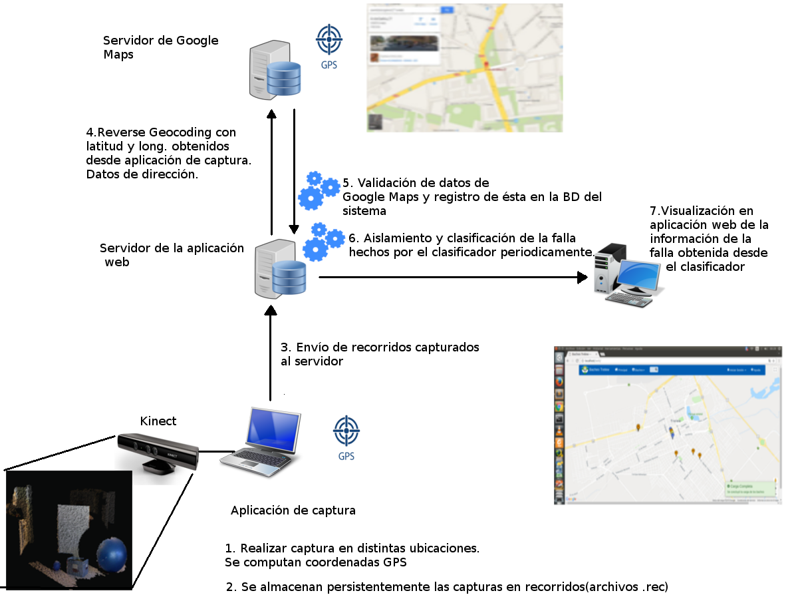

Capítulo 6. Caso de aplicación
==============================

Arquitectura global del sistema de administración de fallas
-----------------------------------------------------------

.. TODO: Se da una explicación de la estructura general de las 3 aplicaciones y como éstas interactúan mutuamente para conseguir el objetivo de la tesina.

La arquitectura general del sistema de registro y administración de fallas sobre circuitos viales, se compone de tres aplicaciones independientes: Aplicación web, aplicación de captura y aplicación de clasificación, con diferentes funcionalidades, que por medio de la interacción permiten llevar a cabo el registro, clasificación y obtención de información inherente a distintos tipos de fallas. La forma en que éstas interactúan y la frecuencia de ejecución se encuentra predefinida por medio de archivos de configuración específicos de cada una y, el lugar de ejecución (cliente o servidor) se encuentra condicionada por la funcionalidad que proporcionan al sistema global de administración de fallas. Así, las interacciones definen un flujo de trabajo que involucran tanto a la maquina cliente de captura de fallas como al servidor que las procesa y que se describe en la siguiente figura:

   Flujo de trabajo de aplicación web.

1. En esta etapa la aplicación de captura fue configurada previamente en una notebook/netbook/ultrabook o algún dispositivo con espacio suficiente y conexión USB para interactuar con el dispositivo Kinect y un GPS. Así, en esta etapa se realiza la  captura de fallas en algún vehículo en distintas ubicaciones y para cada falla se computan su latitud y longitud. 
2. Una vez realizada la captura de un conjunto de fallas a lo largo de una calle completa, se las puede almacenar de manera persistente en un recorrido. Un recorrido o archivo de recorrido, es un archivo con extensión .rec que permite almacenar un conjunto de fallas en disco, registrando para cada falla la siguiente información: geolocalización, capturas asociadas a la falla, tipo de falla, nivel de criticidad y tipo de material, siendo éstos últimos tres especificados por el usuario de la aplicación al momento de posicionarse sobre la falla. 
3. Luego de haber almacenado varios recorridos en disco y de contar con conexión a Internet, estos se cargan nuevamente desde la aplicación y se envían al servidor web, para la computación de la información faltante de la falla.   
4. Durante este paso, con la latitud y longitud obtenidas por cada falla, se realiza reverse geocoding a Google Maps con el fin de obtener los datos de la dirección principal (nombre de calle y rango de altura) y, debido a que Google Maps no provee la información respecto de los nombres de las calles que forman parte de la intersección más cercana a la ubicación, ésta se solicita a los servidores de Geonames.org que ofrece dicha funcionalidad. 
5. De esta forma, con la información obtenida por ambos servidores, se realiza una validación de los datos obtenidos, se los adapta al formato de la base de datos del sistema y finalmente, se los registra en sistema de administración y registro de fallas.  
6. La aplicación de clasificación o clasificador, se encuentra alojada en el mismo servidor donde reside la aplicación web, configurada como un cron job (o tarea programada) que se ejecuta con una frecuencia de 5 min., por lo que la información de clasificación de una falla puede demorar un tiempo extra y no estar disponible de manera instantánea, al contrario de lo que ocurre con la información de las fallas subidas en un recorrido. Debido a que en la práctica algunas fallas no cuentan con una único patrón que los distinga como un bache o una grieta, sino que pueden contener deformaciones de ambos tipos, el clasificador se encuentra configurado para aislar varias clases de fallas en una captura, aislando por cada clase de falla encontrada en una captura, uno o más clusters, mostrando la información de cada cluster junto con el nombre de la captura a la que pertenece.   
7. Finalmente, una vez que el demonio de clasificación se haya ejecutado, serán visibles en cada falla de la aplicación web el tipo al que pertenece, determinado por el clasificador, y sus dimensiones (altura, ancho y profundidad para baches y grosor, largo y profundidad para grietas).

En las siguientes secciones se describirán en detalle la arquitectura, características  y modo de uso de cada una de las aplicaciones que componen el sistema de registro y administración de fallas. 

Aplicación web
--------------

.. TODO: Incluir:
..				-Requerimientos funcionales, no funcionales
..              -Diseño: Arquitectura de la aplicación.Incluir Diagrama de Clases Software. Descripción breve de la funcionalidad que proporcionan los módulos principales. 
..              -Manual del usuario: Descripción respecto de como emplear las funcionalidades.
..                                 *Funcionalidades heredadas: Incluir funcionalidad realizada durante el proyecto de investigación (previo a la tesina).
..                                 *Funcionalidades agregadas: Incluir funcionalidad que fue desarrollada como parte de la tesina. 
..              -Librerías empleadas para el desarrollo

Aplicación de captura(appCliente)
---------------------------------

.. TODO: Incluir:
..				-Requerimientos funcionales, no funcionales
..              -Diseño: Arquitectura de la aplicación.Incluir Diagrama de Clases Software. Descripción breve de la funcionalidad que proporcionan los módulos principales. 
..              -Librerías empleadas para el desarrollo
..              -Manual del usuario: Descripción respecto de como emplear las funcionalidades 

.. h4 -->

Requerimientos funcionales
^^^^^^^^^^^^^^^^^^^^^^^^^^

Los requerimientos funcionales que fueron determinados para la aplicación de captura de fallas fueron los siguientes:

* *Capturar información relativa a fallas confirmadas en la ubicación de la misma*: La aplicación debe permitir el registro de información asociada a cada falla en el lugar de captura de fallas   (tipo falla y material, criticidad, coordenadas) 
* *Obtención de fallas informadas en una calle desde el servidor*:
* *Captura de información relativa a fallas informadas en la ubicación de la misma*:
*  
  
* *Visualización de las fallas (con luz solar y en ausencia de ésta)*:  
* *Almacenar/Leer de manera persistente un archivo de fallas*:
* *Enviar fallas al servidor remoto*:

Requerimientos no funcionales
^^^^^^^^^^^^^^^^^^^^^^^^^^^^^

Por otro lado, los requerimientos no funcionales que fueron determinados para la aplicación de captura de fallas fueron los siguientes:

* Respuesta rápida ante la solicitud de efectuar una captura, debido a que ésta tarea debe realizarse sobre un vehículo con tiempos de ejecución que pueden estar limitados por la fuente de alimentación del dispositivo sobre el cual se ejecuta la aplicación.  
* Interfaz intuitiva, con terminología e iconos afines al dominio del problema, que agilicen la interacción con el usuario.
* Interacción entre aplicación de captura y aplicación web a través de un protocolo de comunicación sencillo, que permita identificar por medio de códigos de estado posibles errores en la obtención o envío de información.
*   

Arquitectura de la aplicación
^^^^^^^^^^^^^^^^^^^^^^^^^^^^^

Librerías empleadas en la aplicación
^^^^^^^^^^^^^^^^^^^^^^^^^^^^^^^^^^^^

Manual del usuario
^^^^^^^^^^^^^^^^^^

Aplicación de clasificación
---------------------------

.. TODO: Incluir:
..				-Requerimientos funcionales, no funcionales
..              -Diseño: Arquitectura de la aplicación.Incluir Diagrama de Clases Software. Descripción breve de la funcionalidad que proporcionan los módulos principales. 
..              -Librerías empleadas para el desarrollo
..              -Manual del usuario: Descripción respecto de como emplear las funcionalidades 

